# ARCHITECTURE_v2.md — центральное руководство BodgeGene v0.6+

> **Статус:** активный draft, дата 29 апреля 2026. Создан как агрегатор всех обсуждений между Игорем и Chat в апреле 2026 после research-документа `BodgeGene_and_PlasmidVCS__Architecture_Research...md`.
>
> **Назначение:** этот документ — единая точка правды для архитектуры BodgeGene v0.6 и далее. На него опираются дизайн-сессии, спеки спринтов, реализация Code, статья. При расхождении с другими документами — этот побеждает (в том числе `ARCHITECTURE_RESEARCH.md`, который остаётся как research-history, не как руководство).
>
> **Что не в этом документе:** UI-макеты (это отдельные файлы), детальные спеки спринтов (`docs/SPRINT_*.md`), регламент работы Chat ↔ Code (`CHAT_PLAYBOOK.md`).

---

## 0. TL;DR

BodgeGene v0.6+ — open-source web-based plasmid editor с структурированным cloning-провенансом в файле. Не SnapGene-killer, не Benchling-конкурент. Honest research tool для academic / teaching / personal use.

**Архитектурное ядро в одной фразе:** проект — это DAG молекулярных контейнеров, рёбра — операции лабораторного протокола (mix, PCR, digest, clone). Каждое ребро и каждый узел имеют структурированный provenance с PROV-O семантикой. Файл `.bodge` = ZIP с этим DAG.

**Что меняется по сравнению с v0.5:**
- Полный rewrite frontend под новую data model. Старые проекты не мигрируем — wipe data, начинаем чисто.
- Принципиальное переосмысление: **Assembly как отдельный класс не существует**. Сборка = операция в DAG (project-commit), не сущность.
- Окно-структура: DAG проекта как корень, остальное — фулскрины с stack-навигацией.
- Концы контейнера — first-class свойство, видимое в UI и валидируемое при операциях.
- Сшивающий участок (overhang/homology) живёт в концах ампликонов, не отдельная сущность.

**Что переиспользуется из v0.5 (львиная доля кода):**
- Импортёр: `snapgene_parser.py` (PRIMARY) + BioPython (fallback), `common-features.json` (415 features)
- Sequence editing: `FragmentEditor/` (8 файлов, декомпозирован), `annotation-model.js`, `mutagenesis.js`, `plasmid-git.js`
- Assembly UI: `DesignCanvas`, `PartBlock`, `JunctionBlock`, `JunctionDNA`
- Расчёты: `golden-gate.js`, `restriction-db.js`, `local-primer-design.js`, `tm-calculator.js`, `validate.js`
- Каталог: `CatalogPanel.jsx`, common-features data
- DAG-канвас: `flow/` (5 node types, 3 edge types, @xyflow/react)
- Backend: stateless FastAPI + BioPython, не трогаем

**Что переписывается:**
- Все Zustand slices целиком (текущие 6 → новые 7 с другой semantics)
- Все handlers, привязанные к flat fragments[]
- Storage layer (localStorage Zustand persist → IndexedDB+Dexie)
- Обвязка вокруг DesignCanvas (теперь это Mix Workspace, не центральный canvas)
- Обвязка вокруг flow/ (теперь это корневой DAG проекта)
- Все import/export пайплайны .bodge (новый формат)
- ~30% тестов (те, что тестировали store-shape и handlers)

**Distribution / Identity / Sync модель:**
- Hosted web app (`bodgegene.dev`) + open-source self-host + PWA с offline. Desktop app отложен до v1.5+.
- Identity = label, не account. Никакой регистрации, никакого backend для users.
- Sync через файл (manual transfer + cloud-folder через File System Access API + opt-in Google Drive API).
- Backend остаётся stateless calculation service (BioPython parsing). Никакого user state на сервере.

---

## 1. Принципы (immutable, ⚓)

Эти принципы зафиксированы и не меняются в v1.0. Любое архитектурное решение проверяется на совместимость с ними. Изменение принципа = major version bump.

**1.1 Контейнер = единственная единица "молекулярной сущности".** Один тип артефакта в проекте: `MoleculeContainer`. Никаких AssemblyContainer, никаких PrimerContainer, никаких FragmentContainer как отдельных классов. Primers — отдельная сущность (они не молекулы в том же смысле), Library entries — отдельная.

**1.2 Сборка = операция уровня проекта (project-commit), не объект.** Mix (Gibson/GG/RE/KLD/blunt), PCR, digest split, clone-on-import — это рёбра в DAG проекта. У них есть метаданные (reaction class, params, agent, timestamp), но нет lifecycle planning/ready/committed. Операция атомарна: либо состоялась (commit) либо нет.

**1.3 Концы контейнера — first-class свойство.** Для linear контейнера concy (5'/3') с overhang-info видны в UI и валидируются при операциях. Для circular контейнера концов нет. Tools для модификации концов: PCR (создаёт ампликон с primer-tails), digest (разрезает с заданным enzyme, генерирует overhangs), modify-ends (явная правка в Container Window).

**1.4 Сшивающий участок не имеет отдельной сущности.** Overlap/homology, который физически появляется в продукте Gibson из primer-tails — это часть концов исходных ампликонов, не отдельный объект. После операции mix эти overlap'ы материализуются в один шов в продукте, провенанс трекается через цепочку commits.

**1.5 Provenance = side-effect каждой операции, не отдельная фича.** Каждая операция (container-commit или project-commit) автоматически создаёт provenance-запись. PROV-O семантика как vocabulary (Entity / Activity / used / wasGeneratedBy / wasDerivedFrom / hadPlan), но plain JSON на хранении, не RDF.

**1.6 DAG-as-primary-view.** Корневой workspace проекта = DAG. Не список, не tree, не table. Список — projection (side-panel toggle). Это USP проекта, отличающая нас от SnapGene/ApE/Benchling-в-OS.

**1.7 Local-first, открытый формат.** `.bodge` = ZIP с manifest.json + per-container .gb (с structured COMMENT-блоком для provenance) + dag.json. RO-Crate metadata добавится в v0.9 для FAIR-claims в статье. Файл живёт на диске пользователя, не в облаке. Никакого SaaS.

**1.8 Скорость не приоритет. Качество и гибкость важнее.** Решение принято для UX-развилок (fragment-insert и т.п.). Прорабатываем через прототипы и дизайн-сессии, не оптимизируем под "сделать в один клик".

**1.9 Stack-навигация.** Из любого фулскрина "← Назад" возвращает на предыдущий с сохранением state. Mix Workspace draft = unsaved tab, не закрывается при уходе.

**1.10 Honest scope.** BodgeGene модели design intent provenance, не lab outcome verification. Не трекаем transformation efficiency, sequencing-verify, contamination, errors. Это design tool, не lab simulator.

**1.11 Identity = label, не account.** В системе нет понятия user account. `agent` (name + email) — это label для commit attribution, без auth/permissions. Файл — единственный источник правды. Несколько agents могут быть в одном файле как нормальное явление. Backend остаётся stateless calculation service, не user service.

**1.12 Sync через файл, не через сервер.** `.bodge` файл — primary unit обмена. Cloud sync делается через third-party providers (Drive Desktop, Dropbox, OneDrive) через File System Access API. Активная Google Drive API integration — opt-in convenience, не замена. Никакого built-in sync server, никакого real-time collab.

**1.13 Изоморфизм data ↔ протокол.** Каждая операция в data-модели соответствует реальной процедуре в боксе биолога. Контейнер = «виртуальный операционный стол» с одной активной молекулой + историей операций. Это сознательное упрощение относительно физической реальности (где после digest в пробирке физически живёт смесь продуктов): в контейнере остаётся только тот продукт, с которым продолжается работа. Принцип позволяет жёстко привязать data-model к биологическому процессу — каждая запись в системе отвечает на вопрос "что биолог делал на столе для получения этого".

**1.14 Разные операции = разные контейнеры.** Три pUC19 в трёх разных операциях = три разных контейнера, даже при идентичной стартовой молекуле. Биологически это три параллельных tube на столе, не один. Это снимает соблазн делать «один контейнер с branch'ами» — branch'и естественно возникают через DAG (split, повторное использование parent'а в assembly). Принцип «контейнер дешёвый» — создание новой сущности на канвасе нормальная цена за чистоту модели и гибкость; архитектура не должна экономить на контейнерах.

---

## 2. Data model

### 2.1 Entities (4 класса)

```typescript
// Project — корневой объект файла .bodge
interface Project {
  id: UUID;                    // UUIDv7 (timestamp-prefixed)
  schemaVer: number;
  name: string;
  description: string;
  tags: string[];              // ⚓ project-level chips для категоризации в Recent / All projects (DEC-V2-30)
  createdAt: ISO8601;
  updatedAt: ISO8601;
  agent: Agent;                // имя/email для commit attribution
  containerIds: UUID[];        // ordered, source of truth для навигации
  projectCommitIds: UUID[];    // ordered topologically
  primerIds: UUID[];           // project-local pool refs
  settings: ProjectSettings;
  ext: object;                 // forward-compat extension fields
}

// MoleculeContainer — единственный класс молекулярных артефактов
interface MoleculeContainer {
  id: UUID;
  schemaVer: number;
  kind: 'molecule';
  name: string;
  description: string;
  origin: Origin;              // discriminated union (см. 2.2)
  baseSnapshot: Snapshot;      // immutable, content-addressable
  commits: ContainerCommit[];  // empty array на старте, не null
  currentHash: string;         // derived: hash после replay всех commits
  topology: Topology;          // {circular: bool}
  ends: Ends | null;           // {fivePrime, threePrime} для linear; null для circular
  position: {x, y};            // UI state на DAG canvas
  ext: object;
}
// NB: поле `tagIds: UUID[]` убрано в v1.2 (Sprint M-A.3 финализация, 01.05.2026, ⚓ DEC-LIB-10).
// Теги — только на LibraryEntry. В проекте у молекул нет тегов: организация через DAG-навигацию
// + future provenance breadcrumb (M-C). Symmetrically с DEC-V2-30 (Project.tags = flat strings)
// и DEC-LIB-09 (Library = flat tagging).

// ContainerCommit — правка ВНУТРИ одного контейнера
interface ContainerCommit {
  id: UUID;
  parentId: UUID | null;
  hash: string;                // SHA-256(canonical JSON)
  type: ContainerCommitType;   // discriminated union
  payload: object;             // type-specific
  createdAt: ISO8601;
  author: Agent;
  message?: string;
  frozenSnapshot?: Snapshot;   // каждые ~20 commits для perf
  schemaVer: number;
}

// ProjectCommit — операция МЕЖДУ контейнерами (рёбра DAG)
interface ProjectCommit {
  id: UUID;
  hash: string;
  type: ProjectCommitType;     // 'mix' | 'pcr_amplify' | 'digest_split' | 'clone' | 'cut_extract'
  inputs: {
    containerIds: UUID[];
    primerIds?: UUID[];        // для PCR / GG / overlap
    roles?: InputRole[];       // template, fwd, rev, fragment, vector — per-input
  };
  outputs: {
    containerIds: UUID[];      // обычно 1, для digest_split может быть N
  };
  params: ReactionParams;      // type-specific (enzyme, homologyLength, Tm, ...)
  reactionClass?: ReactionClass; // 'gibson' | 'golden_gate' | 'kld' | 're_ligation' | 'blunt_ligation' | 'overlap_pcr'
  createdAt: ISO8601;
  author: Agent;
  message?: string;
  startedAtTime?: ISO8601;
  endedAtTime?: ISO8601;
  schemaVer: number;
}
```

### 2.2 Origin discriminated union (immutable после создания)

```typescript
type Origin =
  | { kind: 'catalog';             catalogId: string; vendor: string; }
  | { kind: 'paste';               pastedAt: ISO8601; }
  | { kind: 'file';                sourceFile: string; sourceFormat: 'gb'|'dna'|'fasta'; }
  | { kind: 'library_clone';       sourceProjectId: UUID; sourceContainerId: UUID; sourceContainerHash: string; clonedAt: ISO8601; }
  | { kind: 'cross_project_clone'; sourceProjectId: UUID; sourceProjectName: string; sourceContainerId: UUID; sourceContainerHash: string; clonedAt: ISO8601; }
  | { kind: 'project_commit';      projectCommitId: UUID; role: 'product'|'split_product'; }
  | { kind: 'manual_create';       createdAt: ISO8601; }     // для пустого контейнера через "+"
```

`origin` фиксируется в момент создания контейнера и **никогда не меняется**. Если контейнер форкается / клонируется — у нового контейнера свой origin, обычно `library_clone`, `cross_project_clone` или `project_commit`.

**Различие `library_clone` и `cross_project_clone`:**
- `library_clone` — контейнер пришёл через Library (личная коллекция, см. §2.7). User добавил контейнер в Library через Importer, потом клонирует его в проект (`+ Из библиотеки` в DAG-toolbar). Изменения в копии не влияют на Library entry (DEC-LIB-06).
- `cross_project_clone` — контейнер пришёл напрямую из другого `.bodge` файла через cross-project import modal (см. §3.x ниже). Не нужен intermediate Library, file-to-file.

Оба immutable, оба несут `sourceProjectId / sourceContainerId / sourceContainerHash`. `cross_project_clone` дополнительно сохраняет `sourceProjectName` потому что project file может стать недоступен и имя должно остаться видимым в provenance.

**Origin vs provenance — разные поля.** В дизайне data model держим **два раздельных поля** на каждом контейнере:

```typescript
interface MoleculeContainer {
  // ... основные поля (id, name, sequence, ends, topology, commits[])

  origin: Origin,                    // ⚓ kind источника (immutable, фиксирован при создании)
  provenance: {                      // metadata "где был создан" (mutable пока в drafts)
    projectId: UUID,                 // в каком проекте создан изначально
    projectName: string,             // имя на момент создания (для UI breadcrumb)
    createdBy: { name, email },      // agent при создании
    createdAt: ISO8601,
    note?: string,                   // свободный текст-описание роли в проекте
  }
}
```

**Почему два поля:** `origin.kind` отвечает на вопрос "что это и откуда взялось" (catalog / paste / file / library_clone), а `provenance` отвечает на вопрос "где и когда создали этот instance в наших workflows". Это **разные семантические оси**, смешивать их в одном поле — антипаттерн (его пример был в v0.5 коде, см. kickoff §4.1.2 как урок). UI пишет provenance в breadcrumb / inspector, origin в badge / иконку и в provenance trail.

### 2.3 ContainerCommit types (правки внутри одного контейнера)

```typescript
type ContainerCommitType =
  | 'substitution'      // payload: {pos, oldBase, newBase}
  | 'insertion'         // payload: {pos, sequence}
  | 'deletion'          // payload: {pos, length}
  | 'mutagenesis'       // payload: {region, codonOld, codonNew, aaOld, aaNew}
  | 'topology_change'   // payload: {fromCircular, toCircular}
  | 'ends_change'       // payload: {oldEnds, newEnds}
  | 'reverse_complement'// payload: {region}
  | 'trim'              // payload: {start, end}  (обрезка sequence)
  | 'annotation_edit'   // payload: {features added/removed/edited}
  | 'tag_add'           // payload: {tagId}
  | 'milestone';        // payload: {label, message}  (no-op, semantic marker)
```

**Правило:** ContainerCommit **не создаёт нового контейнера**. Это правка существующего. Исключение — `cut_extract` ниже, но это уже ProjectCommit.

**Warnings на уровне коммита — `commit.warnings: string[]`.** Каждый ContainerCommit может нести список предупреждений ОТ САМОЙ ЭТОЙ ПРАВКИ — например "введена нестандартная codon для E. coli" (mutagenesis), "PCR product содержит internal BsaI site" (pcr_amplify). Эти warnings **остаются с контейнером навсегда**, отображаются в Container Window history.

⚠️ **Важное правило — warnings не смешиваем с ProjectCommit.** Reaction-warnings (incompatible ends, GG conflicts, buffer mismatch) живут на ProjectCommit (см. §2.4), не на контейнере. UI агрегирует их в **двух разных каналах**: история контейнера показывает свои commit-warnings; узел ProjectCommit на DAG показывает свои reaction-warnings. Это разделение поддерживает принцип 1.13 (изоморфизм data ↔ протокол) — warnings от мутации и warnings от реакции живут в разных физических контекстах в боксе биолога.

### 2.4 ProjectCommit types (операции между контейнерами)

```typescript
type ProjectCommitType =
  | 'mix'              // N inputs → 1 output (Gibson/GG/RE/KLD/blunt)
  | 'pcr_amplify'      // 1 template + 2 primers → 1 amplicon
  | 'digest_split'     // 1 input + enzyme → N output фрагментов
  | 'cut_extract'      // 1 input + region → 1 output фрагмент (manual cut в Container Window)
  | 'clone'            // 1 input → 1 output (frozen lineage from library/duplicate)
  | 'circularize'      // 1 linear → 1 circular (концы стыкуются)
  | 'linearize';       // 1 circular → 1 linear (выбор позиции разрыва)
```

**Правило:** ProjectCommit **создаёт хотя бы один новый контейнер**. Это рёбра DAG.

**`projectCommit.warnings: string[]`** — reaction-warnings от самой реакции (incompatible ends в Gibson, internal BsaI sites в Golden Gate, buffer mismatch в RE digest). Это **отдельный канал** от commit.warnings контейнеров (§2.3). UI рендерит их в node-tooltip / properties pane ProjectCommit, не вместе с warnings контейнеров.

### 2.5 ReactionClass + ReactionParams

```typescript
type ReactionClass = 'gibson' | 'golden_gate' | 'kld' | 're_ligation' | 'blunt_ligation' | 'overlap_pcr';

interface ReactionParams {
  // gibson:
  homologyLength?: number;      // bp
  // golden_gate:
  enzyme?: GoldenGateEnzyme;    // BsaI | BsmBI | BbsI | SapI | ...
  overhangs?: string[];         // 4 nt overhangs in order
  // re_ligation:
  enzymes?: RestrictionEnzyme[];// 1 (single digest) или 2 (double digest)
  // kld:
  primerType?: 'phosphorylated';
  // overlap_pcr:
  splitMode?: 'left_only' | 'right_only' | 'split';  // куда падает overlap
  // shared:
  agent?: Agent;
  notes?: string;
}
```

### 2.6 Primer

```typescript
interface Primer {
  id: UUID;
  schemaVer: number;
  name: string;
  sequence: string;             // IUPAC, sanitized
  origin: PrimerOrigin;         // immutable
  tm?: number;                  // SantaLucia 1998
  tmBinding?: number;           // только binding region (для PCR annealing)
  gcContent?: number;
  hairpin?: HairpinAnalysis;
  tags: string[];
  vendor?: string;
  catalogId?: string;
  orderedAt?: ISO8601;
  backrefs: PrimerUsage[];      // computed/cached
  ext: object;
}

type PrimerOrigin =
  | { kind: 'catalog';          vendor: string; catalogId: string; }
  | { kind: 'paste';            pastedAt: ISO8601; }
  | { kind: 'file_import';      sourceFile: string; sourceContainerId: UUID; }
  | { kind: 'library_clone';    sourceProjectId: UUID; sourcePrimerId: UUID; }
  | { kind: 'designed';         designedAt: ISO8601; method: 'auto'|'manual'; targetContainerId?: UUID; targetRegion?: Region; }
  | { kind: 'overhang_extension'; basePrimerId: UUID; addedTail: string; reason: 'gibson_overlap'|'gg_overhang'|'re_site'; };

interface PrimerUsage {
  containerId: UUID;
  projectCommitId?: UUID;       // если usage в operation
  containerCommitId?: UUID;     // если usage в правке внутри контейнера
  role: 'fwd' | 'rev' | 'binding' | 'mutagenesis';
}
```

### 2.7 Library

**Library = личная коллекция контейнеров и праймеров вне проектов** (DEC-LIB-01, 01.05.2026). Концептуально аналог `~/SnapGene Files/` или Benchling Inventory — flat collection в IndexedDB, через которую биолог накапливает re-usable building blocks (плазмиды-backbone'ы, cDNA-инсерты, готовые primer pairs). **НЕ 3-tier ownership** (project-local / shared / catalog) как было в первом draft этого документа от 29.04.2026 — sharing-механика не оправдана для local-first single-user продукта (sync через `.bodge` файлы и cloud-folder, см. §5.3). Старая ссылка «3 tier ownership» в §2.2 (`library_clone` description) и §3.7 Mermaid (Library node label) — устаревшая; механика cross-project import (§3.4) остаётся валидной, симметрия с library_clone сохраняется концептуально.

**Два kind в Library** (DEC-LIB-02 + DEC-LIB-03):

```typescript
interface LibraryEntry {
  id: UUID;
  kind: 'container' | 'primer';   // только два — features живут внутри контейнеров (DEC-LIB-04)
  resourceId: UUID;                // ref на frozen MoleculeContainer / Primer body
  resourceHash: string;            // SHA-256 для дедупликации и source-of-truth marker
  name: string;
  tags: string[];                  // flat strings, без folder hierarchy (DEC-LIB-09)
  addedAt: ISO8601;
  ext: object;
}
```

- `kind: 'container'` — плазмиды и линейные фрагменты в одной коллекции (DEC-LIB-02). Различие через топологию-фильтр в UI (Все / Плазмиды / Линейные), не через разные классы данных.
- `kind: 'primer'` — отдельный раздел Library (UI tab «Контейнеры | Праймеры»). Семантически ДНК-молекула, операционно отличается (короткая, single-strand, без annotations, имеет Tm/GC/binding-region).
- **Features — derived state контейнеров, не browsable отдельно** (DEC-LIB-04). Аннотации живут внутри MoleculeContainer как разметка sequence (Snapshot.regions/details/points + ContainerCommit `annotation_edit`); нет third-tier «Feature browser». `common-features.json` (415 verified) остаётся как source для **авто-аннотатора** (`auto-annotate.js` в M-D), не как Library tier.
- **Plans (saved reaction templates)** — выпадают из data-model полностью; если потребуются в v0.7+, реализуются как отдельная сущность вне Library.

**Sequence заморожен после первой загрузки** (DEC-LIB-05). После добавления контейнера/праймера в Library его sequence (и базовые baseline-аннотации для контейнера) immutable. Изменение sequence — **только два пути**:

1. Момент первой загрузки в Importer wizard preview-step (правка ДО commit-в-library)
2. Клонирование в проект (DEC-LIB-06) — копия живёт своей жизнью внутри проекта с собственными ContainerCommits, исходник в Library не затрагивается

Library entry — это «trusted reference catalog», не source-of-truth для редактирования. Симметрично frozen `baseSnapshot` на уровне MoleculeContainer (§2.1 + §2.8).

**Связь library ↔ project — копия (origin: library_clone), не ссылка** (DEC-LIB-06). Контейнер из Library в проекте получает новый UUIDv7 и `origin: { kind: 'library_clone', sourceLibraryEntryId, sourceLibraryEntryHash, clonedAt }` (immutable, см. §2.2). Изменения в проектной копии не влияют на Library entry. Обновлений Library от проекта нет — explicit re-import если хочется обновить (биолог явно делает `+ Импорт` в Library с тем же файлом, Library entry overwrites через replace flow).

**PrimerUsage back-references как core feature** (DEC-LIB-07). При просмотре контейнера видны все ассоциированные с ним праймеры (table `primerUsage` из §4.1 schema, computed из projectCommits.inputs.primerIds + containerCommits с праймером-as-input). Симметрично — на праймере видно где он используется (containers + projectCommits). Реализация: M-F (Primer Pool + back-refs side-panel в Container Window).

**Wizard primer-step при .dna import** (DEC-LIB-08). При парсинге SnapGene .dna файла, если найдены primer_bind features **с прикреплённой sequence** — Importer wizard добавляет extra step «В файле найдено N праймеров с известной последовательностью: [☑ M13F, ☑ T7-rev, ...]. Добавить отмеченные в библиотеку → раздел Праймеры?» Default: все ☑. Если в файле primer_bind есть только как имена-метки (без sequence) — step не показывается. **НЕ silent auto-extract** (anti-pattern). Реализация: M-B.1.

**Library minimal CRUD реализуется в M-A.3** — после M-A.1 polish ✅ и M-A.2 i18n ✅ (см. §7). Полный browse + add + delete + tags + filter; UX-полировка после взаимной реализации с DAG в M-B/M-C/M-H.

**UX-ориентиры:** SnapGene (hotkeys + density), ApE (минимализм + скорость), pLannotate (compact data-density), частично Geneious. **Бенчлинг отвергнут как референс** (формулировка Игоря 01.05.2026: «отвратительно ванильный, функционал размазан, нет горячих клавиш»).

### 2.8 Snapshot + replay

```typescript
interface Snapshot {
  hash: string;                 // SHA-256(canonical JSON sans hash)
  sequence: string;             // IUPAC
  topology: Topology;
  ends: Ends | null;
  regions: Region[];
  details: Detail[];
  points: Point[];
}
```

**Replay invariants:**
- Operations — pure functions: no `Date.now()`, `Math.random()`, no mutation
- All non-deterministic data captured at commit creation, stored in payload
- Canonical JSON (sorted keys, no whitespace) перед хешированием
- Hash включает parentHash + baseSnapshotHash → защита от silent corruption
- frozenSnapshot каждые N=20 commits → speedup replay 20×

**Lazy commits решение принято: НЕТ.** Контейнеры всегда имеют `commits: []` при создании (не null). Концептуальная нагрузка от двойственности null/[] не оправдывает экономию ~20 байт. Решение зафиксировано в DECISIONS.md.

### 2.9 Hyperedge Project Commits

ProjectCommit с N inputs / N outputs — **hyperedge** в DAG. Семантически это один Activity-узел в PROV-O, но в нашем хранении это запись с `inputs.containerIds[]` и `outputs.containerIds[]` массивами. Edges DAG **derive'ятся** для рендера:

```
for each ProjectCommit C:
  for each input I in C.inputs.containerIds: edge {from: I, to: C, kind: 'used'}
  for each output O in C.outputs.containerIds: edge {from: C, to: O, kind: 'wasGeneratedBy'}
```

ProjectCommit рендерится в DAG как маленький промежуточный узел (diamond shape для отличия от контейнеров-rectangles).

### 2.10 Что упрощается / не моделируется (честный список)

**Принимаем как корректное упрощение:**
- Multi-fragment assembly как один атомарный ProjectCommit (биологически = одна реакция, одна тубочка)
- Mutagenesis / cut-keep / fragment-insert как ContainerCommit (правка той же молекулы)
- Один контейнер = одна молекула (не популяция)
- `origin` immutable

**Документируем как не моделируем (open для v1.5+):**
- Transformation efficiency / strain context
- Sequencing-verification (sanger/NGS validation)
- Concentration / amount tracking
- Real lab errors (PCR mismatch, contamination)
- Failed experiments (можно добавить флаг `success: false` в ProjectCommit)
- Time-ordering между параллельными операциями
- Combinatorial / parametric design (SBOL3 `CombinatorialDerivation`)

---

## 3. Окна и навигация

### 3.1 Иерархия по типу

**App-level топбар** (всегда видна на любом view кроме стартового):
- `← Назад` (pop с stack)
- Breadcrumb (Project / Container / Mix / ...)
- Имя проекта + dirty marker
- Save status / автосейв
- Global search
- Меню (Settings / Library / Importer / Primer Pool / Export)

**Стартовый экран** (no project): единственный фулскрин без `← Назад`. Layout утверждён в DEC-DS-01 (split panel с amber accent, 30.04.2026). Содержимое:

- **Primary actions** (sidebar, верхний блок): `+ New project` (amber-accent primary), `↑ Open .bodge…`. **Import sequence убран** со стартового экрана 01.05.2026 (DEC-IMP-03) — без открытого проекта импортировать в проект некуда; импорт в Library без проекта возможен через separate trigger из Library fullscreen toolbar (M-A.3).
- **Recent projects** (правая колонка, scrollable): 10 last из IndexedDB. Карточка содержит name + meta (time-since · containers count · saved/unsaved) + path (monospace) + tags (chips, DEC-V2-30) + description (italic right column, 3-line clamp). «View all 47 projects →» link под списком ведёт на All projects (#7).
- **Browse entries** (sidebar, нижний блок): Library (#4), Primer pool (#6), All projects (#7) — dual-context, см. ниже. Group projects (disabled stub в M-A с badge `soon` — обязательная фича, реализация после M-I, DEC-V2-29).
- **Header right:** Guide (link на `bodgegene.dev/guide`, external — открывается в новом tab), Settings (modal проекта-агностик).
- **Footer:** «Install as desktop app» (PWA install hint, см. §5.1).

**M-A scope содержимого (по факту реализации 30.04 + 01.05.2026):** New / Open — workable (M-A core ✅); Import sequence убран со стартового экрана (DEC-IMP-03); Recent — реальный список из Dexie (DEC-V2-22); Browse entries (Library / Primer pool / All projects) — фулскрин-заглушки «В разработке» в M-A core, **Library minimal CRUD приходит в M-A.3** (после M-A.1 polish ✅ и M-A.2 i18n ✅); Group projects — полностью disabled. Полная реализация Browse entries: Primer pool в M-F, Library в M-H, All projects — отдельным милстоуном между M-A и M-B.

**Тёмная и светлая тема** обе поддерживаются с самого начала (M-A) через CSS-variables на root container (`data-theme=light|dark`) — Игорь работает в обеих, переключатель в Settings.

**Фулскрины** (стек, корень = DAG):

| # | Окно | Роль | Переиспользует |
|---|------|------|----------------|
| 1 | **DAG проекта** ⚓ корень | Контейнеры = узлы, ProjectCommits = рёбра | `flow/`, @xyflow/react |
| 2 | Container Window | Условный SnapGene: sequence + annotations + правки + history | `FragmentEditor/`, annotation-model, mutagenesis, plasmid-git |
| 3 | Mix Workspace | Подготовка одного ProjectCommit (mix/PCR/digest); draft в памяти | `DesignCanvas`, `PartBlock`, `JunctionBlock`, `JunctionDNA`, расчёты |
| 4 | Library | 3 tier (project-local / shared / catalog), browse + clone | `CatalogPanel`, common-features.json |
| 5 | Importer | Wizard: source → parse → preview → create container | `snapgene_parser.py`, BioPython, ImportStartScreen |
| 6 | Primer Pool standalone | Bulk-management того же компонента, что drawer | (новый, но reuses primer logic) |
| 7 | **All projects** | Browse всех `.bodge` проектов в IndexedDB: filter по тэгу, search по имени, sort by date/name/tag, pagination | (новый; M-A scope = заглушка «В разработке») |

**Browse entries — dual-context (DEC-V2-28).** Library (#4), Primer pool (#6), All projects (#7) доступны **двумя путями**: со Start screen (sidebar, без открытого проекта — standalone access) и из in-project DAG-toolbar (с открытым `.bodge` на background — push в stack). Семантика идентична: те же компоненты, те же данные (catalog Library, primer pool кросс-проектный по IndexedDB, реестр всех `.bodge` проектов). Различие только в навигации возврата — со Start screen `← Назад` ведёт на Start, из DAG-toolbar `← Назад` ведёт обратно в DAG того же проекта. Остальные фулскрины (Container Window #2, Mix Workspace #3, Importer #5) — только in-project, без открытого `.bodge` они не имеют смысла.

**Drawer'ы** (overlay'ятся на текущий фулскрин, запоминают open-state):

| Drawer | В каком фулскрине |
|--------|------------------|
| Primer Pool drawer | DAG, Mix Workspace |
| Commit history | Container Window |
| Side-panel список контейнеров | DAG |
| Annotations side-panel | Container Window |

**Modal/popup'ы:**
- Settings modal (метаданные проекта, agent, display, snapshot freq)
- Container picker modal (для fragment-insert; UX = смесь A+C, прорабатываем в прототипе)
- **Cross-project import modal** (fullscreen 95vw × 90vh, см. §3.4 ниже)
- Confirmation dialogs (delete, discard draft, revert, close-unsaved)
- JunctionBlock popup (контекстный, в Mix Workspace)
- Annotation inline editor (контекстный, в Container Window)

### 3.2 Stack-навигация

При нажатии на любое действие "перейти в окно X" — push X в stack. `← Назад` = pop.

**Mix Workspace draft** — особый случай: при уходе из Mix Workspace на другой фулскрин, **draft не теряется**. Возвращаешься через `← Назад` или через клик на ProjectCommit в DAG — draft на месте, все inputs / junctions / primers / params сохранены в Zustand-store.

**Сценарий примера:**
```
DAG → Mix Workspace (черновик: 3 контейнера, junctions настроены)
    → Primer Pool drawer (нужно посмотреть primer)
    → "Открыть полную версию" → Primer Pool standalone (push)
    → ← Назад → возврат в Mix Workspace (drawer открыт, контекст сохранён)
    → ← Назад → возврат в DAG (Mix Workspace остался в памяти как draft)
```

**При закрытии проекта:** если есть незакоммиченные Mix drafts — спрашиваем "сохранить как plan?" (опц., v0.7+) или discard.

### 3.3 Корневой view = DAG

Это решение зафиксировано как ⚓. Аргументы:
- DAG-as-primary-view — наша USP против SnapGene/ApE/Benchling-в-OS
- Список — projection (toggle side-panel)
- Один корень = одна точка `← Назад`, никакой неоднозначности
- На пустом проекте DAG = пустой канвас с подсказкой → хороший first-run UX

### 3.4 Cross-project import modal

Импорт контейнеров из второго `.bodge` файла в текущий проект. Реализован как **fullscreen modal с read-only DAG view проекта-донора** (95vw × 90vh).

**Ключевая идея:** **тот же DAG view component**, что в корневом view (§3.3), но с prop `readOnly: true`. Один компонент, два контекста — read-only modal не делает ничего нового, использует то что уже есть.

**Workflow:**
1. User в DAG проекта A → toolbar action "Импорт из проекта (.bodge)" (или через Importer wizard, см. ниже)
2. File picker → выбран `.bodge` проекта B
3. Модалка открывается, ZIP парсится в memory модалки (не в Zustand store основного проекта)
4. Внутри модалки рендерится полный DAG проекта B в **read-only режиме**:
   - Все edit-actions disabled (+ Импорт, + Сборка, context-menus с правами на запись)
   - Доступны: zoom, pan, layout, filter, hover-tooltips, side-panel список, click для выбора
5. User выбирает контейнер(ы) — клик на узле или checkbox в side-panel. **Multi-select поддерживается** через Cmd/Ctrl+click или checkbox
6. Preview pane справа показывает выбранный контейнер: имя, length, topology, ends, origin, последние commits
7. Footer: "Импортировать [N] контейнеров"
8. Модалка закрывается, контейнеры появляются в DAG проекта A с `origin: cross_project_clone`
9. Donor (B) парсинг освобождается из памяти

**Что переносится (flat import):**
- Container целиком: baseSnapshot + все ContainerCommits + currentHash + ends + topology + name
- Каждому импортированному контейнеру присваивается **новый UUIDv7** (никаких id collisions, см. §3.4.1)
- `origin = { kind: 'cross_project_clone', sourceProjectId, sourceProjectName, sourceContainerId, sourceContainerHash, clonedAt }` — immutable

**Что НЕ переносится:**
- Upstream subgraph (parent containers, projectCommits-edges, primers usage)
- Reasoning: концевые primers обычно переписываются при reuse контейнера, мы много не теряем; subgraph-import — false economy для этого workflow

**В UI это явно:** preview pane показывает "Этот контейнер был получен через [Gibson] из [pUC19] + [insert]. Будет импортирован как linear snapshot, без upstream цепочки." Чтобы пользователь не ожидал полный граф.

**Edge cases (зафиксированы):**
- *ID collision при multi-import:* всегда новый UUIDv7. User не возится с id, всё автоматически.
- *Name collision:* duplicate names допускаются. Контейнеров с одинаковыми именами может быть сколько угодно. User сам переименует если хочет.

**Reuse pattern:**
```
Корневой DAG view:    <DagView readOnly={false} project={zustandProject} />
Cross-project modal:  <DagView readOnly={true}  project={parsedDonorBlob} selection={selectedIds} onSelect={setSelected} />
```

Это разделение делает компонент переиспользуемым **в третьем месте тоже** — Library overlay в M-H, RO-Crate preview в v0.9. Один компонент, четыре контекста.

**Implementation milestone:** **M-B**, параллельно с sequence import. Оба используют единый Importer фулскрин с разветвлением источников (см. §3.4.2).

### 3.5 Importer как точка входа внешних данных

Importer — фулскрин для парсинга **внешних** форматов в внутренние сущности BodgeGene (DEC-IMP-01, 01.05.2026). Library — **не** источник Importer'а: Library содержит уже-внутренние данные, парсить там нечего. Доступ к Library из проекта реализуется отдельной операцией «Add from library» (library picker), не через Importer.

**Три разделённые операции** (DEC-IMP-01):

| Операция | Триггер | Источник | Куда попадает |
|----------|---------|----------|---------------|
| Импорт в library | `+ Импорт` в Library toolbar | external file/paste/`.bodge` | только library |
| Импорт в проект | `+ Импорт` в DAG toolbar | external file/paste/`.bodge` | DAG + автоматом library |
| Добавить из library | `+ Из библиотеки` в DAG toolbar | library picker | DAG (как `library_clone` копия) |

Третья — **library picker**, не Importer.

**3 типа источника** (DEC-IMP-02):

| Источник | Результат | Реализация |
|---|---|---|
| Sequence file (`.gb` / `.dna` / `.fasta`) | 1 контейнер | **M-B.1** (reuses snapgene_parser PRIMARY + BioPython fallback) |
| Paste sequence (Ctrl+V в textarea) | 1 контейнер | **M-B.2** (другой UX path, не блокер skeleton) |
| Cross-project `.bodge` | N контейнеров | **M-B.3** (через cross-project picker — см. §3.4) |
| URL (Addgene API и т.п.) | 1 контейнер | **отложено, v0.7+** (требует CORS proxy + OAuth для некоторых registries) |

В M-B.1 поддерживаются все три формата файлов одновременно — backend `snapgene_parser.py` уже работает PRIMARY для `.dna`, BioPython тривиально парсит `.gb` и `.fasta`. Скоуп растёт ~×1.1, не ×3.

**Два контекста запуска** (DEC-IMP-04, оба в M-B.1 skeleton):

**Контекст in-project** (`+ Импорт` в DAG toolbar): после confirm → контейнер появляется в DAG проекта + автоматически копируется в Library (одна операция импорта = два места).

**Контекст into-library** (`+ Импорт` в Library toolbar): после confirm → контейнер появляется в Library только (без открытого проекта или с открытым — поведение симметрично, проект не модифицируется).

Реализация: единый Importer фулскрин-компонент с prop `target: 'project' | 'library'`. Различается только финальный шаг «куда положить результат» — парсинг + preview + wizard primer-step (см. ниже) одинаковы.

**Контекст «no-project from start screen» удалён** (DEC-IMP-03): без открытого проекта импортировать в проект некуда. Биолог с файлом без `.bodge` идёт `+ New project` → Importer из DAG-toolbar (двухступенчатый flow, но логически чистый, принцип 1.8).

**Rich preview default** (DEC-IMP-05). Importer wizard preview-step рендерит rich preview, не minimal text-only. Reuse `PlasmidMiniMap.jsx` (preview-карточка) + 3-section structure (map / annotations / sequence) для контейнерных файлов; для праймеров — простой sequence-card с Tm/GC. См. §8.1 v0.5 visualization first-class reuse.

**Wizard primer-step при .dna с primer_bind+sequence** (DEC-LIB-08). При парсинге SnapGene .dna, если найдены primer_bind features с прикреплённой sequence — добавляется extra step с checkbox-list: «В файле найдено N праймеров с известной последовательностью: [☑ M13F, ☑ T7-rev, ...]. Добавить отмеченные в библиотеку → раздел Праймеры?» Default: все ☑. Если в файле primer_bind есть только как имена-метки (без sequence) — step **не показывается**. НЕ silent auto-extract.

### 3.6 Открытые UX-вопросы (через прототип)

**Fragment-insert UX = смесь A+C:**
- (A) Modal picker — быстрый путь: выделил позицию в Container Window → "Вставить" → modal со списком контейнеров → выбрал → вставился
- (C) "Open in Mix Workspace" — полноценный путь: выделил позицию → "Вставить и настроить" → переход в Mix Workspace, контейнер уже там linear с разрезом

Оба пути будут в прототипе. Какой выживет — увидим. Скорость не приоритет.

**Концы контейнера в UI на DAG:** видны как пометки на узле (overhang sequences для linear), кружочки/квадратики для blunt/sticky. Точная визуальная реализация — дизайн-сессия. Возможно вариант с явными "tongue" формами как в учебниках по молбиологии.

**DAG-узлы для ProjectCommit'ов:** diamond shape vs другая. Tooltip с params. Click → Mix Workspace в read-only. Точная визуалка — дизайн-сессия.

### 3.7 Схема навигации (Mermaid)

Диаграмма ниже визуализирует все правила §3.1 и §3.2 в одной картинке. Заменяет утраченный `bodgegene_windows_v2.drawio` (потеря сессии 29.04.2026, см. TECH_DEBT TD-TOOLS-DRAWIO).

**Условные обозначения:**
- 🟡 **Корень** (`Start`, `DAG`) — единственные view'ы без `← Назад`. Stack-навигация всегда возвращается к одному из них.
- 🔵 **Фулскрин** — push в stack при открытии. `← Назад` = pop с сохранением state (Mix Workspace draft переживает уход).
- 🟫 **External link** — открывается в новом tab или системном browser (Guide ведёт на `bodgegene.dev/guide`). Не часть stack.
- 🔴 **Fullscreen modal** — overlay поверх текущего фулскрина, не push. Закрывается через X / Esc, возвращается к фоновому фулскрину.
- ⚪ **Drawer** — slide-in side-panel над фулскрином, sticky (запоминает open-state).
- Сплошные стрелки `→` — push transitions (стек растёт).
- Пунктирные `-.->` — overlay открывается / закрывается (стек не меняется).
- Back-transitions (`← Назад`) не рендерим — это implicit pop с любого фулскрина к предыдущему.

```mermaid
flowchart TD
    %% ============ КОРНИ ============
    Start(["🏠 Стартовый экран<br/>no project · NO ← Back"]):::root
    DAG(["📊 DAG проекта<br/>⚓ корень open-project"]):::root

    %% ============ ФУЛСКРИНЫ ============
    Container(["📄 Container Window<br/>sequence + правки + history"]):::fs
    Mix(["🧪 Mix Workspace<br/>draft = unsaved tab"]):::fs
    Library(["📚 Library<br/>personal collection"]):::fs
    Importer(["📂 Importer<br/>source → parse → preview"]):::fs
    PrimerStand(["🧬 Primer Pool standalone<br/>bulk management"]):::fs
    AllProjects(["🗂 All projects<br/>browse + filter / search / sort"]):::fs
    Guide(["📖 Guide<br/>docs (external)"]):::ext

    %% ============ FULLSCREEN MODAL ============
    CrossImport[/"🔀 Cross-project import modal<br/>read-only DAG view донора<br/>95vw × 90vh"/]:::modal

    %% ============ DRAWERS ============
    PrimerDrawer{{"🧬 Primer Pool drawer"}}:::drawer
    HistoryDrawer{{"⏱ Commit history drawer"}}:::drawer
    SideListDrawer{{"📋 Side-panel список контейнеров"}}:::drawer
    AnnoDrawer{{"🏷 Annotations side-panel"}}:::drawer

    %% ============ PUSH ИЗ START ============
    Start -->|New / Open .bodge / Recent| DAG
    Start -->|sidebar: Library| Library
    Start -->|sidebar: Primer pool| PrimerStand
    Start -->|sidebar: All projects| AllProjects
    Start -->|header: Guide| Guide

    %% ============ PUSH ИЗ DAG ============
    DAG -->|click container node| Container
    DAG -->|toolbar: + Сборка| Mix
    DAG -->|toolbar: 📚 Библиотека| Library
    DAG -->|toolbar: 📂 Импорт| Importer
    Library -->|toolbar: + Импорт| Importer
    DAG -->|toolbar: 🧬 Primers| PrimerStand
    DAG -->|toolbar: 🗂 All projects| AllProjects
    DAG -->|click ProjectCommit edge<br/>read-only| Mix

    %% ============ PUSH ИЗ CONTAINER ============
    Container -->|cut & extract<br/>insert fragment path C| Mix

    %% ============ PUSH ИЗ LIBRARY ============
    Library -->|clone container| DAG

    %% ============ PUSH ИЗ MIX ============
    Mix -->|commit → DAG| DAG

    %% ============ IMPORTER КОНТЕКСТЫ ============
    Importer -. context A: новый проект .-> DAG
    Importer -. context B: текущий проект .-> DAG

    %% ============ MODAL OVERLAY ============
    DAG -. fullscreen modal .-> CrossImport
    CrossImport -. import контейнеров .-> DAG

    %% ============ DRAWERS ============
    DAG -. drawer .-> PrimerDrawer
    DAG -. drawer .-> SideListDrawer
    Mix -. drawer .-> PrimerDrawer
    Container -. drawer .-> HistoryDrawer
    Container -. drawer .-> AnnoDrawer
    PrimerDrawer -->|открыть полную| PrimerStand

    classDef root fill:#fff4d4,stroke:#b88800,stroke-width:3px,color:#000
    classDef fs fill:#e8f0ff,stroke:#3366cc,stroke-width:2px,color:#000
    classDef ext fill:#f0e8d4,stroke:#666,stroke-width:1px,color:#000,stroke-dasharray: 4 2
    classDef modal fill:#ffe8e8,stroke:#cc3333,stroke-width:2px,color:#000
    classDef drawer fill:#f0f0f0,stroke:#888,stroke-width:1px,color:#000
```



**Что не показано на диаграмме (для краткости):**
- Settings modal — overlay поверх любого фулскрина, открывается через меню в топбаре.
- Confirmation dialogs (delete, discard, revert, close-unsaved) — overlay в любом контексте.
- JunctionBlock popup — контекстный popup внутри Mix Workspace.
- Annotation inline editor — контекстный popup внутри Container Window.
- Container picker modal (для fragment-insert path A) — overlay из Container Window, альтернатива path C через Mix.
- Cross-project import modal может быть открыт из Importer (когда источник = `.bodge` файл) — то же окно, тот же `<DagView readOnly={true}>` компонент.
- Stack-навигация back-edges (`← Назад` из любого фулскрина → pop на предыдущий) — implicit, не рендерится.

**Mix Workspace draft переживает уход:** при push'е любого другого фулскрина из Mix — draft (`mixDraftSlice.draft`) остаётся в Zustand. Возврат через `← Назад` или клик на ProjectCommit-узел (если draft уже закоммичен → read-only) показывает его в том же состоянии. См. §3.2 для подробного сценария.

---

## 4. Persistence

### 4.0 Имя формата файла: .bodge

Расширение проекта — `.bodge`.

**Этимология (для README / статьи / маркетинга):** "to bodge" в британском инженерном жаргоне означает "склеить наспех, наколхозить, слепить из подручного". Это **самоироничное** название, отражающее реальность wet-lab cloning: биолог часто склеивает плазмиды из того, что есть под рукой, через PCR / Gibson / Golden Gate, и каждый успешный конструкт — это маленький bodge, доведённый до работающего состояния.

Формат `.bodge` существует именно для того, чтобы **задокументировать этот bodge** — какие фрагменты, какими primers, в каком порядке, по какому методу. Не вылизанная синтетическая биология, а честный слепок реальной работы.

Технически — это ZIP-архив с manifest, project.json, container'ами в .gb, commits, primers, library. Плюс RO-Crate metadata в v0.9+ для FAIR-claims.

Альтернативное имя `.bdg` рассматривалось и отклонено: расширение уже занято в системе MIME (BadgeMaker, и др.), да и `.bodge` — звучит лучше и более self-explanatory.

### 4.1 IndexedDB через Dexie.js

```javascript
db.version(1).stores({
  projects:        '++id, name, createdAt, updatedAt',
  containers:      '++id, projectId, kind, name, [projectId+kind]',
  containerCommits:'++id, containerId, parentId, createdAt, [containerId+createdAt]',
  projectCommits:  '++id, projectId, type, createdAt, [projectId+createdAt]',
  primers:         '++id, projectId, sequence, name, *tags, [projectId+sequence]',
  primerUsage:     '++id, primerId, containerId, projectCommitId?, [primerId+containerId]',
  library:         '++id, kind, ownership, *tags, [kind+ownership]',
  blobs:           'id',  // PNG renders, OPFS-style content
  refs:            'name'  // 'project/<id>/main' → containerId
});
```

**Indexes design:**
- `containers [projectId+kind]` — фильтр по проекту + типу
- `containerCommits [containerId+createdAt]` — chronological replay
- `projectCommits [projectId+createdAt]` — chronological DAG ordering
- `primers [projectId+sequence]` — dedupe по sequence в проекте
- `primerUsage [primerId+containerId]` — back-reference query "where used"
- `library [kind+ownership]` — overlay lookup для UI

### 4.2 .bodge формат (ZIP)

```
project.bodge/
├── manifest.json              ← {fileFormatVersion, schemaVersion, appVersion}
├── project.json               ← Project entity
├── containers/
│   ├── <id>.json              ← MoleculeContainer body
│   └── <id>.gb                ← GenBank export с COMMENT-block для provenance
├── containerCommits/
│   └── <hash>.json            ← content-addressable
├── projectCommits/
│   └── <hash>.json            ← content-addressable
├── primers/
│   └── primers.json
├── library/
│   └── library.json
├── refs/
│   └── refs.json
└── renders/                   ← optional, PNG/SVG previews
    └── <id>.png
```

**RO-Crate metadata** (`ro-crate-metadata.json`) — добавляется в v0.9, не в v0.6. Без неё .bodge остаётся валидным ZIP с manifest + JSON.

### 4.3 GenBank export per container

Структурированный COMMENT-блок:
```
COMMENT     ##BodgeGene-Provenance-START##
            schema      :: https://bodgegene.dev/schema/v1
            format      :: base64-json
            payload     :: eyJjb250YWluZXJJZCI6...
            ##BodgeGene-Provenance-END##
```

Это NCBI-blessed pattern, все парсеры (SnapGene, Benchling, Geneious, ApE, BioPython) сохраняют его byte-for-byte. При re-import в BodgeGene — DAG восстанавливается из payload. При import в другие tools — sequence/features читаются нормально, COMMENT игнорируется.

### 4.4 Auto-save / multi-tab

- Throttle 2s + debounce 5s для writes в IndexedDB
- `dirty` флаг в Zustand, отображается в топбаре
- `beforeunload` event при `dirty`
- BroadcastChannel для cross-tab уведомлений
- `navigator.locks.request` для эксклюзивных DB writes

---

## 5. Distribution / Identity / Sync

Этот раздел описывает как BodgeGene распространяется, как мы понимаем "пользователя" и как .bodge файлы живут между устройствами. Все решения в этой секции — ⚓ immutable для v1.0.

### 5.1 Distribution model

**Канонический способ распространения — hosted web app + open-source self-host.**

| Path | Аудитория | Status v1.0 |
|------|-----------|-------------|
| Hosted web app (`bodgegene.dev`) | Casual users, students, "попробовать" | ✅ Primary |
| Open-source repo + self-host | Academic labs, privacy-focused | ✅ Supported |
| PWA installable (offline-capable) | Power users, lab desktops | ✅ Built-in |
| Desktop app (Tauri-based .exe / .dmg / .AppImage) | Serious users, regulatory environments | ⏸ v1.5+ |

**Hosting:** Cloudflare Pages / Vercel / Netlify (свободный tier достаточен — мы static SPA + IndexedDB). Стоимость близкая к нулю до десятков тысяч users в месяц.

**Self-host рецепт:**
```bash
git clone github.com/zoman994/bodgegene
cd bodgegene/gui/designer
npm ci && npm run build
# деплой dist/ как static files на любой web server
```

Backend (FastAPI + BioPython) развёртывается отдельно, но **opt-in** — фронтенд работает в degraded mode без backend (импорт .dna через WASM-fallback, остальные операции через JS).

**PWA capabilities заложены с v0.6:**
- `manifest.json` с иконками, theme-color, display=standalone
- Service worker для offline-кэша (Workbox-based, через `vite-plugin-pwa`)
- "Install BodgeGene" prompt при первом значимом use
- IndexedDB как primary storage = offline-friendly by default

**Что НЕ делаем для distribution:**
- ❌ App Store / Play Store distribution (mobile not in scope для v1.0)
- ❌ Snap / Flatpak / AUR packaging (overkill для pet-проекта)
- ❌ Docker image для frontend (у нас просто static files — Docker overhead не нужен; backend Docker — да, в v0.7+)

### 5.2 Identity model: local-only attribution

**Утверждение:** BodgeGene не имеет понятия "user account". Identity = label для commit attribution, не единица security/permissions.

**Реализация:**
- В Settings есть поля `name` и `email`
- Хранятся в **localStorage** (`appPreferences.agent`), не в `.bodge` файле
- Используются как `commit.author.name` / `commit.author.email` при создании любого commit (container или project уровня)
- Никакой валидации, никакой авторизации, никакого backend

**Множественные agents в одном файле — нормально и ожидаемо:**

```
Container "pET28a-myGene":
  ContainerCommit #1: author = {name: "Alice", email: "alice@..."}
  ContainerCommit #2: author = {name: "Bob",   email: "bob@..."}    <- передали файл коллеге
  ContainerCommit #3: author = {name: "Alice", email: "alice@..."}  <- получили обратно
```

Несколько agents в одном файле = несколько labels. Никакой системы permissions, никакой "owner" entity. **Файл — единственный источник правды.**

**Reasoning:** identity = label принципиально снимает огромный пласт работы (auth, sessions, password reset, account management, GDPR-compliance, billing). Это то, что превращает tool в product. BodgeGene — tool.

**Что НЕ делаем:**
- ❌ User accounts с регистрацией
- ❌ Auth backend (OAuth, JWT, sessions)
- ❌ Verified-author signatures на commits (можно как future feature через PGP, но не v1.0)
- ❌ Public profiles / shared links / social features
- ❌ "Sign in with Google/GitHub" даже как опция

### 5.3 Sync model: manual + cloud-folder + Drive API hybrid

Файл `.bodge` живёт между устройствами через **три параллельных механизма**, ни один из которых не требует BodgeGene-серверов.

**Уровень 1: Manual file transfer.** `.bodge` это файл. Email, USB, мессенджер, любой transport. Это fundamental способ — `.bodge` как `.pdf`. Работает always.

**Уровень 2: Cloud folder integration через File System Access API.** Если у user'а установлены Google Drive Desktop / Dropbox / OneDrive / iCloud Drive — `.bodge` сохранённый в их sync-папку автоматически syncается. Мы не знаем и не должны знать что это cloud — для нас это просто локальная папка. Работает для всех провайдеров одинаково.

**Уровень 3: Active Google Drive API (convenience для Drive users).** Прямые кнопки "Open from Google Drive" / "Save to Google Drive" в UI. Это **дополнительная** convenience-фича для users, у которых Drive — primary cloud. Не замещает Уровень 2, дополняет.

**Detection и UX:**
- Уровень 2 работает невидимо — user сам знает что сохранил в Drive folder
- Уровень 3 — отдельные buttons / menu items, требуют OAuth flow при первом использовании
- Если user предпочитает Уровень 2 — Уровень 3 можно никогда не активировать

**Active Drive API requires:**
- Google Cloud project (бесплатно для basic usage)
- OAuth 2.0 client setup
- Google Identity Services library
- Drive API v3 endpoints
- ~200-300 строк интеграционного кода
- API key в client (с restrictions to bodgegene.dev origin)

**Active Drive API delivers:**
- File picker UI (выбрать .bodge из Drive без download)
- Список .bodge files в Drive как "available projects" в стартовом экране
- Save без нужды держать Drive Desktop client установленным
- Работает в любом браузере, не только когда Drive Desktop запущен

**Conflict resolution: manual.** Если два user'а параллельно редактируют один .bodge через Dropbox/Drive sync, провайдер создаст conflicted-copy:
```
project.bodge
project (conflicted copy by Bob 2026-04-29).bodge
```

User получает оба файла, открывает каждый, решает какой оставить или копирует изменения вручную. **BodgeGene не пытается auto-merge** в v1.0.

**Auto-merge через Merkle-DAG возможен в будущем:**
- `.bodge` это content-addressable DAG — теоретически two .bodge файла можно union'ить если они расходятся только в новых commits (без conflicts)
- Conflict в одном container = explicit user choice какой commit принять
- Это **research direction для v1.5+**, не v1.0

**Offline-online cycle:**
- User работает offline (PWA / нет интернета): IndexedDB сохраняет всё локально
- Появляется сеть: cloud-провайдер (Drive Desktop / Dropbox) автоматически syncает файл
- Никакой нашей логики не требуется — "sync" делает provider, мы просто пишем в файл

**Git workflow (BYO):**
- `.bodge` это ZIP, plain `git diff` будет binary-noisy
- `git lfs` решает blob storage
- Возможно для academic labs которые уже используют git, но не оптимизируем
- Не блокируем

**Что НЕ делаем для sync:**
- ❌ Built-in sync server (auth + storage + conflict-resolution server-side)
- ❌ Real-time collaboration (CRDT / OT / WebRTC peer-to-peer)
- ❌ Sharing links ("отправь URL коллеге" — нет, отправляй файл)
- ❌ Version control on server-side (mirror на нашем backend)
- ❌ Auto-merge на client-side в v1.0

### 5.4 Backend stays stateless

В соответствии с identity-model (5.2) и sync-model (5.3):

**Backend остаётся stateless calculation service:**
- FastAPI endpoints для parsing `.dna` через `snapgene_parser.py`
- BioPython operations (если что-то не реализуется в JS)
- Никакого пользовательского состояния
- Никаких database
- Никаких sessions
- Никаких user-related endpoints

**Это значит:**
- Backend horizontally scalable trivially (любое количество stateless workers)
- Можно деплоить через Cloudflare Workers / AWS Lambda / Fly.io / любой serverless
- Стоимость близкая к нулю при низкой нагрузке
- Нет GDPR-обязательств перед users (мы не храним их данные)
- Нет attack surface (нечего ломать кроме calculation endpoints)

**В будущем backend может расти:**
- BodgeGene Hub — registry для shared library entries (v2.0+)
- Optional account-based sync — opt-in feature (v2.0+)
- Это **major version bump**, не v1.x работа

### 5.5 Архитектурные следствия для текущей работы

При проектировании окон и data flow в v0.6+ держим в голове:

1. **`agent` это label, не identity.** Везде где встречается `Agent` тип — это просто `{name, email}` без валидации. Никаких permission checks.

2. **`.bodge` файл — единственный источник правды.** Никаких "проектов на сервере", никаких "shared workspaces". Открыл файл — видишь полную историю. Закрыл файл — она ушла в локальное хранилище.

3. **localStorage для UI, IndexedDB для projects, .bodge ZIP для transfer.** Три уровня, каждый со своей ролью. Не путать.

4. **File System Access API priority** в реализации. Даже если Safari/Firefox требуют fallback — Chrome/Edge получают first-class experience. Drive Desktop / Dropbox автоматически синкаются как side-effect.

5. **PWA-first mindset.** Service worker, manifest, offline IndexedDB persistence — встроены с v0.6. Не bolted-on later.

6. **Active Drive API — opt-in feature.** Зашит в код, но требует OAuth setup от user (один раз). Если user не хочет — Уровень 2 (passive) работает always.

7. **Conflict resolution — user's responsibility.** Документируем явно: "при совместной работе через cloud-папку конфликты решает user". Никакого магического merge.

### 5.6 Project lifecycle (между сессиями работы)

Этот подраздел описывает как проект "живёт" между моментами когда user открывает и закрывает приложение. Эта семантика — ⚓ immutable для v1.0.

#### 5.6.1 Mental model: три уровня состояния

Чтобы lifecycle был понятен и user'у, и нам — фиксируем три уровня "состояния" с чёткими ролями:

**Уровень A — Persistent storage (источник правды).** Переживает закрытие вкладки, краш, перезагрузку:
- **IndexedDB** — рабочая копия, всегда последняя, читается/пишется автоматически
- **`.bodge` файл на диске** — версия, которую user **явно сохранил**

Эти две версии могут расходиться. Расхождение = "несохранённые изменения" (`dirty`).

**Уровень B — In-memory state (Zustand).** Содержит UI state, draft Mix Workspace, undo stack, и domain state, **загруженный из IndexedDB**. При закрытии вкладки исчезает, но IndexedDB его восстановит при следующем открытии.

**Уровень C — UI flash state.** Hover-states, focus, dialog-open-flags. Не персистится.

**Главный принцип:** IndexedDB — это **continuous autosave**, не "save". User не должен думать о нём, он невидим. "Save" в UI — это только про `.bodge` файл.

Это даёт **никогда не теряем работу** без нагрузки постоянных save-dialog'ов.

#### 5.6.2 Project entity: lifecycle fields

```typescript
interface Project {
  // ... existing fields из §2.1

  // Lifecycle metadata (в IndexedDB, НЕ в .bodge файле):
  fileHandle?: FileSystemFileHandle;     // serialized handle reference (Chrome/Edge)
  fileName?: string;                      // имя файла (для всех браузеров)
  lastSavedToFileAt?: ISO8601;           // когда последний раз писали в файл
  lastModifiedInIndexedDBAt: ISO8601;    // когда последний раз менялось в IndexedDB
  fileLastKnownModified?: ISO8601;       // lastModified файла на момент last save (для conflict detect)
  cleanShutdown?: boolean;                // был ли последний close graceful (для crash detect)
}

// dirty derive'ится: lastModifiedInIndexedDBAt > lastSavedToFileAt (или файл вообще без disk-binding)
```

**Важно:** `fileHandle` хранится в IndexedDB но **не в .bodge** файле. Handle — это reference на конкретный файл на конкретном диске. Не имеет смысла в файле, который сам куда-то отправляется.

#### 5.6.3 Open project: три пути

**A. Создать новый** (со стартового экрана):
- Создаётся новый `Project` в IndexedDB с UUIDv7
- `fileHandle` = undefined (нет disk-binding)
- Открывается DAG (пустой)
- В Recent projects появляется как "Untitled (unsaved)" если user не save'нул

**B. Открыть .bodge** (file picker):
- File System Access API → handle получен / Safari fallback → File object получен
- ZIP парсится, content импортируется в IndexedDB
- **Если Project с таким `id` уже есть в IndexedDB:** показываем диалог:
  - "В вашей рабочей копии есть несохранённые изменения от [дата]. Файл на диске от [дата]."
  - Опции: `Открыть из файла (потеряете рабочую копию)` / `Продолжить с рабочей копией (игнорировать файл)` / `Отмена`
  - Никогда молча не перезаписываем
- Если Project с таким `id` НЕ существует — импортируем чисто

**C. Recent project** (со стартового экрана):
- Читаем напрямую из IndexedDB, не из файла
- Если у Project есть `fileHandle` — пытаемся восстановить permission через `queryPermission`
- Если permission revoked — работаем без file-binding пока user не save'нет explicit Save As

#### 5.6.4 Working in project

- Любая правка → Zustand state mutates → throttled write в IndexedDB через 2-5s
- При write — обновляется `lastModifiedInIndexedDBAt`
- `dirty` derive'ится: `dirty = (lastModifiedInIndexedDBAt > lastSavedToFileAt) || !fileHandle`
- В топбаре visible **dirty marker** (точка рядом с именем проекта)

#### 5.6.5 Save в файл

**Триггеры:**
- Cmd/Ctrl+S
- "Сохранить" в меню
- "Сохранить как..." (force file picker даже если есть handle)

**Flow:**
1. Если есть `fileHandle` И permission ok:
   - Проверяем `await handle.getFile().lastModified` vs `fileLastKnownModified`
   - Если расходятся (файл изменился извне через cloud sync): warning "Файл изменился на диске. Перезаписать?"
   - User confirms → write через `handle.createWritable()`
2. Если нет handle / Safari / handle stale:
   - Force file picker (Save As flow)
   - User выбирает место → получаем handle (Chrome) или просто download (Safari)
3. Update `lastSavedToFileAt` и `fileLastKnownModified`
4. Toast "Сохранено" 2s

**Auto-save в файл — НЕТ.** Save в файл — explicit user action. IndexedDB autosave — separate уровень. Это даёт user'у понятное mental model:
- "Файл — то, что я сохранил"
- "Рабочая копия — то, что в браузере, не теряется"

(Альтернативы вроде "auto-save в файл через 30s бездействия как Google Docs" — отвергаем для v1.0. Manual save + IndexedDB safety net.)

#### 5.6.6 Close tab / window

- Если `dirty: true` → `beforeunload` показывает browser-native warning ("Изменения не сохранены")
- IndexedDB pending writes — flushed через `navigator.locks` lock перед unload
- В IndexedDB записывается `cleanShutdown: true` — индикатор graceful close
- При следующем открытии — данные из IndexedDB полностью восстановятся

#### 5.6.7 Crash / browser hard close

- IndexedDB transactions atomic — либо commit, либо rollback. Никогда partial state.
- Throttled writes значит максимум 5 секунд работы потеряно при crash
- При следующем открытии:
  - Если `cleanShutdown !== true` — был crash
  - Восстанавливаем рабочую копию из IndexedDB
  - Показываем toast: "Восстановлена рабочая копия от [дата] [время]. Последнее автосохранение в браузере."
  - Сбрасываем `cleanShutdown` обратно в false до следующего graceful close

**Эта семантика ловит:** browser crash, OS reboot без save, случайное закрытие вкладки. User никогда не теряет больше 5 секунд работы.

#### 5.6.8 Multi-tab: блокируется в v0.6

**Сценарий:** user открыл один и тот же проект в двух вкладках (Cmd+T → дублировал URL).

**Решение для v0.6:** запрещаем. Detection через `navigator.locks`:
1. При открытии проекта пытаемся `navigator.locks.request('bodge-project-${projectId}', { mode: 'exclusive', ifAvailable: true })`
2. Если lock получен — работаем нормально
3. Если lock уже held — показываем экран "Проект уже открыт в другой вкладке. Хотите перетащить работу сюда?" с кнопкой "Перенять контроль" (force release lock в первой вкладке через BroadcastChannel)
4. Первая вкладка при потере lock — перейдёт в read-only режим с уведомлением

**Reasoning:** настоящий multi-tab sync через BroadcastChannel + sync layer — серьёзная работа (race conditions, conflict resolution в реальном времени). Не оправдано для pet-проекта без collaboration story. Для v0.6 запрет — простой и безопасный.

**Пересмотр в v0.8+ возможен** если будет реальный use case.

#### 5.6.9 Conflict detection при save

Сценарий: user открыл `.bodge` через File System Access API → редактирует → коллега через cloud sync обновил файл на диске → user пытается save.

**Простая защита (v1.0):**
1. Перед write: `const currentMod = await handle.getFile().then(f => f.lastModified)`
2. Сравниваем с `fileLastKnownModified`
3. Если расходятся: warning dialog "Файл был изменён на диске после вашего последнего сохранения. Перезаписать [имя файла]?"
4. Опции: `Перезаписать` / `Отмена` / `Сохранить как новый файл`

Не делаем continuous polling за изменениями (v0.6) — только проверка перед save. Continuous polling — overkill для нашего use case.

#### 5.6.10 Stale handle detection

File System Access API requires permission re-prompt в случаях:
- Browser перезапущен
- Permission expired (некоторые browsers истекают через дни)
- User вручную revoke'нул в site settings

**Detection и recovery:**
```javascript
const status = await handle.queryPermission({ mode: 'readwrite' });
if (status !== 'granted') {
  const result = await handle.requestPermission({ mode: 'readwrite' });
  if (result !== 'granted') {
    // user denied → treated as no handle, fallback to Save As
  }
}
```

UI: если handle stale при load — показываем неинтрузивный banner "Восстановите доступ к файлу" с кнопкой re-prompt.

#### 5.6.11 Lifecycle UI: что user видит

**Топбар status indicator:**
- ⚪ (или просто отсутствие точки) — saved, всё ок
- 🔵 синяя точка — `dirty`, есть несохранённые изменения
- 🟡 жёлтая точка с warning icon — stale handle, file changed externally
- 💾 spinner — save в процессе

**Текстовый секондари в топбаре** (мелким, под именем проекта):
- "Сохранено 2 минуты назад"
- "Не сохранено"
- "Автосохранение в браузере"
- "Файл изменился на диске"

**Toasts:**
- "Сохранено" — 2s после успешного save
- "Восстановлена рабочая копия от [дата]" — после crash recovery
- "Файл изменился на диске" — если detection при save сработал
- Errors — manual dismiss

#### 5.6.12 Recent projects

В IndexedDB храним список последних N=10 проектов. Метаданные:
- `id`, `name`, `lastModifiedInIndexedDBAt`, `fileName` (если был save), `cleanShutdown`
- Не храним полный snapshot — только references на проекты в той же IndexedDB

В стартовом экране показываем:
- Имя проекта
- "Последняя правка: 2 часа назад"
- Иконка статуса (saved/unsaved/in-progress)
- При клике — открываем проект через путь C (см. 5.6.3)
- Опция "Удалить из недавних" (не удаляет проект, только убирает из списка)

**Не показываем в Recent:** проекты которые user явно "Закрыл" через меню (Close project), удалённые, или которые > 90 дней не открывались.

#### 5.6.13 Lifecycle правила (svedka)

1. IndexedDB = continuous autosave (throttle 2-5s), невидимо для user
2. `.bodge` файл = explicit user save (Cmd/Ctrl+S), no auto-save в файл
3. Multi-tab блокируется в v0.6 через `navigator.locks`
4. Crash recovery = автоматическая, через `cleanShutdown` флаг + toast уведомление
5. Conflict detection при save (file changed externally) = простая проверка lastModified, warning перед write
6. Stale handle = re-prompt permission через `queryPermission` + банер в UI
7. New project без disk-binding = валиден, "Untitled (unsaved)" в Recent
8. Open уже-существующего-в-IndexedDB файла = explicit user choice (file wins / IndexedDB wins / cancel)
9. Dirty marker в топбаре всегда виден когда != saved
10. `beforeunload` show'ит warning только если `dirty`

#### 5.6.14 Открытые вопросы (для будущих сессий)

- **A. Auto-save в файл (Google Docs style).** Отложено как closed-no для v1.0. Может пересмотреться если user feedback покажет проблему "забыл сохранить".
- **B. Multi-tab sync через BroadcastChannel.** v0.8+ если будет реальный use case.
- **C. "Recent activity" feed на стартовом экране** (последние операции через все проекты). Может быть полезно, может быть distraction. v0.7+.
- **D. Project export когда нет file handle.** Browser fallback на download — какое имя файла предлагаем? `<projectName>.bodge`. Куда падает — стандартная Downloads папка. Решено.
- **E. "Snapshots" / versions внутри IndexedDB** (помимо file save). Полезно для recovery если user удалил container, но adds complexity. Отложено.

---

## 6. Zustand slices (новая структура)

```javascript
// slices/projectSlice.js
{
  currentProjectId,
  projects: { [id]: Project },
  recentProjectIds: UUID[],

  // Lifecycle state (см. §5.6):
  fileHandle: FileSystemFileHandle | null,    // current project's file handle
  fileName: string | null,                     // имя файла (для Safari fallback)
  lastSavedToFileAt: ISO8601 | null,
  fileLastKnownModified: ISO8601 | null,       // для conflict detection
  cleanShutdown: bool,                          // ставится true при graceful close
  recoveredFromCrash: bool,                     // флаг для toast после restart

  // Status (derived):
  dirty: bool,                                  // computed: lastModifiedInIndexedDBAt > lastSavedToFileAt || !fileHandle
  saveStatus: 'idle' | 'saving' | 'error',
  fileExternallyModified: bool,                 // detected перед save
  handlePermissionStatus: 'granted' | 'prompt' | 'denied' | null,

  // Multi-tab lock:
  hasProjectLock: bool,                         // через navigator.locks
  lockHolderTabId: string | null,               // если кто-то другой держит lock
}

// slices/containerSlice.js (unified для MoleculeContainer)
{
  containers: { [id]: MoleculeContainer },
  containerCommits: { [containerId]: ContainerCommit[] },
  derivedSnapshots: { [containerId]: Snapshot },  // memoized replay
}

// slices/projectCommitSlice.js (рёбра DAG)
{
  projectCommits: { [id]: ProjectCommit },
  byProject: { [projectId]: UUID[] },             // ordered topologically
}

// slices/mixDraftSlice.js (Mix Workspace state)
{
  draft: {
    inputContainerIds: UUID[],
    inputRoles: InputRole[],
    junctions: Junction[],
    primerAttachments: PrimerAttachment[],
    reactionClass: ReactionClass | null,
    params: ReactionParams,
    productName: string | null,
    productMessage: string | null,
  } | null,                                       // null = no active draft
  drafts: { [id]: Draft },                        // если разрешим несколько drafts
}

// slices/primerPoolSlice.js
{
  primers: { [id]: Primer },
  usage: { [primerId]: PrimerUsage[] },           // computed
}

// slices/librarySlice.js
{
  libraryEntries: { [id]: LibraryEntry },
  filterOwnership: 'all'|'project-local'|'shared'|'catalog',
  filterKind: 'all'|'feature'|'plasmid'|'primer'|'plan',
}

// slices/canvasSlice.js (UI state, не undoable)
{
  dagViewport: {x, y, zoom},
  dagSelectedIds: UUID[],
  navStack: NavStackEntry[],                     // для ← Назад
  drawers: { primerPool: bool, history: bool, sideList: bool, annotations: bool },
  activeFullscreen: 'dag'|'container'|'mix'|'library'|'importer'|'primerPool'|'start',
  activeContainerId: UUID | null,                 // для Container Window
}

// slices/uiSlice.js
{
  modals: { settings: bool, containerPicker: object | null, confirm: object | null },
  theme: 'light'|'dark',
}
```

**Undo policy:**
- Domain state (projectSlice / containerSlice / projectCommitSlice / mixDraftSlice / primerPoolSlice / librarySlice) — undoable
- UI state (canvasSlice / uiSlice) — НЕ undoable
- Undo откатывает в Zustand, но **не удаляет коммиты из IndexedDB** (append-only). При undo визуально откатываемся, при следующей операции форкаемся (новый commit с пропуском "отменённого").

---

## 7. Roadmap

### v0.6.0 (Q3 2026) — Persistence + DAG core

Цель: **рабочий e2e сценарий** "создать проект → импортировать .gb → сохранить .bodge → открыть заново".

Milestones (по окнам, не по техническим спринтам):

**M-A. Стартовый экран + Project shell + Library minimal CRUD (~2-3 недели + sub-sprints)**
- **M-A core ✅ 30.04.2026** — стартовый экран Variant B v7 + Dexie schema v1 + AppShell/Topbar + StartScreen + 7-entry hotkey registry + ProjectInfoModal + auto-open после createProject + export mode + delete с soft-delete; ~17 коммитов в `feature/racetrack-canvas`
- **M-A.1 polish ✅ 01.05.2026** — PWA setup (vite-plugin-pwa + Hybrid B icons) + Notion-style Toast queue + soft-delete pattern + 6 TD entries closed (5 коммитов K1–K5)
- **M-A.2 i18n-prep ✅ 01.05.2026** — UI strings → English через `lib/strings.js` namespace dictionary; bilingual policy (DEC-MA2-01)
- **M-A.3 Library minimal CRUD** — следующий sub-sprint (после M-B kickoff формализации 01.05.2026). Browse + add + delete + tags + filter в Library fullscreen. Triggers: `+ Импорт` button → Importer (контекст into-library, M-B.1 dependency); `+ Из библиотеки` button (для DAG-toolbar после M-B). UX-полировка после взаимной реализации с DAG в M-B/M-C/M-H. Глубина расширяется в финальный M-H.
- Сценарий M-A core: создать проект → пустой DAG → закрыть/открыть проект работает

**M-B. Importer + первый Container на DAG (~3 недели, разбит на sub-sprints)**
- **M-B.1** — Importer wizard, file source 3 формата одновременно (.dna PRIMARY + .gb + .fasta), оба контекста (in-project + into-library), rich preview (reuses v0.5 PlasmidMiniMap + 3-section structure), primer wizard step при .dna с primer_bind+sequence (DEC-LIB-08), создание MoleculeContainer от import, контейнер появляется на DAG узлом + автоматом в Library, сохранение `.bodge` ZIP (минимальный manifest + project + 1 container)
- **M-B.2** — Paste sequence source (textarea + sequence-format detection)
- **M-B.3** — Cross-project import через fullscreen modal с readOnly DagView донора (см. §3.4)
- Сценарий: импортировал pUC19.gb → видишь его на DAG + в Library → save .bodge → open .bodge → видишь то же самое

**M-C. Container Window read-only (~3-4 недели)**
- Container Window фулскрин (reuses FragmentEditor/)
- Sequence view, annotations sidebar (read-only)
- Provenance breadcrumb
- Метаданные (length, GC%, topology, ends)
- Stack-навигация: DAG → Container → ← Назад → DAG
- Сценарий: клик на узел DAG → видишь контейнер → возврат

**M-D. Container Window editable + ContainerCommits (~4 недели)**
- In-container правки: substitution / insertion / deletion / mutagenesis
- ContainerCommits в IndexedDB
- Replay engine
- Undo/Redo
- Commit history drawer
- Annotations editing (inline)
- Сценарий: правишь sequence → видишь commits → undo возвращает → save persists

### v0.7.0 (Q4 2026) — Mix Workspace + Primer pool

**M-E. Mix Workspace + первая операция Gibson (~4 недели)**
- Mix Workspace фулскрин (reuses DesignCanvas)
- Один ReactionClass: Gibson
- Junction'ы между inputs
- JunctionDNA визуализация
- Commit → создаётся ProjectCommit + новый MoleculeContainer как product
- DAG показывает ребро от inputs к product через ProjectCommit-узел

**M-F. Primer Pool drawer + standalone (~3 недели)**
- Primer Pool slice
- Drawer-режим в Mix Workspace
- Standalone fullscreen (тот же компонент)
- Back-references (where-used)
- Dedup по sequence

**M-G. Остальные ReactionClasses (~3 недели)**
- Golden Gate (с enzyme picker и overhang validation)
- KLD (mutagenesis на circular)
- RE-ligation (single + double digest)
- Blunt ligation
- Overlap PCR (split modes)
- PCR amplify (mix preset с template + 2 primers)

### v0.8.0 (Q1 2027) — Library + DAG polish

**M-H. Library фулскрин — финальная полировка (~3 недели)**
- Базовый CRUD реализован в M-A.3 (выше). M-H = полировка + advanced features:
- Search / filter / sort через все Library entries
- Dual-context view (DEC-V2-28): Library как standalone fullscreen со Start screen + push в DAG-toolbar `← Назад` симметрия
- Persisted Tag-DB (cross-project tag suggestions) — расширение DEC-MA-04 (sessионных tag suggestions)
- Bulk operations (multi-select delete / re-tag / export subset)
- Deduplication при `+ Импорт` повторного файла (resourceHash check) — replace либо keep-both prompt

**M-I. DAG polish + digest split + cut_extract (~3 недели)**
- digest_split operation
- cut_extract в Container Window (порождает ProjectCommit)
- DAG filters (по типу узла, по reaction class рёбер, по дате)
- Trace lineage
- Read-only Mix Workspace при клике на ребро DAG

### v0.9.0 (Q2 2027) — Polish + paper preparation

- RO-Crate export
- SBOL3 export (basic, behind FF)
- GenBank round-trip validation suite (50 plasmids)
- Documentation: user guide + architecture spec
- Performance: 1000 commits replay < 200ms
- UX research session: один beta-user (academic lab)

### v1.0.0 (Q3 2027) — Public release

- Bioinformatics Application Note submission ("BodgeGene: format-compatible plasmid editor with graph-of-operations data model for verifiable cloning *design* provenance")
- JOSS submission
- Public demo + блог-пост

**Acknowledgment:** roadmap = 12+ месяцев календаря при темпе 10ч/нед. Это много для solo-проекта. Митигация — milestones по окнам (каждый даёт visible progress), не по техническим спринтам. После каждого milestone — проект работает end-to-end на ограниченном scope.

---

## 8. Что переиспользуется vs переписывается (детально)

### 8.1 Переиспользуется без изменений

**Backend:**
- `src/pvcs/snapgene_parser.py` (PRIMARY .dna парсер)
- BioPython integration
- FastAPI endpoints
- 22 модуля backend, 112 pytest тестов

**Frontend — расчётные модули:**
- `local-primer-design.js`
- `tm-calculator.js` (SantaLucia 1998 NN)
- `golden-gate.js` (GG enzyme DB + Type IIS validation)
- `restriction-db.js` (63 RE)
- `orf-detection.js`
- `tags-db.js`
- `validate.js`
- `mutagenesis.js`

**Frontend — данные:**
- `common-features.json` (415 verified features)
- `parts[]` static data
- Цветовые палитры (`feature-palette.js`)

**Frontend — UI компоненты Mix Workspace:**
- `DesignCanvas.jsx` (с минимальной обвязкой для приёма containerIds вместо fragments)
- `PartBlock.jsx` (regular / merged / compact modes)
- `JunctionBlock.jsx` (popup настройки стыка)
- `JunctionDNA.jsx` (визуал стыка с праймерами)
- Racetrack view для circular

**Frontend — UI компоненты Container Window:**
- `FragmentEditor/` (8 файлов после декомпозиции, 35.6 KB index)
- `EditorPanels`, `SequenceGrid`, `DnaMutationPopup`, `AAMutationPopup`, `FullViewGrid`
- `annotation-model.js` (getRegions, id-backfill)

**Frontend — Visualization first-class reuse в M-B / M-C / M-E** (DEC-REUSE-01, 01.05.2026). Полная экосистема визуализации v0.5 переиспользуется как базовые building blocks, не «временные адаптеры». Wipe data — да, wipe code — нет.

| Компонент | Размер | Где применяется |
|-----------|--------|-----------------|
| `PlasmidMiniMap.jsx` | 20.6 KB | Importer wizard preview (M-B); Container Window header minimap (M-C). Two-mode (inline / overlay), hover-grow через portal |
| `PlasmidMap.jsx` | 34.3 KB | Container Window full circular viewer (M-C) — feature arcs, sub-tracks, RE sites + MCS, primer arcs, junction zones, zoom/pan |
| `PlasmidViewer.jsx` | 20.1 KB | Container Window read-only modal **основа** (M-C) — three-section: map + annotations table + colored sequence + AA + RE markers. Почти готовая база |
| `SequenceMapView.jsx` | 21.8 KB | Container Window sequence section (M-C) — SnapGene-style double-strand, primer tracks, AA, hotkeys P/R/Ctrl+C для primer-from-selection |
| `SequencePreview.jsx` | 15.0 KB | Inline preview в Importer wizard и других местах (region labels, AA, ruler) |
| `AnnotationEditor.jsx` | 15.1 KB | Features table read-only mode в M-C, editable mode в M-D |
| `RacetrackView.jsx` | 8.2 KB | Mix Workspace stadium view для circular (**M-E**, не M-B) |

**Frontend — UI компоненты прочее:**
- `CatalogPanel.jsx` (Library catalog)
- `ImportStartScreen` (Importer wizard start)
- `ImportDecisionModal`
- `flow/` (5 node types, 3 edge types для DAG)
- `PlasmidUseWizard` modes (некоторые из 10 мигрируют как операции в Container Window)

**Тесты:**
- ~70% Vitest тестов на чистые функции (расчёты, replay, mutagenesis, sequence-diff) остаются
- 100% pytest backend тестов остаются

### 8.2 Переписывается

**Frontend — store:**
- Все 6 текущих slices → 7 новых slices с другой semantics
- Persistence layer (localStorage Zustand persist → Dexie)
- Все hooks (useGeneratePrimers, useFragmentHandlers) под новый shape store

**Frontend — обвязка:**
- App.jsx (root layout) под stack-навигацию
- Все handlers, привязанные к flat fragments[]
- ActionBar / ImportStartScreen (адаптируются под новые triggers)

**Frontend — новый код:**
- DAG корневой view (обвязка вокруг flow/, новые data-attachment'ы)
- Mix Workspace fullscreen (обвязка вокруг DesignCanvas)
- Container Window fullscreen (обвязка вокруг FragmentEditor/)
- Stack-навигация
- .bodge формат (export/import)
- Provenance COMMENT-block в GenBank export
- Origin tracking для контейнеров и primers
- ProjectCommit обработка
- Primer back-references compute

**Frontend — удаляется:**
- `assemblies` slice (нет AssemblyContainer как класса)
- Старые QuickStart / `assembly`-routed components
- Многое из текущего App.jsx routing

### 8.3 Тесты после rewrite

```
Текущее: 1090 тестов (978 Vitest + 112 pytest)
После rewrite (оценка):
  - pytest: 112 → 112 (backend stateless, без изменений)
  - Vitest на чистые функции: ~590 → ~590 (расчёты, replay, mutagenesis)
  - Vitest на store-shape: ~290 → переписать ~290 под новые slices
  - Vitest на components: ~100 → частично переписать (~60% reuse)

Итого после rewrite: ~ 1100-1200 тестов (немного больше из-за новых abstractions)
```

---

## 9. Открытые вопросы (для прототипа / будущих сессий)

**UX-вопросы (через прототип):**
1. Fragment-insert UX (modal picker vs Open in Mix Workspace) — оба пути, выживет один
2. Концы контейнера в UI на DAG (текстовые пометки vs tongue-формы как в учебниках)
3. ProjectCommit-узлы на DAG (shape, click-behavior)
4. Primer Pool drawer compact-режим — что показывать в первую очередь
5. DAG side-panel списка контейнеров — table с какими колонками
6. Onboarding для нового пользователя (прежде SnapGene-flavored mental model)

**Архитектурные (для будущих сессий):**
7. Snapshot frequency N — измерить на реальных проектах в v0.7
8. Hot/cold split commits в IndexedDB (для проектов >1000 commits) — открыто
9. OPFS migration для blobs — открыто для v1.5
10. Failed experiments на DAG (greyed-out vs hidden)
11. Sequencing-verify как ProjectCommit — открыто для v1.5+
12. Transformation / strain context — открыто для v1.5+
13. Drag-drop graph editor (вместо императивных диалогов) — пересмотр на основе user feedback v0.8+

**Open до v2.0+:**
14. Collaboration (Linear-style server total order) — нужен backend
15. Plugin system — открыто
16. Combinatorial / parametric design (SBOL3 CombinatorialDerivation) — открыто

---

## 10. Что НЕ делаем

Закрытые решения, попыток нет:

**Архитектурные / data model:**
- **CRDT для real-time collab.** Биология не sequence-CRDT-friendly. Single-user dominant. Если когда-нибудь collab — Linear-style server total order, не CRDT.
- **3-way merge как в Git.** Нет соответствующей биологической семантики. Conflict resolution = explicit user-driven новая операция.
- **Декодирование SnapGene history blocks (типы 7, 11).** Закрытый формат, ничтожный ROI.
- **SBOL3 как нативный формат хранения.** Overhead RDF, никто не читает кроме SynBioHub. SBOL3 export — да, как secondary в v0.7+.
- **Drag-drop graph editor для main editing.** UX исследовано: для wet-lab пользователей плохой выбор. Императивные диалоги — основной путь. DAG — read-only визуализация.
- **Lazy commits.** Решение: всегда `commits: []`, не null. Двойственность не оправдывает экономию памяти.
- **Адаптерный слой между v0.5 и v0.6 моделями.** Wipe data, чистый rewrite.
- **Chain-of-pairwise-edges для multi-fragment assembly.** Hyperedge правильно (один ProjectCommit с N inputs).
- **AssemblyContainer как отдельный класс.** Сборка = ребро DAG (ProjectCommit), не сущность. DEC-V2-02 ⚓.
- **Library как 3-tier ownership** (project-local / shared / catalog). Отвергнуто 01.05.2026 — DEC-LIB-01 ⚓. Library = flat personal collection вне проектов (контейнеры + праймеры через kind discriminator). Sharing-механика не оправдана для local-first single-user продукта; sync через `.bodge` файлы и cloud-folder (DEC-V2-12 + DEC-V2-21). Group projects (DEC-V2-29 — мультитим в одном `.bodge`) — отдельная фича, реализация после M-I.
- **Sharing / promote в Library** (project-local → shared promote, public catalog tier). Отвергнуто вместе с DEC-LIB-01 — нет shared tier'а, нет promote.
- **Features browser в Library** как отдельный tier. Отвергнуто 01.05.2026 — DEC-LIB-04. Features = derived state контейнеров (Snapshot.regions/details/points), не browsable отдельно. `common-features.json` (415 verified) остаётся как source для авто-аннотатора, не как Library tier.
- **Folder hierarchy в Library** (вложенные папки). Отвергнуто 01.05.2026 — DEC-LIB-09. Только flat tagging (`tags: string[]`).
- **Auto-extract primers из .dna без подтверждения биолога.** Отвергнуто 01.05.2026 — DEC-LIB-08. Wizard step с checkbox-list (default ☑) при импорте .dna с primer_bind+sequence; silent extract — anti-pattern.
- **`↓ Import sequence` на стартовом экране.** Отвергнуто 01.05.2026 — DEC-IMP-03. Без открытого проекта импортировать в проект некуда; импорт в Library без проекта возможен через separate trigger из Library toolbar (M-A.3).
- **URL-импорт (Addgene API и т.п.)** в M-B. Отложено в v0.7+ — требует CORS proxy + OAuth для некоторых registries, separate workstream.

**Distribution / Identity / Sync:**
- **Built-in sync server.** Никакого backend для user data. Auth + storage + conflict resolution делает third-party (Drive / Dropbox).
- **User accounts.** Identity = label, не account. Никакой регистрации, никаких passwords, никаких sessions.
- **Real-time collaboration.** Ни OT, ни CRDT, ни WebRTC. Single-user dominant + cloud-folder sync.
- **Sharing links.** Не "отправь URL коллеге" — отправляй файл. `.bodge` — единица обмена.
- **Server-side mirror проектов.** Файл = источник правды, ни на каком сервере его нет.
- **Auto-merge .bodge файлов в v1.0.** Conflict через cloud-папку = manual user resolution. Auto-merge через Merkle-DAG — research direction для v1.5+.
- **Mobile / responsive design.** Desktop-first. PWA installable но не оптимизирован для < 1024px viewport.
- **App Store / Play Store.** Mobile not in scope, native distribution не нужен.

---

## 11. Глоссарий

| Термин | Значение |
|--------|----------|
| **Project** | Корневой объект файла .bodge. Содержит containers, projectCommits, primers, library |
| **MoleculeContainer** | Молекулярный артефакт (плазмида / линейный фрагмент / ампликон). Единственный класс молекул. |
| **Container** | Сокращение от MoleculeContainer, в context UI |
| **ContainerCommit** | Правка ВНУТРИ контейнера (substitution / insertion / deletion / annotation_edit / etc) |
| **ProjectCommit** | Операция МЕЖДУ контейнерами (mix / pcr_amplify / digest_split / cut_extract / clone) |
| **Mix** | ProjectCommit reaction-типа: Gibson / GG / KLD / RE-ligation / blunt-ligation / overlap-PCR |
| **Reaction class** | Конкретный тип mix-операции |
| **Reaction params** | Параметры reaction class (enzyme, homologyLength, Tm, overhang specs, ...) |
| **Origin** | Immutable discriminated union: откуда взялся контейнер или primer |
| **Provenance** | Mutable metadata о том где/когда контейнер создан в workflows. Отдельно от origin. |
| **Ends** | Концы linear контейнера (5'/3' с overhang sequence или blunt). null для circular. |
| **Snapshot** | Immutable content-hashed состояние контейнера (sequence + topology + ends + annotations) |
| **Replay** | Применение всех ContainerCommits последовательно к baseSnapshot для получения current state |
| **Frozen snapshot** | Cached snapshot каждые ~20 commits для perf |
| **Lazy commits** | НЕ ИСПОЛЬЗУЕМ. Решение: всегда `commits: []` |
| **Hyperedge** | ProjectCommit с N inputs / M outputs. Один Activity-узел в PROV-O. |
| **DAG** | Directed Acyclic Graph контейнеров (узлы) и projectCommits (рёбра). Корневой view. |
| **Stack-навигация** | Push/pop фулскринов. ← Назад возвращает на предыдущий с сохранением state. |
| **Mix draft** | Незакоммиченное состояние Mix Workspace, держится в Zustand-store как unsaved tab |
| **Drawer** | Slide-in side-panel над фулскрином. Запоминает open-state. |
| **Library** | Личная коллекция контейнеров и праймеров вне проектов (DEC-LIB-01). Flat structure, два kind: `container` / `primer`. Аналог `~/SnapGene Files/`. Не 3-tier ownership |
| **Library entry** | Запись в Library: `{kind, resourceId, resourceHash, name, tags, addedAt}`. Sequence заморожен после первой загрузки (DEC-LIB-05) |
| **Clone-on-import** | Создание контейнера в проекте из Library entry: новый UUIDv7 + `origin: library_clone` (immutable). Изменения в копии не влияют на источник (DEC-LIB-06) |
| **Frozen sequence** | Sequence в Library entry immutable после первой загрузки. Правки только при first import (preview-step) либо при clone в проект (DEC-LIB-05) |
| **Library picker** | Compact UI выбора контейнера из Library в DAG (`+ Из библиотеки`). Отдельная операция от Importer (DEC-IMP-01) |
| **PrimerUsage** | Computed/cached back-reference table: на контейнере видно праймеры, на праймере — где используется (containers + projectCommits). Реализация M-F (DEC-LIB-07) |
| **PROV-O** | W3C Provenance Ontology — vocabulary для provenance. Используем как vocabulary, не RDF storage. |
| **RO-Crate** | Research Object packaging spec. v0.9+ для FAIR-claims в статье. |
| **Junction** | Стык между двумя PartBlock в Mix Workspace. Имеет тип (overlap/GG/RE/KLD/blunt). |
| **Overhang** | Однонитевой выступ на конце DNA-фрагмента. Часть Ends. |
| **Sticky end** | Несущий overhang конец |
| **Blunt end** | Tупой конец (overhang.length === 0) |
| **Container picker** | Modal для выбора контейнера в operation. Один из путей fragment-insert (UX смесь A+C). |
| **Read-only Mix** | Mix Workspace в режиме просмотра committed ProjectCommit (открывается клик на DAG ребро) |
| **Cross-project import modal** | Fullscreen modal с read-only DAG view проекта-донора. Реюзит DagView с readOnly:true. |

---

## 12. Связанные документы

- `BodgeGene_and_PlasmidVCS__Architecture_Research...md` — research-history (читать не как руководство, как архив исследования). Содержит детальную competitive analysis и обоснование решений.
- `docs/DESIGN_SYSTEM.md` — визуальный язык, цветовая палитра, типографика, компонентная библиотека
- `docs/CODE_HANDOFF_PROTOCOL.md` — регламент работы Chat ↔ Code
- `docs/SPEC_CHECKLIST.md` — pre-handoff чеклист для спек
- `CHAT_PLAYBOOK.md` — общий регламент работы Chat
- `DECISIONS.md` — append-only лог архитектурных решений с фундаментальными помеченными ⚓
- `BUGS.md` — трекер багов (на момент rewrite — wipe, новый старт)
- `TECH_DEBT.md` — реестр технодолга
- `CURRENT_TASK.md` — текущая задача (на момент создания этого документа — дизайн-сессия первого окна)
- `docs/_TEMPLATE_SPEC.md` — шаблон для спек спринтов
- `docs/ACCEPTANCE_ALGORITHM.md` — процедура визуальной приёмки
- `docs/BUG_BASH_PROTOCOL.md` — процедура bug bash
- ~~`docs/bodgegene_windows_v2.drawio`~~ — оригинальная schema утрачена при потере сессии 29.04.2026; **актуальная схема живёт прямо в §3.7 этого документа** как Mermaid-диаграмма (закрывает TD-TOOLS-DRAWIO в TECH_DEBT.md)
- `docs/design_assets/bodgegene_workspace.html` — цветовой дизайн арок и плазмид (рабочий референс)
- `docs/design_assets/feature_palette.html` — палитра feature-цветов (рабочий референс)

---

**Дата создания:** 29 апреля 2026
**Авторы:** Игорь Синельников (концепт, решения) + Claude Chat (формализация, формулирование, документирование)
**Версия документа:** 1.2 — MoleculeContainer.tagIds removed (Sprint M-A.3 finalization, Q1 collision closed)
**Статус:** активный, эволюционирует с проектом

**Changelog:**
- 1.0 (29.04.2026) — initial draft, агрегатор апрельских обсуждений
- 1.1 (01.05.2026, третья сессия) — обновлены §2.7 Library (полная замена под DEC-LIB-01..09 — flat personal collection вместо 3-tier ownership), §3.1 (убран `↓ Import sequence`), §3.5 Importer (3 источника + 2 контекста, no-project режим удалён), §3.7 Mermaid (Library label + edges), §7 v0.6.0 roadmap (M-A trifecta ✅ + M-A.3 Library + M-B.1/B.2/B.3 sub-sprints, M-H = полировка), §8.1 (Visualization first-class reuse block по DEC-REUSE-01), §10 (Library 3-tier ownership + sharing + features-browser + folder-hierarchy + auto-extract primers + `↓ Import sequence` + URL-import — все отвергнуто), §11 Глоссарий (Library / Clone-on-import / Frozen sequence / Library picker / PrimerUsage / Library entry — переписаны)
- 1.2 (01.05.2026, четвёртая сессия — Sprint M-A.3 финализация) — §2.1 убрано поле `tagIds: UUID[]` из MoleculeContainer interface (⚓ DEC-LIB-10). Q1 collision из M-B Kickoff закрыт. Теги живут только на LibraryEntry; в проекте организация молекул идёт через DAG-навигацию + future provenance breadcrumb (M-C). Симметрично DEC-V2-30 (Project.tags = flat strings) и DEC-LIB-09 (Library = flat tagging).

_При любом архитектурном решении после этой даты — обновить соответствующую секцию + зафиксировать в DECISIONS.md._
