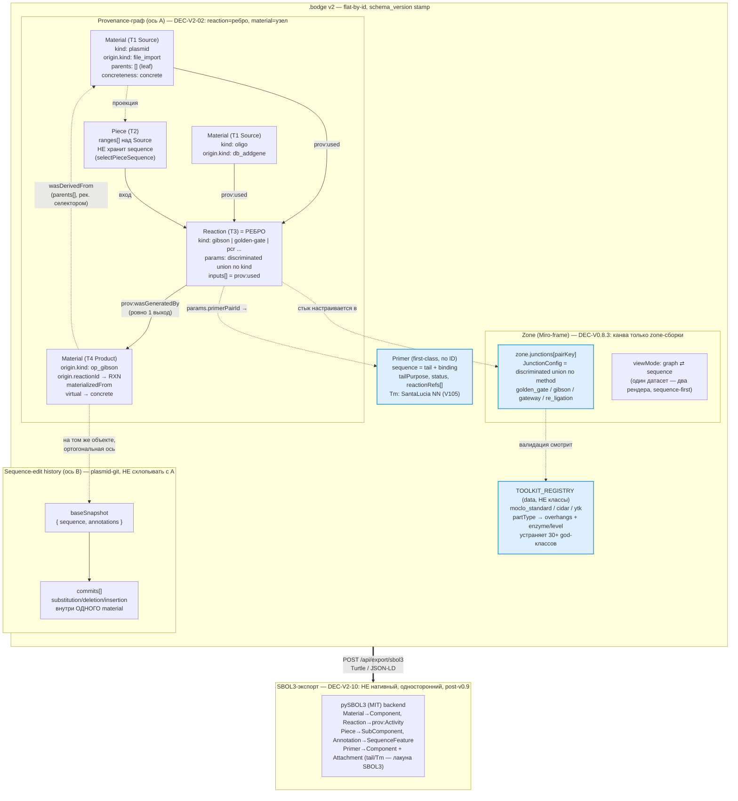

# BodgeGene — дизайн канваса v2: данные · праймеры · git · визуал

> **Тип:** дизайн-предложение (вход для решений Игоря/Chat). **Дата:** 02.06.2026. **Заменяет v1.**
> **Метод:** робастный multi-агентный research — 15 агентов (12 web+repo + 3 синтез), `tools/canvas-research-workflow.js`. Встроенный `/deep-research` в этой среде падает на StructuredOutput (2 прогона) — поэтому собран свой воркфлоу без schema-форсинга. Плюс архивные `COMPARATIVE_OPENCLONING/OSS_HARVEST.md` + сверка с ⚓.
> **Визуальная презентация:** `docs/prototype/provenance_canvas_v2.html` (+ ранний `canvas-design-mockup.html`).
> **Уважает залоченное:** `DEC-V2-02` (assembly = ребро DAG, не объект), zones-only (`DEC-V0.8.3-CANVAS-FINAL-MODEL`), sequence-first, `DEC-V2-10` (SBOL3 не нативный, только экспорт). Точки напряжения — врезки **⚠ Tension** внутри секций.

## §0. TL;DR — ключевые решения

1. **Provenance = bipartite-граф `Material`(узел) + `Reaction`(ребро)** ≈ OpenCloning sequences+sources ≈ PROV-O Entity/Activity. Наш four-tier (Source→Piece→Reaction→Product) — **проекция** этого графа, не отдельная онтология.
2. **ДВЕ ортогональные оси истории** (главная находка research): **A — provenance-DAG** «из чего собрано» (рёбра-реакции между материалами, N родителей) и **B — sequence-edit history** «что правилось в молекуле» (`plasmid-git`: baseSnapshot+commits, 1 предшественник). **Никогда не схлопывать** — ни в данных, ни в UI. SnapGene/QUEEN их схлопывают (UX-сокращение); OpenCloning/Benchling держат раздельно — берём раздельно.
3. **Git прикручиваем так:** ось A = provenance-граф (есть «бесплатно» из four-tier); ось B = возродить отвалившийся `plasmid-git` (TD-PLASMID-GIT-LOSS) как per-`Material` историю правок последовательности. Обе оси — на одном объекте, разные структуры, разные запросы.
4. **Праймеры:** единый пул (`primerSlice` + Dexie `primers`) + ссылки из реакций (PCR-реакция ссылается на 2 праймера пула); модель tail(5′-overhang)/binding; глифы на канвасе (PrimerTrack pentagon-arrows на pieces).
5. **Хранение:** плоские словари по id в `.bodge` v2 (как `CloningStrategy`): `input==[]` (а не null) для leaf-материала, `type`-дискриминатор, `schema_version` semver в файле + пошаговые миграции (взять у OpenCloning вместо wipe).
6. **Операции — discriminated-union по `kind`** (не «мешок params», не 16 god-классов): метод-специфичные ограничения (GG fusion sites, MoClo levels, Gateway att) — на варианте union.
7. **Визуал:** два согласованных вида одной модели (provenance-зоны ⇄ sequence-first editable, наш G/S-toggle); **глифы SBOL Visual 3** (specific, не generic; consistent backbone; явные стрелки); жест «+» под узлом → форма; React Flow grouping/auto-layout/виртуализация.
8. **Стандарты:** SBOL Visual — ✅ взять; SBOL3 **export** — ✅ взять (публикация/interop); SBOL3 native — ❌ нет (DEC-V2-10); GenBank-нотация координат — ✅ взять; pydna backend — 🟡 Q-STRAT.

## §1. Ландшафт OSS (сжато)

| Инструмент | Модель данных | Визуал/UX | Берём |
|---|---|---|---|
| **OpenCloning** | CloningStrategy: flat sequences+sources по id; 16 typed source; schema_version + миграции | family-tree; «+» под нодой → форма; hide-ancestors; read-only вьювер | provenance-модель, flat-by-id, schema-в-файле, «+», миграции |
| **SBOL Visual 3** | глифы ↔ SBOL3 + Sequence Ontology | promoter/RBS/CDS/terminator на backbone; specific-not-generic | визуальный словарь частей |
| **SBOL3 / PROV-O** | Component/Sequence/Feature; Entity/Activity/wasGeneratedBy | — | provenance-выравнивание + export |
| **DIVA / j5 / DeviceEditor** | j5 assembly pieces + junctions + methods | BioCAD drag иконок-частей → j5 | drag-частей, авто-дизайн сборки |
| **pydna** | overlap-граф (узлы=overlap, рёбра=fragment); Dseqrecord | библиотека | backend (Q-STRAT); что хранить в результате реакции |
| **React Flow** (@xyflow, у нас) | — | grouping/sub-flows, dagre/elk, виртуализация | зоны-группы, авто-раскладка, масштаб |

Полный разбор — в секциях ниже (§2 данные, §3 праймеры+git, §4 визуал) + `docs/archive/COMPARATIVE_*.md`.

---


# Модель данных

> **Статус locked-якорей.** Эта секция уважает: `DEC-V2-02` (assembly = ребро DAG, не объект с жизненным циклом), zones-only (`DEC-V0.8.3-CANVAS-FINAL-MODEL`), sequence-first (последовательность первична, `Piece` не хранит вычисленную последовательность), `DEC-V2-10` (SBOL3 не нативный формат, только экспорт). Точки напряжения вынесены в отдельные врезки **⚠ Tension**.

---

## 0. Исходный тезис: provenance-граф, а не дерево объектов

Опорная находка из аудита OpenCloning_LinkML ([CloningStrategy](https://opencloning.github.io/OpenCloning_LinkML/CloningStrategy/)) и из PROV-O ([W3C PROV-O](https://www.w3.org/TR/prov-o/)): история клонирования — это **bipartite-граф из двух типов узлов**, связанных целочисленными (у нас — строковыми) ID, а не вложенное JSON-дерево.

| OpenCloning | PROV-O | BodgeGene |
|---|---|---|
| `Sequence` | `prov:Entity` | материал (молекула / кусок ДНК) |
| `Source` | `prov:Activity` | операция, породившая материал |
| `Source.input[].sequence` (ID-ссылка) | `prov:used` | вход операции |
| `Sequence.source` (ID-ссылка) | `prov:wasGeneratedBy` | выход операции |
| `Source.input == []` | leaf-entity | материал без вычислимого происхождения (импорт, ручной ввод) |

Это **ровно** наш `DEC-V2-02`: операция (`Source`) — это ребро провенанса между материалом-узлами, а не контейнер с собственным жизненным циклом. OpenCloning кодирует граф как два плоских списка (`sequences[]` + `sources[]`), и диффинг, миграция и стриминг от этого становятся проще ([CloningStrategy](https://opencloning.github.io/OpenCloning_LinkML/CloningStrategy/)). Мы наследуем эту топологию, но не классовую иерархию (см. §4).

**Важная развилка из аудита версионирования.** Provenance-граф («из чего собрано») и история правок последовательности («что менялось в этой молекуле») — это **две ортогональные оси**, а не одна ось на разной гранулярности. OpenCloning и Benchling держат их раздельно; SnapGene и QUEEN схлопывают в один «history» — это UX-сокращение, не концептуальное единство. Мы держим раздельно:

- **Ось A — provenance DAG** (`Reaction`-рёбра между `Material`-узлами): «из чего собрано». Навигация назад к родителям / вперёд к продуктам. У продукта N родителей (Gibson = 3–6 фрагментов).
- **Ось B — sequence-edit history** (`baseSnapshot` + `commits[]` внутри одного материала, существующий `plasmid-git.js`): «какие правки внесены в эту молекулу». Линейный commit-лог. У версии один предшественник.

Эти две оси живут на одном объекте `Material`, но обслуживают разные запросы и **никогда не схлопываются** ни в UI, ни в данных.

---

## 1. Provenance-граф и его маппинг на четырёхуровневую модель

### 1.1 Узлы и рёбра

Граф провенанса BodgeGene состоит из узлов-**материалов** и рёбер-**реакций**:

```
Material (узел, prov:Entity)
   ▲                    │
   │ wasGeneratedBy     │ used (входы)
   │ (ровно один выход) ▼
Reaction (ребро, prov:Activity)
```

Наша четырёхуровневая канва (Source → Piece → Reaction → Product) — это **проекция** этого графа, а не отдельная онтология. Соответствие:

| Tier | Сущность канвы | Узел/ребро провенанса | prov-роль | Текущее хранилище |
|---|---|---|---|---|
| **T1 Source** | `Container` (`kind: plasmid/oligo/gblock/derived_product`) | leaf-`Material` (origin = file_import / manual / db) | `prov:Entity`, `input==[]` | `state.containers[]` |
| **T2 Piece** | `Piece` (диапазоны над источниками) | промежуточный `Material` | `prov:Entity` (wasDerivedFrom источника) | `state.pieces[]` |
| **T3 Reaction** | `Operation` (`kind: pcr/gibson/golden-gate/...`) | **ребро** | `prov:Activity` | `state.operations[]` |
| **T4 Product** | `Container` с `materializedFrom` | `Material` | `prov:Entity` (wasGeneratedBy Reaction) | `state.containers[]` (виртуальный → материализованный) |

Ключевое наблюдение из сравнения с OpenCloning: у нас **есть** уровни Piece/Library, которых нет у `CloningStrategy` (там все последовательности плоско; нет разделения «библиотека vs сборка»). Зато OpenCloning имеет явный `AssemblySource.input: [AssemblyFragment]` с `left_location`/`right_location`, кодирующими сайты связывания праймеров и зоны overlap ([AssemblyFragment](https://opencloning.github.io/OpenCloning_LinkML/AssemblyFragment/)) — это наш аналог `piece.ranges[]` + tail-геометрии праймеров.

### 1.2 DAG-рёбра как persisted-поле

Сейчас провенанс у нас **структурный** (плоский тег `container.origin.kind`), не обходимый граф: нет индекса «дай все транзитивные предки этого контейнера». Чтобы ось A стала навигируемой, на `Material` добавляется поле `parents[]` — это и есть рёбра DAG, заполняемые когда операция порождает материал:

```ts
parents: Array<{
  materialId: string;   // родитель-узел
  reactionId: string;   // ребро (Operation), через которое получен
  role: 'substrate' | 'insert' | 'backbone' | 'template' | 'primer' | 'fragment';
}>
```

Обход — чистый хелпер `getAncestors(materialId, materials, reactions) → MaterialNode[]` (предлагается в `lib/container-provenance.js`, ~6 KB; **не** в `plasmid-git.js` — оси не делят структуру данных).

> **⚠ Tension (DEC-V2-02).** `parents[]` на материале и `Reaction` как ребро — это **дублирование** одного ребра с двух концов (`reaction.inputs[]` смотрит на входы, `material.parents[]` смотрит назад). Это денормализация ради O(1)-обхода назад. Якорь `DEC-V2-02` гласит «reaction = edge, container = node» — формально `parents[]` на узле не нарушает это (это кэш ребра, а не новый класс `AssemblyContainer`), но требует поддержания консистентности при удалении операций. Альтернатива — выводить предков обходом `reactions[]` без денормализации; при текущих масштабах (10–50 конструктов) это допустимо, и `parents[]` можно сделать **выводимым селектором**, а не persisted-полем. **Рекомендация: вывести селектором, не хранить** — это снимает напряжение с якорем и риск рассинхрона.

---

## 2. Flat-by-id хранилище: Dexie + `.bodge` v2

### 2.1 Принцип: два плоских списка, связанных по ID

Вслед за `CloningStrategy` ([CloningStrategy](https://opencloning.github.io/OpenCloning_LinkML/CloningStrategy/)), в `.bodge` v2 граф кодируется **не** вложенным деревом, а плоскими словарями по ID. Это совпадает с тем, что уже делает `SPEC_BODGE_FORMAT_V2_CORE.md`.

Конвенции, перенятые напрямую из OpenCloning (раздел «Key concrete facts»):

1. **`input == []` (пустой массив), не `null`/отсутствие** — канонический способ отличить «материал без вычислимого провенанса» от «материал-продукт операции».
2. **`type`-дискриминатор на каждом полиморфном объекте** — LinkML-идиоматический discriminator для (де)сериализации (см. §4).
3. **`schema_version` как semver-строка** в корне файла — читается мигратором, чтобы знать, с какого звена цепочки стартовать (см. §5).
4. У нас — **строковые UUID** вместо целочисленных ID OpenCloning; ID-linking-паттерн остаётся, но строго на строках.

### 2.2 Форма `.bodge` v2 (корень)

```jsonc
{
  "schema_version": "2.0.0",        // semver-строка (VersionNumber-стиль OpenCloning)
  "app_version": "0.8.4-alpha",     // схлопнутый аналог backend_version + frontend_version
  "project": { "id": "...", "name": "...", "organism": "A.niger | T.reesei | ..." },

  // ── Плоские словари по ID (provenance-граф) ──
  "materials": { "<id>": { /* Material, см. §3 */ } },
  "reactions": { "<id>": { /* Reaction, discriminated union, см. §4 */ } },
  "primers":   { "<id>": { /* Primer, см. §3.3 */ } },

  // ── Канва (только зоны, DEC-V0.8.3) ──
  "zones":      { "<id>": { /* Zone с per-junction config, см. §3.4 */ } },
  "pieces":     { "<id>": { /* Piece, абстрактный слой, см. §3 */ } },

  // ── Канонические последовательности (sequence-first) ──
  // На диске .bodge: containers/<id>.gb (GenBank), provenance в COMMENT
  "containerRefs": ["<id>", ...]
}
```

Последовательности материалов хранятся как `containers/<id>.gb` (GenBank внутри ZIP), а провенанс (origin + commits оси B) — в GenBank `COMMENT`, как уже реализует `bodge-container-genbank.js`. Это прямое следствие `DEC-V2-10`: нативный формат — `.bodge` (ZIP + GenBank), не SBOL3 RDF.

### 2.3 Соответствие Dexie ↔ `.bodge`

OpenCloning не имеет клиентского store — состояние = JSON-файл. У нас две системы персистентности (это надо явно держать в голове):

| Что | Где | DB-версия |
|---|---|---|
| Библиотека (parts, containers, primers, snippets, commonFeatures) | **Dexie** `dexie-schema.js` | `DB_VERSION=6` |
| Состояние канвы (containers/pieces/operations/zones одного проекта) | **отдельный kv-store** `skeleton-persistence.js` (НЕ Dexie) | schema `v=10` (four-tier) |

Версионные штампы переносятся по образцу OpenCloning (три штампа: `schema_version` + `backend_version` + `frontend_version`):

- `project.schema_version` ← `CloningStrategy.schema_version` (одна semver-строка);
- `project.app_version` ← схлопнутые `backend_version` + `frontend_version` (у нас нет раздельного версионирования backend/frontend для формата).

Dexie-таблицы остаются flat-by-id (`containers` индексируется `id, projectId, kind, [projectId+kind]`). Provenance-граф материализуется при загрузке проекта из `containers` + GenBank-`COMMENT`.

---

## 3. Дуальность abstract ↔ concrete (план vs построенное) при sequence-first

### 3.1 Проблема и решение

Полевая лакуна (из аудита construct-canvas-ux): ни один инструмент не даёт **одновременно** «sketch-first» (поставить блок-намерение «promoter TBD» до того, как назначена последовательность — Genetic Constructor, [ACS SynBio](https://pubs.acs.org/doi/10.1021/acssynbio.7b00236)) **и** редактируемую sequence-first канву. j5/DeviceEditor делают чёткое разделение **Part (логический вход) vs Assembly Piece (физический фрагмент с праймерными хвостами)** ([j5 manual: target part order](https://j5.jbei.org/j5manual/pages/40.html), [DeviceEditor PMC](https://pmc.ncbi.nlm.nih.gov/articles/PMC3317443/)).

Мы решаем это **не** двумя датасетами, а **одним материалом с двумя состояниями concreteness**. Это согласуется с sequence-first якорем: последовательность первична, но **может быть отложенной (planned)**.

```ts
type Material = {
  id: string;
  type: 'material';               // discriminator
  name: string;

  // ── Абстрактный слой (план) ──
  intent?: {                      // что это ДОЛЖНО быть (sketch-first)
    role: string;                 // SO-term-совместимая роль: 'promoter' | 'cds' | ...
    toolkit?: string;             // 'moclo_standard' | 'cidar' | ... (см. §4.3)
    partType?: string;            // 'cds' | 'terminator' | ... — ключ в TOOLKIT_REGISTRY
  };

  // ── Конкретный слой (построенное) ──
  concreteness: 'planned' | 'concrete';
  // concrete: последовательность есть в containers/<id>.gb
  // planned:  последовательности ещё нет, материал — placeholder в графе

  origin: {                       // provenance-тег
    kind: 'file_import' | 'manual' | 'db_addgene' | 'db_ncbi'
        | 'op_pcr' | 'op_cut' | 'op_ligation' | 'op_gibson' | 'op_golden_gate' | 'op_kld';
    reactionId?: string;          // если порождён операцией
    dbId?: string;                // если внешний источник
  };

  parents: Array<{ materialId: string; reactionId: string; role: string }>;
  // (см. §1.2 — рекомендуется выводить селектором)

  topology: 'circular' | 'linear';

  // ── Ось B: sequence-edit history (plasmid-git, существующий) ──
  baseSnapshot?: { sequence: string; annotations: Annotation[] };
  commits?: Array<PlasmidGitCommit>;   // substitution/deletion/insertion внутри ОДНОГО материала
};
```

**Где `planned` ≠ нарушение sequence-first.** Sequence-first означает «последовательность первична как модель отображения и редактирования», а не «последовательность обязана существовать в каждый момент». Виртуальный продукт (T4) уже работает именно так у нас: пунктирная граница, последовательность из реактивного селектора `selectPieceSequence`, потом материализация (`container.materializedFrom`). Мы обобщаем тот же механизм на любой материал: `planned` материал — узел графа без `.gb`-файла; как только реакция исполнена или пользователь ввёл/импортировал последовательность, он становится `concrete`.

### 3.2 `Piece` остаётся абстракцией над источниками

`Piece` — это не материал, а **проекция-диапазон** (текущая модель, `DEC-CANVAS-4T-01`): он не хранит вычисленную последовательность (выводится `selectPieceSequence`), не хранит праймеры (ссылается через `acquisitionParams.primerPairId`), не хранит топологию (все pieces линейны).

```ts
type Piece = {
  id: string;
  type: 'piece';
  sourceIds: string[];
  ranges: Array<{ sourceId: string; start: number; end: number; orientation: 1 | -1 }>;
  acquisitionMethod: 'undefined' | 'pcr' | 'ov-pcr' | 'restriction' | 'direct' | 'synthesis';
  acquisitionParams: { primerPairId?: string; /* ... */ };
  functionalLabel?: string;
  // НЕТ: sequence (селектор), primers (по ссылке), topology (всегда linear)
};
```

Координаты диапазонов — **GenBank 1-indexed inclusive**, по образцу `SequenceRange` (паттерн `^\d+\.\.\d+$`) из OpenCloning ([SequenceRange](https://opencloning.github.io/OpenCloning_LinkML/SequenceRange/)). Это сознательное решение: устраняет класс off-by-one-багов при обмене с GenBank-инструментами. Где важна цепь (аннотации, геномные координаты) — используем `SimpleSequenceLocation`-стиль с обёрткой `complement(...)` ([SimpleSequenceLocation](https://opencloning.github.io/OpenCloning_LinkML/SimpleSequenceLocation/)); где цепь захвачена отдельным полем `orientation` — strand-agnostic диапазон.

### 3.3 Primer как first-class объект (унификация двух систем)

Из аудита primer-mgmt: у нас сейчас **три** формы праймера (assembly-draft, Dexie pool, legacy flat), и при промоушене designed→pool теряется tail/binding-разбивка. Унифицируем по образцу OpenCloning/j5 (праймеры — first-class в `primers[]`, на них ссылаются по ID; [Primer](https://opencloning.github.io/OpenCloning_LinkML/Primer/), [j5 master oligos](https://j5.jbei.org/j5manual/pages/43.html)) и Geneious/Benchling (extension/tail показывается отдельно, Tm «с хвостом и без»):

```ts
type Primer = {
  id: string;
  type: 'primer';
  name: string;
  sequence: string;          // полный 5'→3' (tail + binding)
  bindingSequence: string;   // annealing-регион (= pydna footprint)
  tailSequence: string;      // 5'-overhang ('' если хвоста нет)
  tm: number;                // Tm binding-региона (SantaLucia NN, ≡ tmBinding)
  tmFull?: number;           // Tm полного праймера (для импортированных без tail-контекста)
  gc: number;
  direction: 'forward' | 'reverse' | null;
  tailPurpose: 'overlap' | 'gg' | 're' | 'kld' | '';
  projectId: string | null;  // null = library-only
  status: 'imported' | 'designed' | 'ordered' | 'received' | 'archived';
  origin: { kind: 'file_import' | 'designed' | 'paste'; assemblyId?: string };
  reactionRefs?: Array<{ reactionId: string; role: 'fwd' | 'rev' }>;  // write-once на промоушене
};
```

Расширение Dexie `primers` — **чисто аддитивное** (новые столбцы `bindingSequence`, `tailSequence`, `gc`, `tailPurpose`, `tmFull`); старые строки читаются как `''`/`null` через `normalizePrimer`, **wipe не нужен**. Tm — только через `tm-calculator.js` (SantaLucia 1998 NN, якорь V105). На канве праймер — **не** самостоятельный узел, а аннотация PCR-ребра (рендер: solid pentagon-arrow для binding + полупрозрачный прямоугольник для tail — текущий `PrimerTrack.jsx`, менять не надо).

### 3.4 Zone и per-junction config

Zone — Miro-frame (`DEC-CANVAS-4T-07`); канва держит **только** zone-сборки (`DEC-V0.8.3`). Конфиг стыка живёт в `zone.junctions[pairKey]`, где `pairKey = "${leftSegmentId}__${rightSegmentId}"` (стабильная строка, не позиционный индекс):

```ts
type Zone = {
  id: string;
  bounds: { x: number; y: number; width: number; height: number };
  collapsed: boolean;
  viewMode: 'graph' | 'sequence';   // один датасет — два рендера (sequence-first)
  junctions: Record<string, JunctionConfig>;  // см. §4.2
};
```

> **⚠ Tension (sequence-first vs planned).** Sketch-first материалы (`concreteness: 'planned'`) рендерятся в sequence-view как разрывы/placeholder. Это согласуется с тем, как SBOL Visual рисует `omitted-detail` (ellipsis-разрыв в backbone, [SBOL Visual 3](https://sbolstandard.org/docs/SBOL-Visual-3.0.pdf)). Напряжение возникает, если пользователь захочет редактировать последовательность `planned`-материала посимвольно — её ещё нет. Решение: переход planned→concrete при первом вводе символа (как Benchling «click-to-position cursor, type to insert»). Это **не** нарушает якорь, но требует, чтобы sequence-view умел показывать planned-узел без `.gb`.

---

## 4. Операции как discriminated union по `kind` — без 16 god-классов

### 4.1 Главный принцип: один тип, дискриминант + per-method payload

Главный анти-паттерн (из аудита assembly-standards): god-класс на метод. Библиотека `moclo` (Larralde) демонстрирует провал в миниатюре — **30+ классов** (`CIDARPromoter`, `CIDARTerminator`, ...) существуют **только** чтобы хранить строки overhang'ов из утверждённого набора; фактический алгоритм совместимости — это **равенство строк на 4 символах**, затемнённое разрастанием классов ([moclo concepts](https://moclo.readthedocs.io/en/latest/concepts/index.html), [moclo CIDAR](https://moclo.readthedocs.io/en/latest/kits/cidar/index.html)).

Data-driven альтернатива (как Benchling и j5: метод = поле + per-method params-блоб; [Benchling Golden Gate](https://help.benchling.com/hc/en-us/articles/20473158763533-Modeling-Golden-Gate-assemblies-with-the-combinatorial-assembly-tool), [j5 manual](https://j5.jbei.org/j5manual/pages/22.html)): **один тип `Reaction`** с дискриминантом `kind` и union'ом per-method полей. Это совпадает с нашим центральным `op-kinds-registry.js` (`DEC-OPS-KIND-REGISTRY-01`).

```ts
type Reaction = {
  id: string;
  type: 'reaction';            // верхний discriminator
  kind: ReactionKind;          // внутренний discriminator
  inputs: Array<{ pieceId: string; role: string }>;   // prov:used
  outputs: string[];           // pieceId[] (prov:wasGeneratedBy)
  position: { x: number; y: number };
  zoneId: string;
  status: 'planned' | 'executed';
  executedAt?: string;
  params: ReactionParams;      // discriminated по kind — см. ниже
};

type ReactionKind =
  | 'pcr' | 'ov-pcr' | 'restriction' | 'ligation'
  | 'gibson' | 'golden-gate' | 'kld' | 'mutagenesis';

// Discriminated union — TS narrowing по kind:
type ReactionParams =
  | { kind: 'pcr';         primerPairId: string; addPrimerFeatures?: boolean }
  | { kind: 'ov-pcr';      primerPairId: string }
  | { kind: 'restriction'; enzymes: string[]; cut?: RestrictionSequenceCut[] }
  | { kind: 'ligation';    circular: boolean }
  | { kind: 'gibson';      circular: boolean }
  | { kind: 'golden-gate'; enzyme: 'BsaI'|'BpiI'|'BsmBI'|'BtgZI'|'SapI'; level?: 0|1|2|3 }
  | { kind: 'kld';         /* kinase-ligation-DpnI */ }
  | { kind: 'mutagenesis'; primerPairId: string };
```

Компат-проверка стыка — **чистая функция-switch** по дискриминанту, не диспетчеризация методов класса. Это покрывает три типа ограничений, к которым сводятся **все** методы (синтез из аудита assembly-standards):

- **(a) равенство тегов стыка** — GG fusion sites, Gateway att-sites, BioBrick RE-sites;
- **(b) локальная термодинамическая величина** — Gibson overlap Tm/length;
- **(c) запрет последовательности на уровне part** — BioBrick forbidden sites.

### 4.2 `JunctionConfig` — тоже discriminated union (на уровне Zone)

Конфиг стыка (живёт в `zone.junctions[pairKey]`) кодирует method-specific ограничения тем же приёмом. Поглощает j5-информированные поля (FAS, DSF, forced overhang; [DeviceEditor column directives](https://j5.jbei.org/DeviceEditor_manual/pages/106.html)) и pydna-результат сборки ([pydna assembly](https://pmc.ncbi.nlm.nih.gov/articles/PMC4472420/)):

```ts
type JunctionConfig =
  | { method: 'golden_gate';
      enzyme: 'BsaI'|'BpiI'|'BsmBI'|'BtgZI'|'SapI';
      upstreamOverhang: string;     // 4 bp
      downstreamOverhang: string;   // 4 bp соседа
      level?: 0|1|2|3;
      toolkit?: string;             // ключ в TOOLKIT_REGISTRY (§4.3)
    }
  | { method: 'gibson';
      overlapLength: number;        // 15–40 bp
      overlapTm: number;            // ≥48°C (NEB)
      overlapSeq?: string;
    }
  | { method: 'gateway';
      attVariant: 'B'|'L'|'R'|'P';
      attNumber: 1|2|3|4|5;         // MultiSite-орто-позиция
      reaction: 'BP'|'LR';
    }
  | { method: 're_ligation';
      prefixEnzyme: string; suffixEnzyme: string; scarSequence?: string;
    }
  | { method: 'overlap' | 'kld';
      overlapTarget?: number; overlapLength?: number; overlapTm?: number;
    };
```

`junctions_compatible(left, right)` — switch на `method`: для `golden_gate` сравнивает `downstreamOverhang === upstreamOverhang` + `enzyme`; для `gateway` — `attNumber` равны и реакции спарены; для `gibson` — `overlapTm ≥ 48` + проверка, что overlap-последовательность реально есть в обоих фланкирующих фрагментах.

### 4.3 Toolkit-ограничения как **data-registry**, не подклассы

MoClo/CIDAR/EcoFlex/YTK — это **разные реестры**, не разные классы (синтез assembly-standards). Toolkit = именованный constraint-set: словарь `(part_type → [upstream, downstream])` + назначение фермента на уровень. Чередование BsaI/BpiI по уровням ([MoClo PLoS ONE](https://journals.plos.org/plosone/article?id=10.1371/journal.pone.0016765), [Golden Standard NAR](https://academic.oup.com/nar/article/51/19/e98/7276311)) и каноничный набор 8 fusion-сайтов Level 0 (GGAG/TACT/AATG/AGGT/GCTT/CGCT/TGCC/ACTA) живут как данные:

```ts
const TOOLKIT_REGISTRY = {
  moclo_standard: {
    level: 0, enzyme: 'BsaI',
    partTypes: {
      promoter:   { upstream: 'GGAG', downstream: 'TACT' },
      '5utr':     { upstream: 'TACT', downstream: 'AATG' },
      cds:        { upstream: 'AATG', downstream: 'GCTT' },
      terminator: { upstream: 'AGGT', downstream: ['GCTT','CGCT','TGCC','ACTA'] },
    },
  },
  moclo_level1: { level: 1, enzyme: 'BpiI',
    positionOverhangs: ['TGCC','GCAA','ACTA','TTAC','CAGA','TGTG','GAGC','GGGA'] },
  cidar: { level: 0, enzyme: 'BsaI', partTypes: { /* тот же набор A–H */ } },
  ytk:   { /* другой набор overhang'ов */ },
} as const;
```

Материал получает `intent.toolkit` + `intent.partType` (строки); валидация смотрит ожидаемые overhang'и в реестре. **Ни одного класса** на toolkit или part-type. Запрет BioBrick-сайтов (EcoRI/XbaI/SpeI/PstI; [PMC4269934](https://pmc.ncbi.nlm.nih.gov/articles/PMC4269934/)) — part-level-ограничение на `Material` (простой string-scan), не junction-level. Уровень MoClo — свойство **сборки/реакции** (`reaction.params.level`), не отдельного фрагмента: Level-1-кассета несёт BpiI-сайты на backbone, поэтому следующая сборка автоматически берёт другой фермент.

> **⚠ Tension (enzyme-separation invariant).** Якорь `ENZYME_NOTE`: `GG_ENZYMES` (5 Type IIS, `golden-gate.js`) и `RE_ENZYMES` (63 классических, `restriction-db.js`) — две раздельные БД, не смешивать. В discriminated-union выше `golden-gate.params.enzyme` тянет из `GG_ENZYMES`, а `restriction.params.enzymes` — из `RE_ENZYMES`. Union **не** вводит общий «enzyme»-тип, который бы стёр границу; но runtime-guard'а нет (валидация только через `validate.js`). **Рекомендация:** TypeScript literal-типы (`'BsaI'|'BpiI'|...` vs `string[]`) делают границу видимой компилятору — это и есть «не смешивать» на уровне типов. Аудит OpenCloning отмечает, что их `RestrictionAndLigationSource` объединяет GG + классическую RE-лигацию под одним классом ([RestrictionAndLigationSource](https://opencloning.github.io/OpenCloning_LinkML/RestrictionAndLigationSource/)) — мы это **сознательно отвергаем**: разделение по `kind: 'golden-gate'` vs `kind: 'restriction'`+`'ligation'` биологически чище (Type IIS режет вне сайта, Type II — палиндром в сайте).

### 4.4 Результат реакции (pydna-информированный)

Реакция при исполнении пишет результат на выходной материал. Из аудита pydna ([Johansson 2015](https://pmc.ncbi.nlm.nih.gov/articles/PMC4472420/)): хранить **все** валидные продукты (не только основной — «неожиданные продукты» научно важны), `seguid`/`cseguid` на каждом продукте (rotation-invariant identity без хранения полной последовательности всюду), узлы-стыки = overlap-последовательности (не только длины), `circular` выводится из топологии графа, не из входного допущения:

```ts
type ReactionResult = {
  products: Array<{
    seguid: string;            // rotation-invariant checksum
    length: number;
    circular: boolean;         // из топологии графа сборки, не из входа
    junctions: Array<{
      leftFragmentId: string; rightFragmentId: string;
      overlapSeq: string; overlapLen: number;
      overlapType: 'homology' | 'sticky_end' | 'blunt';
    }>;
    fragmentOrder: string[];
  }>;
  primaryProductIndex: number;
};
```

---

## 5. `schema_version` и миграции

### 5.1 Штамп версии в файле — обязательное условие автомиграции

Единственная самая переносимая конвенция OpenCloning: `schema_version` (semver-строка) в корне файла, читаемая мигратором для выбора стартового звена цепочки ([releases](https://github.com/OpenCloning/OpenCloning_LinkML/releases)). Без этого поля автомиграция невозможна. У `.bodge` v2 это `project.schema_version`.

### 5.2 Pairwise-цепочка трансформаций

Механизм OpenCloning (прямо адаптируемый):

```
migrations/
  __init__.py                      # реестр упорядоченных пар версий
  transformations/
    v2_0_0_to_v2_1_0.{ts}          # одна функция на переход
    ...
  model_archive/
    v2_0_0.{ts}                    # замороженная модель каждой старой версии
  __tests__/migration.test.ts      # тест на каждую пару
```

4 шага на новую миграцию (по OpenCloning): (1) заморозить текущую модель в `model_archive/`, (2) написать transform-функцию, (3) зарегистрировать пару в реестре, (4) добавить тест. Backup создаётся автоматически перед миграцией.

### 5.3 Что мигрируем аддитивно, что — wipe

| Изменение | Стратегия | Обоснование |
|---|---|---|
| Dexie `primers` +5 столбцов (§3.3) | **Аддитивно**, без wipe | старые строки → `''`/`null` через `normalizePrimer`; индексы не меняются |
| Dexie `snippets`/`commonFeatures` | **Аддитивно** (v5/v6 уже так) | account-global, исключены из `clearAll` |
| `.bodge` v1 → v2 (provenance-граф, primer-унификация) | **Lossy-миграция** допустима | `SPEC_BODGE_FORMAT_V2_CORE §11.4`: plasmid-git history на диск ещё не персистится — терять нечего |
| Глобальный переход v0.5 → v0.6 (исторический) | **Wipe** | якорь `DEC-V2-08` «quality > speed» |

> **⚠ Tension (плоский wipe vs pairwise).** Текущая стратегия проекта — wipe (`DEC-V2-08`). Pairwise-модель OpenCloning требует, чтобы `schema_version` **уже был** в файле до того, как формат стабилизируется. **Это не конфликт, а последовательность:** wipe закрыл v0.5→v0.6; начиная с `.bodge` v2 мы вводим `schema_version` в файл — и с этого момента pairwise-цепочка применима к будущим v2.x→v2.y без wipe. Критическое предусловие — штамп версии в файле; без него мигратор не определит стартовый transform.

---

## 6. Выравнивание с PROV-O / SBOL3-экспортом

### 6.1 PROV-O: граф уже изоморфен

Наш `Material`/`Reaction`-граф изоморфен PROV-O Entity/Activity-цепочке ([PROV-O](https://www.w3.org/TR/prov-o/), [SBOL3 + PROV-O](https://www.frontiersin.org/journals/bioengineering-and-biotechnology/articles/10.3389/fbioe.2020.01009/full)):

```
Product_Material ←─wasGeneratedBy── Reaction_Activity
                                         │ used ──→ Fragment_Material (backbone)
                                         │ used ──→ Fragment_Material (insert)
                                         │ used ──→ Primer (если PCR)
                                         └ wasAssociatedWith ──→ Agent (BodgeGene v0.8.4)
Fragment_Material ──wasDerivedFrom──→ Source_Material (instance библиотечного part)
```

`reaction.inputs[]` = `prov:used` (с опциональным `role` ≈ `prov:Usage.roles`); `material.origin.reactionId` = `prov:wasGeneratedBy`; `material.parents[]` = `prov:wasDerivedFrom`-shortcut. На каждый `kind` реакции вешается `prov:type` (Gibson / GG-Type-IIS / RE-digest+ligation / KLD).

### 6.2 SBOL3 — только экспорт, не нативное хранилище

Якорь `DEC-V2-10`: SBOL3 как нативное хранилище отвергнут (RDF-overhead). SBOL3-экспорт — допустимый вторичный путь (Q-STRAT-09, post-v0.9.0). Маппинг на экспорте ([pySBOL3 data model](https://pysbol3.readthedocs.io/en/latest/sbol_data_model.html), [SBOL 3.1.0](https://sbolstandard.org/docs/SBOL3.1.0.pdf)):

| BodgeGene | SBOL3 | PROV-O |
|---|---|---|
| Source-`Material` (part) | `Component` (role = SO-term) | `prov:Entity` |
| `Piece` (часть на канве) | `SubComponent` внутри assembly-`Component` | `prov:Entity` |
| `Reaction` + params | `prov:Activity` (typed: Gibson/GG/RE/KLD) | `prov:Activity` |
| Product-`Material` | `Component` + `Sequence` | `prov:Entity` |
| `Primer` | `Component` (role `SO:0000112`) + `Attachment` для tail/Tm | `prov:Entity` |
| `Annotation` | `SequenceFeature` (SO-role + `Range`) | — |
| BodgeGene-инструмент | `prov:Agent` (SoftwareAgent) | `prov:Agent` |
| физический конструкт (wet-lab) | `Implementation` `wasGeneratedBy` build-Activity | будущий scope |

Реализация — в Python-бэкенде через **pySBOL3** (MIT, [ACS pySBOL3](https://pubs.acs.org/doi/10.1021/acssynbio.2c00249)): `POST /api/export/sbol3` принимает `.bodge` v2, возвращает Turtle/JSON-LD. IRI-неймспейс детерминирован: `https://sbol.bodgegene.app/{user_id}/{construct_id}/`. SO-term-маппинг (~15 строк, data-файл) и набор SBOL-Visual-глифов для аннотаций — по таблице из аудита sbol-visual (promoter→`SO:0000167`, cds→`SO:0000316`, reporter/marker→`cds` с label, insulator→`inert-dna-spacer` `SO:0002223`; [SBOL Visual 3](https://sbolstandard.org/docs/SBOL-Visual-3.0.pdf)).

> **⚠ Tension (известная лакуна экосистемы).** SBOL3 **не имеет** нативного представления primer-design (overhang/tail/Tm) — это пробел всей SBOL-экосистемы, не наш ([SBOL3 spec](https://sbolstandard.org/docs/SBOL3.1.0.pdf)). Праймеры экспортируются как `Component` (role `SO:0000112`) + tail/Tm уезжают в `Attachment` (CSV/JSON), привязанный к Activity через `prov:hadPrimarySource`. Это согласуется с `DEC-V2-10` (экспорт односторонний, round-trip не требуется) — потеря primer-метаданных на SBOL3-экспорте приемлема, потому что канонический store — `.bodge`.

---

## 7. Диаграмма



---

## 8. Сводка решений и точек напряжения

| # | Решение | Источник-образец | Якорь | Напряжение |
|---|---|---|---|---|
| 1 | Provenance = bipartite-граф (Material-узлы, Reaction-рёбра), flat-by-id | OpenCloning `CloningStrategy` | `DEC-V2-02` ✓ | `parents[]` денормализует ребро — **рекомендация: вывести селектором**, не хранить |
| 2 | Две ортогональные оси версионирования (A: DAG, B: plasmid-git) — не схлопывать | OpenCloning/Benchling (раздельно) vs SnapGene/QUEEN (слито) | — | UI должен держать раздельно; ось B живёт на том же `Material` |
| 3 | Abstract↔concrete = `concreteness: planned\|concrete` на одном Material | Genetic Constructor sketch-first | sequence-first ✓ | planned-узел без `.gb`; sequence-view должен его рисовать (как SBOL `omitted-detail`) |
| 4 | Reaction = discriminated union по `kind`; toolkit = data-registry | Benchling/j5; против `moclo`-30-классов | `DEC-OPS-KIND-REGISTRY-01` ✓ | enzyme-separation: TS literal-типы делают границу `GG_ENZYMES`/`RE_ENZYMES` видимой компилятору |
| 5 | `schema_version` в файле + pairwise-миграции | OpenCloning migrations | `DEC-V2-08` (wipe) | не конфликт, а последовательность: wipe закрыл v0.5→v0.6, pairwise начинается с v2.x |
| 6 | SBOL3 — только экспорт через pySBOL3 | SBOL3 + PROV-O | `DEC-V2-10` ✓ | primer tail/Tm — лакуна SBOL3, уезжает в `Attachment`; round-trip не нужен |
| 7 | Координаты GenBank 1-indexed (`SequenceRange`) | OpenCloning `SequenceRange` | — | устраняет off-by-one при обмене с GenBank-инструментами |
| 8 | Primer first-class, Dexie-расширение аддитивное | OpenCloning/j5/Geneious | V105 (SantaLucia) ✓ | wipe не нужен; `normalizePrimer` читает старые строки как `''`/`null` |

---

## Праймеры в модели

### Где живут праймеры: единый пул + ссылки из реакций

Праймер — **first-class сущность с единым пулом**, не вложенное поле фрагмента. Это решение совпадает с тем, как делают OpenCloning (`CloningStrategy.primers[]` на корне), j5 (общий master oligos list), Benchling и Geneious (отдельный oligo-реестр) — все референсные инструменты держат олигонуклеотиды в общем реестре и ссылаются на них из шагов сборки [OpenCloning_LinkML/Primer](https://opencloning.github.io/OpenCloning_LinkML/Primer/), [j5 Master Oligos List](https://j5.jbei.org/j5manual/pages/43.html), [Benchling Primer Design](https://www.benchling.com/primer-design-using-benchlings-molecular-biology-tools), [Geneious Primers](https://manual.geneious.com/en/latest/Primers.html).

У нас это уже реализовано как `primerSlice` (одна из 7 глобальных Zustand-слайсов) + Dexie-таблица `primers` (DB_VERSION=6, индексы `id, name, projectId, status, addedAt, resourceHash, [projectId+status]`). Текущая форма `PrimerRow`:

```js
{ id, name, sequence, tm, length, direction,
  projectId: string|null,                  // null = library-only / orphan
  status: 'imported'|'designed'|'ordered'|'received'|'archived',
  origin: { kind:'file_import'|'designed'|'paste', sourceFile?, designedInMix? },
  resourceHash, addedAt }
```

Ссылка из реакции — **по `id`, не встраивание**. В четырёхуровневой модели операция PCR хранит праймеры через `acquisitionParams.primerPairId` на Куске (`piece.acquisitionParams`), а сама `operation.params` ссылается на пул. Это прямой аналог `PCRSource.input[]` → `CloningStrategy.primers[]` у OpenCloning, где AssemblyFragment с `left_location:null, right_location:"32..51"` = forward-праймер, а фрагмент с обоими locations = матрица [OpenCloning_LinkML/AssemblyFragment](https://opencloning.github.io/OpenCloning_LinkML/AssemblyFragment/).

### Структурный разрыв (требует исправления)

Сейчас существуют **два расходящихся типа праймеров** (зафиксировано как open bug V130/V131):

- **Type A — assembly primers** (выход `designPrimersLocal`/`primer-derive.js`): несут `bindingSequence, tailSequence, tailPurpose, tmBinding, tmAdjusted, gc, direction, source{...}`, но живут эфемерно в `assemblyDraftPrimers[draftId][]`, **не в пуле**.
- **Type B — pool primers** (Dexie): несут только полный `sequence` + `tm`, **без** `bindingSequence`/`tailSequence`/`gc`.

При промоушене designed-праймера в пул split tail/binding **теряется**, и переиспользованный праймер не может восстановить tail без пересчёта из контекста сборки. Кроме того canvas-`primer-derive.js` НЕ получил pydna-фиксы ориентации tail (V123/V124/V125), которые получил `local-primer-design.js` — две системы расходятся.

**Рекомендация (аддитивный bump Dexie до v7, без wipe):** одна форма для всех праймеров; на промоушене переносить tail/binding целиком, на импорте — `bindingSequence = sequence, tailSequence = '', tailPurpose = ''`, `gc` считать. Никогда не пересчитывать ретроактивно. Pattern совпадает с pydna (`tail = seq[:-footprint_len]`, `footprint = seq[-footprint_len:]`, Tm только для footprint) и Geneious/Benchling (Tm «with and without the extension») [pydna](https://github.com/pydna-group/pydna), [Geneious Primers](https://manual.geneious.com/en/latest/Primers.html):

```js
// PrimerRow v7 (аддитивно; старые строки читаются как '' / null через normalizePrimer)
{ id, name,
  sequence,           // полный 5'→3' олиго (tail + binding)
  bindingSequence,    // отжигающаяся часть (= pydna footprint)
  tailSequence,       // 5' overhang ('' если нет хвоста)
  tm,                 // Tm binding-региона (SantaLucia NN, ≡ tmBinding) — ⚓ V105
  tmFull,             // Tm полного праймера
  gc,                 // GC% полного праймера (0–100)
  length, direction,  // 'forward' | 'reverse' | null
  tailPurpose,        // 'overlap' | 'gg' | 're' | 'kld' | '' — модель назначения хвоста
  projectId, status, origin, resourceHash, addedAt,
  reactionRefs?: [ { assemblyId, draftId, fragmentName, role:'fwd'|'rev' } ] // write-once на промоушене, только для трейсабилити, НЕ для lookup
}
```

### Модель tail (5'-overhang) / binding и хвосты под методы

Tail/binding split — **каноническая модель** (pydna `tail`/`footprint`; SBOL Visual рисует primer-binding-site как линию с загнутым концом — частичная комплементарная цепь, SO:0005850) [pydna](https://github.com/pydna-group/pydna), [SBOL Visual primer-binding-site](https://github.com/SynBioDex/SBOL-visual). Хвост (`tailPurpose`) кодирует назначение по нашим conventions V123–125 (`local-primer-design.js`):

| Метод | Хвост | Что несёт overhang |
|-------|-------|--------------------|
| Gibson / OV-PCR | `overlap` | гомология ~15–40 bp с соседним фрагментом; Tm overlap ≥48°C [NEB Gibson](https://www.neb.com/en/-/media/nebus/files/manuals/manuale2611.pdf) |
| Golden Gate | `gg` | сайт Type IIS (BsaI/BpiI из `GG_ENZYMES`) + 4-bp fusion site вне сайта узнавания |
| RE-лигирование | `re` | классический сайт (из `RE_ENZYMES`) + protective bases (`generateRETail`) |
| KLD | `kld` | фосфорилируемый 5'-конец без overhang |

Инвариант ⚓: `GG_ENZYMES` (5 Type IIS) и `RE_ENZYMES` (63 классических) — две раздельные БД, не смешивать. Все Tm через `tm-calculator.js` (SantaLucia 1998 NN, ⚓ V105; Wallace удалён).

### Праймеры НА канвасе и в графе провенанса

**На канвасе праймеры НЕ плавают как самостоятельные ноды.** Это аннотация ребра PCR-реакции (от контейнера-матрицы к контейнеру-продукту). Показываем в двух местах: (1) в попапе PCR-операции — пара fwd/rev с sequence, Tm, GC-бейджем, tag назначения хвоста; (2) в `AssemblyPrimersPanel` — пары, сгруппированные по `pairId`. Это совпадает с j5/DeviceEditor (нет «зоны» праймеров — они свойство junction) и с фокус-панелью n8n/Benchling (выбор ноды открывает параметры в боковой панели, канвас остаётся виден) [DeviceEditor PMC](https://pmc.ncbi.nlm.nih.gov/articles/PMC3317443/), [Benchling Assembly Wizard](https://www.benchling.com/blog/assembly-wizard).

**В SequenceView** рендеринг уже корректен (`PrimerTrack.jsx`): binding — сплошная пентагон-стрелка (SVG), хвост — полупрозрачный прямоугольник с 5'-стороны с вписанными основаниями; hit ищется через `indexOf` по top-strand (или RC для reverse), inline/wrapped tail для кольцевых. Это эталонная метафора SnapGene/Benchling/Geneious (цветные направленные стрелки + hover-popup со статами) — менять не нужно.

**В графе провенанса** PCR-реакция (Tier-3 Operation) ссылается на 2 праймера из пула как на входы. По PROV-O это `Activity used → Primer_Entity` (праймер = `prov:Entity`, used реакцией), что точно ложится на `PCRSource.input[]` = 2 AssemblyFragment'а из `primers[]` + матрица [PROV-O](https://www.w3.org/TR/prov-o/), [OpenCloning_LinkML/PCRSource](https://opencloning.github.io/OpenCloning_LinkML/PCRSource/).

### UX: дизайн / заказ / Tm

Жизненный цикл `status` (`imported → designed → ordered → received → archived`) трекает выполнение в лаборатории — это паттерн j5 master oligos (дедуп по sequence перед перезаказом) [j5 Master Oligos List](https://j5.jbei.org/j5manual/pages/43.html). Переиспользование — через `PrimerSuggestionsPanel`/`PrimerReusePicker`: при дизайне нового праймера запрашиваем пул по сходству `bindingSequence` и показываем совпадения с бейджем статуса (ordered/received). Дизайн — единственный source of truth (`reactionRefs` write-once, для контекста «использован в сборке pUC19, fwd для GFP-вставки», но не для поиска).

---

## Git / версионирование

### Двухосевой инсайт: это РАЗНЫЕ оси, не одна

Ключевой вывод исследования: provenance и edit-history — **две ортогональные оси, а не одна ось на разной гранулярности**. Молекула может иметь богатую edit-историю без provenance (набрана с нуля) или глубокий provenance-DAG без правок (собрана и не менялась); в типичном случае у неё есть обе. OpenCloning и Benchling правильно держат их как **разные структуры данных и разные UI-поверхности**; SnapGene и QUEEN схлопывают обе в один embedded «history» — это UX-сокращение, не концептуальное объединение [Benchling version history](https://benchling.com/tutorials/1/version-history), [OpenCloning_LinkML](https://opencloning.github.io/OpenCloning_LinkML/), [QUEEN PMC9130275](https://pmc.ncbi.nlm.nih.gov/articles/PMC9130275/).

| | Ось A: Provenance-DAG | Ось B: Sequence-edit history |
|---|---|---|
| Вопрос | «Из чего и как СОБРАНА молекула?» | «Какие правки внесены в ЭТУ молекулу?» |
| Структура | DAG поверх многих Container'ов | линейный commit-log внутри одного Container |
| Узлы | молекулы + операции | версии одной последовательности |
| Слияние | продукт имеет N родителей (Gibson = 3–6) | один предшественник (кроме branch/revert) |
| У нас | четырёхуровневый граф (Operation = ребро) | `plasmid-git` (baseSnapshot+commits+replay) |
| Эталоны | OpenCloning, SBOL3/PROV-O, SnapGene (частично) | Benchling version history, BioStudio |

**Ответ на вопрос «одно ли это и то же»: нет.** Это две оси, и обе должны жить на одном объекте Container, но обслуживать ортогональные запросы и **никогда не смешиваться** ни в данных, ни в UI.

### Текущее состояние

**Ось A** в четырёхуровневой модели **частично уже есть и достаётся бесплатно**: операции ссылаются на входные/выходные Куски/Контейнеры (`operation.inputs[]`/`operation.outputs[]`), у Container есть `origin.kind` (`op_pcr/op_cut/op_ligation/file_import/...`). Но это **плоские теги провенанса**, не traversable-граф: нет индекса «дай всех транзитивных предков этого контейнера». Это прямой аналог OpenCloning, где `Sequence.source → Source.input[] → Sequence` образует bipartite ID-linked DAG (не вложенное дерево) — структура, по которой удобно diff'ить и мигрировать [OpenCloning_LinkML/CloningStrategy](https://opencloning.github.io/OpenCloning_LinkML/CloningStrategy/), [OpenCloning_LinkML/Source](https://opencloning.github.io/OpenCloning_LinkML/Source/).

**Ось B** (`plasmid-git`) **существует, протестирована (~20 Vitest), но отключена** (TD-PLASMID-GIT-LOSS). Проверено в коде: `baseSnapshot + commits[] + replay` (поддержка substitution/deletion/insertion с indel-aware ремаппингом координат, `replayDiff` для подсветки, `resolveAutoOverride` для codon-level конфликтов), но всё это keyed на `fragment.*` — на сущность, удалённую в v0.5-верстак cleanup. `createPlasmidGitReducers` экспортируется, но **не импортируется ничем** в текущем four-tier коде. При этом `bodge-container-genbank.js` уже имеет слот `provenance.commits[]`, структурно совместимый с plasmid-git, но **никто его не наполняет**.

### Рекомендация: подключить ОБЕ оси, чисто и раздельно

**Ось A — Assembly Provenance Graph (новый concern, НЕ в plasmid-git):**

1. Персистентное поле `parents[]` на Container — `[{ containerId, operationId, role }]`, наполняется когда операция производит контейнер. Это ребро DAG. Совпадает с PROV-O `wasGeneratedBy`/`used` и с OpenCloning `Source.input[]` [PROV-O](https://www.w3.org/TR/prov-o/).
2. Helper `getAncestors(containerId, containers, operations) → ContainerNode[]` для будущей визуализации (PlasmidVersionTree из reserved wizards).
3. Жить должно в новом `lib/container-provenance.js` (~6 KB), **не** в `plasmid-git.js`. Две оси не делят структуру данных.

```
Container
  ├── origin: { kind, operationId, ... }       ← Ось A: тег провенанса (есть сейчас)
  ├── parents: [{ containerId, operationId }]   ← Ось A: рёбра DAG (новое поле)
  ├── baseSnapshot: { sequence, annotations }   ← Ось B: plasmid-git (есть, отключено)
  └── commits: [{ id, type, parentPos, ... }]   ← Ось B: plasmid-git (есть, отключено)
```

**Ось B — revive (НЕ replace) plasmid-git:**

Код корректен, протестирован, а формат `.bodge` v2 уже резервирует слот персистентности — выбрасывать нечего, паттерн baseSnapshot+commits+replay тот же, что у Benchling и BioStudio. Без него у нас провенанс слабее SnapGene, который «автоматически генерирует графическую историю каждой правки» [SnapGene features](https://www.snapgene.com/features). Путь возрождения, **узко заскоупленный** под M-C Container Window (контейнер в four-tier = 1:1 то, что было fragment):

1. Привязать `createPlasmidGitReducers` к **Container-слайсу** (не fragment-слайсу — его больше нет как primary-сущности). Container Window — естественная точка крепления, это «SnapGene-like» per-molecule редактор.
2. Добавить `baseSnapshot` и `commits[]` в модель Container; наполнять `provenance.commits[]` в `bodge-container-genbank.js` при записи, гидрировать `container.commits` из COMMENT при чтении.
3. **Персистить на диск** — критичный пробел (сейчас commits runtime-only). Цель — `containers/<id>.gb` формата v2 (SPEC_BODGE_FORMAT_V2_CORE §16).
4. **НЕ расширять** plasmid-git на provenance. Только substitution/deletion/insertion внутри одной последовательности; `parentPos`-модель координат уже правильная.
5. `TD-ARCH-ANNOTATION-VERSIONING` (versioning аннотаций) — отдельный будущий спринт, не в скоупе revive.

### Как оси взаимодействуют

Они живут на одном Container, но навигируются раздельно: **Ось A** — через граф операций CanvasSkeleton (DAG-view, будущий M-I polish / PlasmidVersionTree); **Ось B** — через `plasmid-git replay` в Container Window. Точка стыка: когда Level-1/собранный продукт материализуется и далее правится — provenance говорит «собран из родителей X,Y», edit-history говорит «потом заменён codon 47». Это и есть unified-модель QUEEN (все предковые истории embedded в новый GenBank), но мы реализуем её через `.bodge` + GenBank COMMENT, а не через RDF/quine [QUEEN PMC9130275](https://pmc.ncbi.nlm.nih.gov/articles/PMC9130275/).

### Что хранить в .bodge

Соблюдая ⚓ **DEC-V2-10 (SBOL3-not-native)** и **DEC-V2-02 (DAG-as-edge)**: native-формат = `.bodge` (ZIP + GenBank), провенанс — в **GenBank COMMENT**, не в SBOL3 RDF. SBOL3-экспорт остаётся допустимым вторичным путём (Q-STRAT-09, post-v0.9.0), где Ось A ложится на `prov:Activity`-цепочку (одна Activity на операцию, `used`-входы, `wasGeneratedBy` на продукт) [SBOL3 + PROV-O](https://pysbol3.readthedocs.io/en/latest/sbol_data_model.html).

Заимствовать у OpenCloning один портируемый паттерн немедленно: **`schema_version` (semver-строка) в корне `.bodge`** — миграционный CLI читает его, чтобы выбрать стартовую трансформацию; без поля в файле миграция не автоматизируется. Также: `input: []` (пустой массив, не `null`) как канонический признак leaf/external-источника, и `type`-дискриминатор на полиморфных объектах [OpenCloning_LinkML releases](https://github.com/OpenCloning/OpenCloning_LinkML/releases), [OpenCloning_LinkML/SourceInput](https://opencloning.github.io/OpenCloning_LinkML/SourceInput/).

**Итог по «revive vs replace»: revive обе оси.** Ось A — расширить существующие плоские теги до traversable-DAG через новый `parents[]` + helper (не трогая plasmid-git). Ось B — оживить plasmid-git как есть, gated на M-C Container Window, с персистом в `containers/<id>.gb`. `.bodge` хранит обе оси в GenBank COMMENT; SBOL3 — будущий one-way экспорт.

---

# VISUAL + INTERACTION — провенанс-канвас ⇄ sequence-first редактор, SBOL Visual 3 glyph-set, апгрейд мокапа

> **Скоуп.** Раздел задаёт визуальный язык и interaction-модель для двух координированных представлений ОДНОЙ модели (four-tier Source/Piece/Reaction/Product + zones), glyph-набор для аннотаций, паттерны React Flow, таблицу «взять / не брать» и SPEC мокапа. Опирается на токены `DESIGN_SYSTEM.md` и locked ⚓ (см. §0). Реализационные детали (reducers, Dexie) — вне скоупа; здесь — визуал и UX.

---

## 0. Якоря, которые этот раздел НЕ нарушает

| ⚓ | Что значит для визуала |
|----|------------------------|
| **DEC-V2-06 DAG-as-primary-view** | Корневой workspace проекта = DAG (граф провенанса). Список/tree — projection (side-panel toggle), не главный экран. Version-timeline (§3.7) — это affordance *внутри* DAG, не замена ему. |
| **DEC-V2-02 / DEC-V2-13..14 DAG-as-edge** | Reaction = ребро-гиперребро (ProjectCommit, N→M), Container = узел. Никаких «AssemblyContainer» с lifecycle. Reaction-нода на канвасе — это **визуализация ребра** (ромб), а не объект-сущность. |
| **DEC-V2-01 один Container** | Один тип молекулярного артефакта. Glyph-set различает *аннотации внутри* контейнера, не классы контейнеров. |
| **Sequence-first (архитектурный принцип)** | G/S-toggle рендерит ОДИН датасет двумя способами. Piece не хранит computed sequence — селектор деривирует. SequenceView **editable**, не read-only как OpenCloning. |
| **DEC-V2-10 SBOL3-not-native** | SBOL Visual 3 берём как **glyph-словарь для рендера** (SO-термины → форма). НЕ как формат хранения. Provenance — в `.bodge` + GenBank COMMENT, не SBOL3 RDF. |
| **DEC-LIB-16 read-only по умолчанию** | Sequence-панель открывается read-only; правка символов — после явного клика READ-ONLY→EDITABLE pill. Аннотации редактируемы в обоих режимах. |
| **ENZYME_NOTE** | `GG_ENZYMES` (Type IIS) и `RE_ENZYMES` (классические) — два словаря. Reaction-preview никогда не смешивает их в одном пикере. |
| **Okabe-Ito + feature-palette A+v2** | Reaction-class цвета (emerald/violet/orange/cyan/neutral/blue) и feature-class цвета (sepia-палитра) — из `DESIGN_SYSTEM.md §2.1`. Stroke арок `#3A2F1F`. |
| **DEC-V0.8.3-CANVAS-FINAL-MODEL** | Канвас держит ТОЛЬКО zone-сборки, не одиночные container-ноды. «+»-под-нодой (§3.1) добавляет операцию/источник в зону, не свободный узел. |

---

## 1. Два координированных представления одной модели

Принцип: **одна модель, две проекции, переключаемые тумблером G/S** (Graph ↔ Sequence). Это не два датасета — это `selectPieceSequence` / DAG-селекторы, рисующие один state двумя способами (sequence-first ⚓). Источник идеи координированных видов — Benchling «three synchronized views» (sequence/linear/plasmid map, [benchling.com/editor](https://benchling.com/editor)) и SnapGene dual map/sequence — но мы расширяем: левый вид у нас не «ещё одна карта», а **граф провенанса** (USP, DEC-V2-06), а правый — **editable sequence-first** (чего нет в OpenCloning, [opencloning.github.io](https://opencloning.github.io/OpenCloning_LinkML/)).

### 1.1 G-вид (Graph / provenance zone-canvas) — `viewMode: 'graph'`

Левая проекция. Зона (React Flow group-node, DEC-CANVAS-4T-07) показывает сборку как **provenance-DAG**: Source-контейнеры → Reaction-ромбы → Product-контейнеры. Соответствует pydna assembly-graph (узлы = overlap/junction, рёбра = фрагменты, [github.com/pydna-group/pydna](https://github.com/pydna-group/pydna)) и OpenCloning Source-as-Activity ([Sequence ≡ prov:Entity, Source ≡ prov:Activity](https://opencloning.github.io/OpenCloning_LinkML/)).

- Узел-контейнер: `ContainerNode` (DESIGN_SYSTEM §4.1) — 160×64, topology-indicator (○/—), origin-badge, EndsBadge.
- Reaction: `ProjectCommitNode` — ромб 32×32, fill = reaction-class color, inner icon per kind (Combine/Scissors/Copy), label снизу («Gibson», «Digest»).
- 3-lane auto-layout (DEC-CANVAS-4T-31): sources-lane → intermediate (dagre/elk LR) → finals-lane.

### 1.2 S-вид (Sequence-first editable) — `viewMode: 'sequence'`

Правая проекция. Тот же набор pieces, но как **горизонтальный rail из частей слева-направо 5'→3'** (метафора Geneious Construct Layout + DeviceEditor bin-row, [manual.geneious.com/Cloning](https://manual.geneious.com/en/latest/Cloning.html), [DeviceEditor PMC3317443](https://pmc.ncbi.nlm.nih.gov/articles/PMC3317443/)), под каждой частью — её sequence в JetBrains Mono + дорожки (annotation/primer/AA/restriction). Это переиспользуемый `SequenceView` (не bespoke — см. memory `feature_reuse_sequence_viewer`), расширенный primer-lane.

3-state машина зоны (уже в коде, `zone-sequence-mode/index.jsx`): **empty → palette → assembled**. S-вид рендерит `ZonePaletteView` (части ещё не собраны, как DeviceEditor bins) либо `ZoneAssembledView` (собранный продукт с sequence + швами).

### 1.3 Тумблер и синхронизация

```
┌─ Zone toolbar ────────────────────────────────────────┐
│  [�myAssembly ▾]   ( ◉ Граф │ ○ Последовательность )  ⌄ │   ← segmented toggle, G/S
└────────────────────────────────────────────────────────┘
```

- Toggle — `segmented control` (две кнопки-pill, активная = `--accent-50` bg + `--accent-500` border). Хоткей **Ctrl+1 / Ctrl+2** (наследие 4-view ⚓, переосмыслено: 1=Graph, 2=Sequence).
- `zone.viewMode` persisted per-zone (zones data-model уже несёт это поле).
- **Coordinated selection** (правило Benchling): выделение piece в G-виде подсвечивает её sequence-блок в S-виде и наоборот. Hover на Reaction-ромбе в G → подсветка шва (junction) в S-виде (паттерн SnapGene History-colors, [snapgene.com/features](https://www.snapgene.com/features)).
- Переход анимируется `--motion-slow 250ms ease-default` (cross-fade, не slide — оба вида занимают то же место).

---

## 2. SBOL Visual 3 glyph-set → наши feature-типы

Берём SBOL Visual 3 sequence-feature glyphs ([SBOL-Visual 3.0 spec](https://sbolstandard.org/docs/SBOL-Visual-3.0.pdf), [github.com/SynBioDex/SBOL-visual](https://github.com/SynBioDex/SBOL-visual)) как **форму** аннотации. Цвет берём из нашей feature-palette A+v2 (SBOL цвет не мандатит — [«color SHOULD be used, not mandated»](https://pmc.ncbi.nlm.nih.gov/articles/PMC8560346/)). Это апгрейд текущих прямоугольных rect'ов `AnnotationTrack` до семантических глифов.

### 2.1 Маппинг наших типов на глифы

| Наш `feature.type` | SBOL Visual glyph | SO term | Форма | Fill (light, из palette) |
|--------------------|-------------------|---------|-------|--------------------------|
| `CDS` | **cds** | SO:0000316 | прямоуг. со скошенным концом-стрелкой | `#B0C84A` |
| `marker` (resistance) | **cds** + label | SO:0000316 | как CDS, различение лейблом | `#D9836B` (коралл) |
| `reporter` (GFP/mCherry) | **cds** + label | SO:0000316 | как CDS, различение лейблом | `#5DA5C4` (sky-cyan) |
| `promoter` | **promoter** | SO:0000167 | загнутая стрелка ⌐→ | `#FFC400` |
| `terminator` | **terminator** | SO:0000141 | T-образный над backbone | `#D97B3B` |
| `rep_origin` | **origin-of-replication** | SO:0000296 | круг ○ на backbone | `#E8B333` |
| `RBS` | **ribosome-entry-site** | SO:0000139 | полуовал на backbone | `#B8AA8A` |
| `primer_bind` | **primer-binding-site** | SO:0005850 | линия с загнутым концом | `#9EBAD9` |
| `protein_bind` / `operator` | **operator** | SO:0000057 / SO:0000409 | «чашка» с прогибом backbone | `#6DA4C4` (operator) / `#A5CFD5` (cap) |
| `misc_feature` | **unspecified** | SO:0000001 | generic rect (fallback) | `#EEE7D5` (ivory) |

Различение reporter/marker от обычного CDS — **только лейблом + цветом** (SBOL не имеет отдельного glyph; [«Reporter = CDS»](https://pmc.ncbi.nlm.nih.gov/articles/PMC8560346/)). Это совпадает с нашим `feature-palette.js` (resistance→коралл, reporter→sky-cyan, оба CDS-семейства).

### 2.2 Обязательные правила SBOL (нормативные, соблюдаем все)

1. **Specific, не generic.** Если тип известен — рисуем конкретный глиф (promoter = загнутая стрелка), а не generic box. Generic `unspecified` — только для `misc_feature`/неизвестного. Это прямо повышает читаемость vs текущие одинаковые rect'ы.
2. **Consistent backbone.** Один backbone-стиль на весь контейнер: либо одинарная линия (ssNA), либо двойная (dsNA) — не смешивать в одном виде ([SBOL Visual 2.0–3.0 normative](https://pmc.ncbi.nlm.nih.gov/articles/PMC8560345/)). Наши контейнеры dsDNA → одинарная линия backbone (упрощение, dsDNA подразумевается). Bounding-box глифа **касается** backbone.
3. **Explicit arrows = direction.** Глифы с присущей направленностью (CDS, promoter, terminator) кодируют strand формой стрелки. Reverse-strand глиф **повёрнут на 180°** (или horizontal flip), читается 5'→3' справа-налево. Forward — над backbone, reverse — под (опционально). Это уже частично есть (reverse-аннотации), формализуем через rotation-rule.
4. **Молекулярные виды НЕ касаются backbone** (на будущее — для interaction-диаграмм; пока вне скоупа, но glyph-primitive проектируем с этим инвариантом).
5. **Polypeptide-regions** (tag/his/linker/2A) — chevron-границы ВНУТРИ родительского CDS-глифа (SO:0000839), не отдельный блок на backbone. Совпадает с нашей 3-level annotation моделью (detail внутри region, ⚓).

### 2.3 Реализационная заметка для рендера

- Один shared SVG-primitive `<FeatureGlyph type role start end strand>` в `tracks/AnnotationTrack.jsx` (HARD-breached 48.54 KB → **декомпозиция обязательна перед расширением**, size-budget). Глифы — параметрические pSVG в духе paraSBOLv ([PMC8546602](https://pmc.ncbi.nlm.nih.gov/articles/PMC8546602/)): функция возвращает path + baseline-endpoint.
- SO-term хранится в `feature.soTerm` (additive), резолв `type → glyph` — статическая мапа (как `TOOLKIT_REGISTRY` data-driven, не классы).
- Цвет — `featureColorShaded(type, name)` (уже есть): три CDS на плазмиде → видимо разные оттенки в рамках hue, семейство сохраняется.

---

## 3. Interaction-паттерны

### 3.1 «+»-под-нодой → форма (OpenCloning pattern)

Под каждым Product/Source-контейнером в G-виде — призрачная кнопка **`+`** (видна на hover, `--text-tertiary`, 16px). Клик → inline-форма выбора следующей операции (OpenCloning «add source step», [docs.opencloning.org](https://docs.opencloning.org/)). Это «продли провенанс отсюда».

```
   ┌──────────────┐
   │  pUC19  ○    │
   │  2686 bp     │
   └──────┬───────┘
         (+)              ← hover-affordance
          │
   ┌──────┴──────────────────────┐
   │ Что сделать с pUC19?         │   ← OpKindPicker (уже есть)
   │ [Digest] [PCR] [Gibson]…     │
   └──────────────────────────────┘
```

- Форма — `OpKindPicker` / `OpPopupRouter` (в коде). Выбор kind → method-specific popup (PCROpPopup, GibsonOpPopup…).
- Reaction-picker показывает **только валидные** kind'ы для топологии входа (circular → KLD доступен; linear → нет; ⚓ chooseStrategy fragmentContext).
- **Два клика максимум** (⚓): hover→`+` (клик 1) → выбор kind (клик 2) → форма уже открыта.

### 3.2 Drag part-icons в зону (DeviceEditor pattern)

В S-виде режим `palette`: слева палитра library-частей с feature-глифами (§2). Биолог **тащит глиф в зону** → часть встаёт в rail на позицию drop (5'→3' порядок). Метафора DeviceEditor «drag SBOLv icon to canvas» ([DeviceEditor manual](https://j5.jbei.org/DeviceEditor_manual/pages/26.html)) + Genetic Constructor block-placement ([ACS SynBio](https://pubs.acs.org/doi/10.1021/acssynbio.7b00236)).

- Drop меняет порядок pieces в зоне (`ZonePaletteView`, уже есть PieceCard).
- При наведении на позицию между частями — **insertion indicator** (вертикальная `--accent-500` линия, 2px).
- Часть из library = read-only island (Benchling parts pattern, [benchling.com/blog/parts](https://www.benchling.com/blog/parts-for-modular-sequence-design)): серый фон, правка через «Edit source».

### 3.3 Drag-edge (соединение)

В G-виде: тащим от output-handle одного контейнера к input-handle Reaction-ромба → создаём ребро. Метафора Geneious drag-to-reorder + React Flow native connect. **Junction-compatibility color** на конце ребра (Geneious tag-junction: green=compatible/red=incompatible/grey=unused, [manual.geneious.com](https://manual.geneious.com/en/latest/Cloning.html)) — наш USP: показываем химию стыка inline, чего нет ни в одном tool (construct-canvas-ux synthesis).

- Cross-zone рёбра рендерим `SmartStepEdge` (избегает коллизий, [@jalez/react-flow-smart-edge](https://github.com/Jalez/react-flow-smart-edge)); intra-zone — `smoothstep` (дёшево).

### 3.4 Hide-ancestors / collapse-zone

- **Collapse-zone**: каждая зона — collapsible group (React Flow `hidden` на child-нодах + `node.data.collapsed`, [reactflow.dev/examples/layout/expand-collapse](https://reactflow.dev/examples/layout/expand-collapse)). Свёрнутая зона = один titled-bar с числом частей. Метафора Blender Node Group / Unreal comment-box ([code.blender.org/2025/05/frame-node-improvements](https://code.blender.org/2025/05/frame-node-improvements/)).
- **Hide-ancestors**: на любом контейнере — context-action «Скрыть предков» → прячет upstream-под-DAG (рекурсивно `hidden`), оставляя текущий узел как leaf. Для разбора больших провенанс-графов. Обратно — «Показать происхождение». Re-layout через elk после toggle.

### 3.5 Reaction preview

При открытой Reaction-форме (§3.1) — **живой preview результата ДО коммита** (то, чего нет в DeviceEditor — там «run j5, потом смотри в VectorEditor», construct-canvas-ux). Панель preview показывает (модель pydna Contig, [PMID 25933606](https://pmc.ncbi.nlm.nih.gov/articles/PMC4472420/)):

- **figure-ASCII** компактно: `35|frag1|61 / frag2|…` (имена + длины overlap'ов).
- Топология продукта (circular/linear) — derived из графа, не из допущения.
- Список junction'ов: overlap-seq (uppercase), длина, тип (homology/sticky/blunt).
- **Все продукты, не только primary** (pydna возвращает все пути — «unexpected products» научно важны).
- Виртуальный продукт на канвасе = пунктирный контур (`VirtualOutputBadge`, уже есть), материализуется по «Выполнить».

### 3.6 Primer glyphs lane

В S-виде под sequence-блоком части — **отдельная primer-дорожка** (`PrimerTrack`, уже есть). Праймеры — НЕ свободные ноды (cloning-primer-mgmt recommendation): они аннотации PCR-реакции.

- Binding region: solid pentagon-arrow (направленный), цвет нейтральный/binding.
- 5'-tail (overlap/RE/GG): полупрозрачный rect к 5'-стороне стрелки, с вписанными основаниями (метафора SnapGene/Benchling/Geneious «extension shown separately», [manual.geneious.com/Primers](https://manual.geneious.com/en/latest/Primers.html)). Цвет tail = reaction-class (overlap→emerald, gg→violet, re→orange) — консистентно с junction.
- Hover-popup: name, Tm (binding), Tm (full), GC%, tailPurpose-badge (паттерн j5 two-Tm, [j5.jbei.org](https://j5.jbei.org/j5manual/pages/43.html)).
- Wrapped tail на line-break / circular — уже решено (wrap-tail-* тесты).

### 3.7 Git / version-timeline affordance

**Не отдельный экран** (DEC-V2-06: DAG — primary). Timeline — это горизонтальная **ось-проекция DAG-провенанса**, доступная как toolbar-toggle. Это Axis A (assembly-provenance, versioning-git-dna): «из чего собрано», а НЕ Axis B (sequence-edit история — то отдельно, в Container Window через plasmid-git).

```
┌─ Version timeline (collapsible strip под toolbar) ──────────────────────┐
│  ● import ── ◆ PCR ── ◆ Gibson ── ◇ (virtual) ── now                    │
│  pUC19      amplicon  product      preview                              │
└──────────────────────────────────────────────────────────────────────────┘
```

- Узлы timeline = ProjectCommit-рёбра в топологическом порядке (SnapGene History-tree, [snapgene.com/features](https://www.snapgene.com/features)).
- **Click commit → History-colors**: подсвечивает в S-виде, какие основания пришли с какого шага (SnapGene single-click origin-tracing). В G-виде — подсвечивает соответствующее ребро + входы.
- Diamond-glyph commit'а = reaction-class color (консистентно с G-видом).
- Virtual/uncommitted шаг = пунктирный ◇.
- Это «git/version» в смысле «лог сборки», не VCS-бранчинг (Axis B — отдельная фича Container Window, не смешиваем — versioning-git-dna verdict).

### 3.8 «Два клика» — сводка

| Действие | Клики |
|----------|-------|
| Продлить провенанс (новая реакция) | hover→`+` → выбор kind |
| Свернуть зону | клик на collapse-icon зоны |
| Переключить G/S | Ctrl+1 / Ctrl+2 (0 кликов) |
| Origin-tracing | click commit в timeline |
| Добавить часть | drag глиф из палитры (1 жест) |
| Открыть reaction-preview | клик на Reaction-ромб |

---

## 4. React Flow паттерны (для зон-канваса)

Версия @xyflow/react v12. Все рекомендации — из reactflow-ux research, привязаны к нашему DEC-SKELETON-01 (изолированный state) и DEC-CANVAS-4T-07/31.

### 4.1 Grouping / `extent: 'parent'`

- Зона = `type: 'group'` node (custom `ZoneNode`), части — `parentId: zoneId`.
- **Soft containment** для большинства зон: БЕЗ `extent:'parent'` (Blender-frame семантика — зона как label, части можно вынести). Toggle «Зафиксировать в зоне» → включает `extent:'parent'` (Unreal «Group Movement» mode).
- Критично: **parent-нода в массиве ДО детей** (иначе React Flow не обработает).
- `expandParent: true` — зона растёт при перетаскивании части к краю.

### 4.2 Auto-layout: dagre + elk

| Engine | Где | Конфиг |
|--------|-----|--------|
| `@dagrejs/dagre` (~40KB, fork — оригинал unmaintained) | Project-DAG (existing), intermediate-lane | быстрый sync, простой DAG |
| `elkjs` (~1.4MB, async) | четырёх-tier zone-layout, «Tidy Up» | `elk.algorithm: layered`, `direction: RIGHT`, **`hierarchyHandling: INCLUDE_CHILDREN`** (критично — иначе sub-flow раскладывается отдельно) |

- `useAutoLayout` hook: использовать `node.measured.width/height` (v12 API) для точного размера.
- Триггер: только на структурные изменения (add/delete/connect), не на каждый render.

### 4.3 Virtualization / performance

- `onlyRenderVisibleElements` — default prop (рендер только видимого вьюпорта).
- `React.memo` на ВСЕ custom-ноды (`ContainerNode`, `ZoneNode`, `OperationNode`) — крупнейший single-выигрыш.
- Стабильный `nodeTypes`/`edgeTypes` — определять ВНЕ компонента (иначе remount всех нод).
- **Semantic zoom**: при `zoom < 0.4` нода рендерит упрощённый цветной rect (только имя) — паттерн Miro/Figma. Наш масштаб (10–50 конструктов) комфортен для React Flow (предел ~200+ плотных нод).
- Selection — через CSS (`.react-flow__node.selected`), НЕ циклом по нодам с set `selected`.

### 4.4 MiniMap

```jsx
<MiniMap pannable zoomable
  nodeColor={(n) =>
    n.type === 'zone' ? 'var(--surface-3)' :
    n.type === 'reaction' ? reactionColor(n.data.kind) :  // emerald/violet/orange…
    'var(--accent-300)'}                                   // container
  maskColor="rgba(15,20,40,0.7)" position="bottom-right" />
```

`nodeColor` как функция → цвет-кодирование по tier (zone/reaction/container), реплицируется в minimap.

### 4.5 Viewport (Figma-mode)

`panOnScroll` + `selectionOnDrag` + `panOnDrag={[1,2]}` (middle/right=pan) + `selectionMode="partial"` (lasso ловит частично задетые ноды) + `multiSelectionKeyCode="Meta"`. `fitView({duration:400})` для «показать всё».

---

## 5. «Взять / не брать» с источниками

| # | Паттерн | Источник | Взять? | Обоснование |
|---|---------|----------|--------|-------------|
| 1 | Provenance-DAG как корневой вид (Source→Reaction→Product) | OpenCloning ([opencloning.github.io](https://opencloning.github.io/OpenCloning_LinkML/)) | ✅ Взять | Совпадает с DEC-V2-06; наш USP. |
| 2 | «+»-под-нодой → форма следующего шага | OpenCloning ([docs.opencloning.org](https://docs.opencloning.org/)) | ✅ Взять | «Два клика», натурально продлевает граф. |
| 3 | Drag SBOLv-глифа в bin/row | DeviceEditor ([PMC3317443](https://pmc.ncbi.nlm.nih.gov/articles/PMC3317443/)) | ✅ Взять | Прямой паттерн для palette-режима зоны. |
| 4 | SBOL Visual 3 glyph-набор (specific shapes) | [SBOL-Visual 3.0](https://sbolstandard.org/docs/SBOL-Visual-3.0.pdf) | ✅ Взять | Апгрейд rect→семантические глифы; standard. |
| 5 | Junction-compatibility color на стыке (green/red) | Geneious ([manual.geneious.com](https://manual.geneious.com/en/latest/Cloning.html)) | ✅ Взять | Самый плотный feedback; усиливаем «химией стыка». |
| 6 | History-colors (click step → подсветка происхождения) | SnapGene ([snapgene.com/features](https://www.snapgene.com/features)) | ✅ Взять | Origin-tracing в S-виде + timeline. |
| 7 | Reaction-preview ДО коммита (все продукты, ASCII-figure) | pydna ([PMID 25933606](https://pmc.ncbi.nlm.nih.gov/articles/PMC4472420/)) | ✅ Взять | Закрывает DeviceEditor friction «run-then-look». |
| 8 | Primer extension/tail показан отдельно от binding | Geneious/Benchling/j5 ([j5.jbei.org](https://j5.jbei.org/j5manual/pages/43.html)) | ✅ Взять | Уже частично есть (PrimerTrack tail). |
| 9 | Two-Tm (full + binding-region) в primer-popup | j5 ([j5manual](https://j5.jbei.org/j5manual/pages/43.html)) | ✅ Взять | Дополнить PrimerTrack hover. |
| 10 | elk `hierarchyHandling: INCLUDE_CHILDREN` для sub-flow | reactflow-ux | ✅ Взять | Единственный корректный путь tier-aware layout. |
| 11 | Semantic zoom < 0.4x → упрощённая нода | reactflow-ux (Miro/Figma) | ✅ Взять | Performance + читаемость zoomed-out. |
| 12 | Focus-panel при select (params в side, не modal) | n8n ([community.n8n.io](https://community.n8n.io/t/help-us-test-some-canvas-improvements/201703)) | ✅ Взять | Канвас остаётся виден при правке части. |
| 13 | Read-only part-island с propagation от master | Benchling ([benchling.com/blog/parts](https://www.benchling.com/blog/parts-for-modular-sequence-design)) | ✅ Взять | Library-driven design; совпадает с DEC-LIB. |
| 14 | Combinatorial bins (вертикальный стек вариантов) | DeviceEditor/Genetic Constructor ([ACS SynBio](https://pubs.acs.org/doi/10.1021/acssynbio.7b00236)) | 🟡 Отложить | Полезно, но не в этом скоупе; зарезервировать lane под варианты (VariantGroupBadge уже есть). |
| 15 | SBOL3 RDF как формат хранения | [SBOL3.1.0](https://sbolstandard.org/docs/SBOL3.1.0.pdf) | ❌ Не брать | DEC-V2-10: native = `.bodge`+GenBank. SBOL3 — только future export (Q-STRAT-09). |
| 16 | Класс-на-метод сборки (god-class) | moclo Python lib ([moclo.readthedocs.io](https://moclo.readthedocs.io/en/latest/concepts/index.html)) | ❌ Не брать | assembly-standards: data-driven discriminated-union (method-field + params), не 30+ классов. Совпадает с DEC-V2-01. |
| 17 | Insulator glyph | SBOL Visual ≤2.2 | ❌ Не брать | Deprecated в v2.3 → `inert-dna-spacer` (SO:0002223). |
| 18 | Drag-to-build на горизонт. rail только block-level | Genetic Constructor (sunset 2018) | 🟡 Адаптировать | Берём rail-метафору, но добавляем editable sequence под каждым блоком (наш sequence-first), чего у GC не было. |
| 19 | Объединять Golden Gate + RE-ligation в один класс | OpenCloning `RestrictionAndLigationSource` | ❌ Не брать | ENZYME_NOTE: GG (Type IIS) ≠ RE (Type II) — два словаря, биологически чище раздельно. |
| 20 | Hide-ancestors / collapse через `hidden` | React Flow ([expand-collapse example](https://reactflow.dev/examples/layout/expand-collapse)) | ✅ Взять | Для больших провенанс-графов. |

---

## 6. SPEC апгрейд-мокапа

Целевой файл-прототип: `docs/prototype/provenance_canvas_v2.html` (статический HTML-мокап для визуальной приёмки, CHAT_PLAYBOOK §2). Light + dark обязательны (⚓ 1.3). Все цвета — CSS-vars из `tokens.css`. Шрифты Inter + JetBrains Mono.

### Layout (fullscreen, DESIGN_SYSTEM §5.1)

```
┌──────────────────────────────────────────────────────────────────────────────┐
│ App topbar (48px):  ‹ Назад   Project ▸ myAssembly        [☀/☾]  [⚙]          │
├──────────────────────────────────────────────────────────────────────────────┤
│ Zone toolbar (40px): [myAssembly ▾]  ( ◉ Граф │ ○ Послед-ть )  [Tidy Up] [⌕]  │
├──────────────────────────────────────────────────────────────────────────────┤
│ Version timeline (28px, collapsible):  ●import─◆PCR─◆Gibson─◇now               │
├───────────────┬────────────────────────────────────────────────┬──────────────┤
│ Side-list     │  PANEL A — zone-canvas (G-вид)                  │  Legend /    │
│ (containers,  │  ┌─ zone: backbone+insert ───────────────┐     │  Focus-panel │
│  projection,  │  │  [pUC19 ○]──◆Digest──[bb —]           │     │              │
│  DEC-V2-06)   │  │       (+)        ↘                     │     │  selected:   │
│  narrow 320px │  │  [insert —]──◆PCR──[ampl —]──◆Gibson──◇│     │  GFP CDS     │
│               │  └────────────────────────────────────────┘    │  Tm/GC…      │
│               │  ──────────────  ИЛИ (по тумблеру) ──────────── │              │
│               │  PANEL B — sequence-first (S-вид)              │  ┌─Legend──┐ │
│               │  ╞═promoter⌐→╪═══CDS▰▰▶═══╪═term⊤═╡  ← rail    │  │ ⌐→ prom │ │
│               │   ATGCTA…       atgGFP…      taa…              │  │ ▰▶ CDS  │ │
│               │   ▭ ann-lane (glyphs §2)                       │  │ ○ ori   │ │
│               │   ◄▬▬ primer-lane (binding+tail §3.6)          │  │ ⊤ term  │ │
│               │   AA-lane / restriction-lane                  │  │ ▸ primer│ │
│               │                                                │  └──────────┘ │
│               └────────────────────────────────────────────────┴──────────────┘
│  MiniMap (bottom-right, nodeColor по tier §4.4)                                │
└──────────────────────────────────────────────────────────────────────────────┘
```

### Панель A — zone-canvas (Graph)
- ≥1 зона = titled group-frame (`--surface-1` bg, `--border-default`, label «myAssembly», collapse-icon).
- 3-lane: sources слева, reaction-ромбы + intermediate в центре (elk LR), finals справа.
- Reaction-ромбы цветом reaction-class; `+`-affordance под Product (hover).
- Один пунктирный virtual-product ◇ (preview-состояние).
- Junction-compat dot на одном ребре (green) и одном (red) — демонстрация §3.3.

### Панель B — sequence-first (Sequence)
- Horizontal rail из 3–4 частей (promoter/CDS/terminator/ori) с **SBOL-глифами §2** (не rect'ы!).
- Под каждой частью — mono-sequence (JetBrains Mono, `--text-mono-base`, letter-spacing 0.025em).
- 4 дорожки: annotation-glyphs, **primer-lane** (pentagon-arrow + полупрозрачный tail-rect с основаниями), AA-lane, restriction-lane.
- READ-ONLY pill в title-row (DEC-LIB-16) + кнопка→EDITABLE.
- Один шов (junction) подсвечен (демонстрация coordinated-selection с панелью A).

### Version timeline
- Горизонтальная strip: `●` (leaf import) → `◆` (committed reaction, reaction-class color) → `◇` (virtual). Hover commit → tooltip с kind+inputs. Click → подсветка (стейт в мокапе можно фиктивный).

### Legend (правый верх)
- Mini-таблица глифов §2 (форма + цвет + подпись): promoter ⌐→, CDS ▰▶, ori ○, terminator ⊤, RBS ◗, primer ▸, operator ⌣.
- Reaction-class swatches: Gibson (emerald), Golden Gate (violet), RE (orange), KLD (cyan), PCR (blue), blunt (neutral).
- Под легендой — Focus-panel (n8n pattern §5 #12): при select части показывает её props (Tm/GC/length/origin) без modal.

### Состояния для приёмки
1. **Default** — G-вид, зона раскрыта, virtual-preview виден.
2. **S-вид** — тот же набор, sequence-first rail с глифами + primer-lane.
3. **Collapsed-zone** — зона свёрнута в один bar «myAssembly · 4 parts».
4. **Reaction-preview open** — ромб Gibson выбран, side-panel с ASCII-figure + список продуктов.
5. **Dark mode** — все 4 состояния в `[data-theme="dark"]`.

### Acceptance-критерии мокапа
- Light/dark эквивалентны, контраст ≥4.5:1 (⚓ 1.3, 7.2).
- Ни одного hardcoded hex — только var() (⚓ 9.4).
- Глифы §2 различимы по форме (не только цвету — ⚓ 9.8 color-blindness).
- G/S toggle визуально очевиден; timeline читается как «лог сборки».
- Reaction-ромбы и timeline-diamonds — один и тот же reaction-class цвет (консистентность).
- Никаких emoji в chrome (⚓ 9.3); иконки — lucide-стиль.

---

## 7. Открытые вопросы (для дизайн-сессии, не блокеры)
1. Глифы reverse-strand: rotate-180° vs horizontal-flip — выбрать один и зафиксировать (SBOL допускает оба).
2. Backbone-линия в S-виде: рисовать ли непрерывную линию сквозь все части rail, или per-part. Склоняюсь к непрерывной (SBOL consistency-rule).
3. Timeline-strip: всегда виден или collapse-by-default. Предлагаю collapse-by-default (information-density, но без перегруза).
4. Combinatorial-варианты (#14): зарезервировать вертикальный bin-stack в зоне под будущий sprint — нужен ли placeholder уже сейчас в мокапе.
5. Точный inner-icon для каждого Reaction-kind ромба (Combine/Scissors/Copy/…) — дорисовать custom SVG (DESIGN_SYSTEM open-q #7).
```

Файлы, на которые опирается раздел (абсолютные пути): `D:\RESplasmide\docs\DESIGN_SYSTEM.md` (токены, §2.1 reaction/feature цвета, stroke `#3A2F1F`), `D:\RESplasmide\ANCHORS.md` (DEC-V2-01/02/06/10, DEC-LIB-16, DEC-CANVAS-4T-07/31), `D:\RESplasmide\gui\designer\src\feature-palette.js` (типы CDS/promoter/reporter/marker/rep_origin/RBS/primer_bind/protein_bind/operator + `featureColorShaded`/`canonicalFeatureKey`), `D:\RESplasmide\gui\designer\src\components\SequenceView\` (переиспользуемый редактор: `tracks/AnnotationTrack.jsx` — HARD-breached 48.54 KB, требует декомпозиции перед расширением глифами; `tracks/PrimerTrack.jsx`, `tracks/AATrack.jsx`, `tracks/RestrictionTrack.jsx`), `D:\RESplasmide\gui\designer\src\components\CanvasSkeleton\canvas\zone-sequence-mode\` (3-state машина empty/palette/assembled: `index.jsx`, `ZonePaletteView.jsx`, `ZoneAssembledView.jsx`, `PieceCard.jsx`), `D:\RESplasmide\gui\designer\src\components\CanvasSkeleton\canvas\operations\` (OpKindPicker, OpPopupRouter, GibsonOpPopup и др. — формы для «+»-под-нодой), `D:\RESplasmide\gui\designer\src\components\CanvasSkeleton\canvas\VirtualOutputBadge.jsx` (пунктирный virtual-product). Целевой мокап для создания: `D:\RESplasmide\docs\prototype\provenance_canvas_v2.html`.
