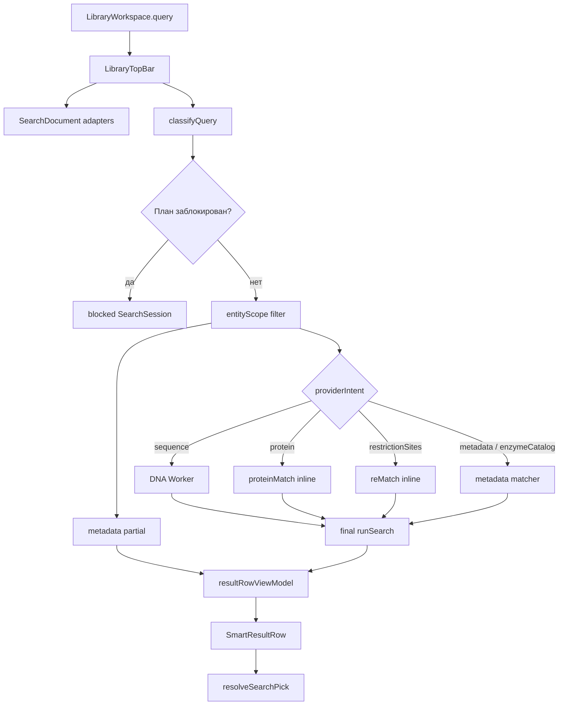

# BodgeGene — Техническая архитектура поиска

Техническая документация для разработчиков. Редакция: 14 июля 2026 года.

**Фактическая база:** worker-resilience и REV #2 Stages 0–2 завершены; Stages 3–6 ещё не считаются реализованными. Руководящая продуктовая спецификация: [`SMART_SEARCH_SCOPES_PREFIXES_REV2.md`](../SMART_SEARCH_SCOPES_PREFIXES_REV2.md).

Пользовательский синтаксис и лабораторные примеры вынесены в [`USER_GUIDE_SEARCH.md`](USER_GUIDE_SEARCH.md). Этот документ объясняет внутренние контракты, поток данных и причины архитектурных решений.

## Содержание

- [Цели и поток данных](#1-цели-архитектуры)
- [Модули и QueryPlan](#3-модули-и-ответственность)
- [Парсер, diagnostics и profiles](#5-registry-lexer-и-serializer)
- [Документы, scope и metadata matcher](#8-searchdocument-и-адаптеры)
- [DNA, protein и restriction providers](#11-dna-provider)
- [Асинхронность, результаты и настройки](#14-partial-final-и-worker-resilience)
- [Состояние поверхностей и расширение](#17-текущее-состояние-поисковых-поверхностей)
- [Тесты, ограничения и roadmap](#19-доказательные-тесты)

---

## 1. Цели архитектуры

Глобальный поиск библиотеки решает несколько разных задач через один нормализованный pipeline. Остальные поисковые поверхности мигрируют на общий контракт поэтапно:

- текстовый поиск по пользовательским сущностям;
- поиск мотивов ДНК;
- поиск пептидов по аннотированным CDS;
- поиск карточек рестриктаз;
- поиск сайтов рестрикции в молекулах;
- быстрый metadata-only фильтр дерева.

Основные инварианты:

1. Обычный запрос не включает справочные каталоги.
2. Область поиска, вычислительный provider и AND-фильтры — независимые оси.
3. Условие, которое конкретная поверхность не умеет исполнить, не может считаться совпадением.
4. Один локальный `id` разных типов сущностей не должен смешивать результаты.
5. DNA-расчёт в штатном Worker-режиме не блокирует интерфейс и не публикует устаревший ответ; inline providers и fallback имеют более слабые гарантии.
6. Метрика должна отражать биологический смысл: совместимость IUPAC не называется идентичностью.
7. Каталог праймеров и проверка их посадки остаются разными задачами.

### Почему поиск разделён на контракты

Сырая строка, Zustand-модели, биологические алгоритмы и UI меняются с разной скоростью. Если связать их напрямую в React-компоненте, добавление нового типа сущности или provider потребует переписать весь путь. Поэтому система разделена на четыре основных контракта:

```text
raw query → QueryPlan
store entities → SearchDocument[]
providers → SearchOccurrence[]
SearchResult[] → view model и kind-aware routing
```

---

## 2. Сквозной поток данных



Практическая последовательность в верхней строке:

1. `LibraryTopBar` нормализует молекулы, проекты и праймеры в `SearchDocument`.
2. Предварительный `QueryPlan` решает, нужно ли строить документы каталога ферментов.
3. Ввод проходит debounce 180 мс.
4. Facade повторно классифицирует строку с пользовательским `minQueryLen`.
5. Error-gate блокирует противоречивый план до biological providers.
6. `entityScope` фильтрует документы до partial, worker и final.
7. Metadata partial публикуется синхронно.
8. Нужный biological provider вычисляет occurrences.
9. Final-сессия публикуется только если запрос всё ещё актуален.
10. Результат преобразуется в UI-модель и маршрутизируется по `entityRef.kind`.

Двойная классификация в `LibraryTopBar` и facade — переходный технический долг. Stage 3 должен дать controller-owned `QueryPlan`, общий для collection gate и исполнения.

---

## 3. Модули и ответственность

| Модуль | Ответственность |
|---|---|
| [`search-prefix-registry.js`](../../gui/designer/src/lib/search-prefix-registry.js) | Канонические префиксы, EN/RU-алиасы, readiness и метаданные режима |
| [`search-query-lexer.js`](../../gui/designer/src/lib/search-query-lexer.js) | Токены, кавычки, escapes, source spans и lexer diagnostics |
| [`query-classify.js`](../../gui/designer/src/lib/query-classify.js) | `raw string → QueryPlan`, конфликты, scope narrowing, serializer |
| [`search-profiles.js`](../../gui/designer/src/lib/search-profiles.js) | Возможности разных поисковых поверхностей |
| [`search-types.js`](../../gui/designer/src/lib/search-types.js) | Переходные JSDoc-типы поиска; известный runtime drift описан ниже |
| [`search-prefs.js`](../../gui/designer/src/lib/search-prefs.js) | Validation и localStorage пользовательских настроек |
| [`search-document-adapters.js`](../../gui/designer/src/lib/search-document-adapters.js) | Молекулы, проекты, праймеры и bridge старого формата |
| [`search-enzyme-adapters.js`](../../gui/designer/src/lib/search-enzyme-adapters.js) | Карточки классических и пользовательских рестриктаз |
| [`search-entity-key.js`](../../gui/designer/src/lib/search-entity-key.js) | Глобальный ключ `<kind>:<id>` |
| [`library-search.js`](../../gui/designer/src/lib/library-search.js) | Scope, metadata matching, ranking, result grouping и tree ledger |
| [`seq-match.js`](../../gui/designer/src/lib/seq-match.js) | Выбор DNA-алгоритма и нормализация occurrences |
| [`sequence-search-bio.js`](../../gui/designer/src/lib/sequence-search-bio.js) | Exhaustive short/IUPAC/circular DNA scan |
| [`sequence-search.js`](../../gui/designer/src/lib/sequence-search.js) | Long linear seed-and-extend |
| [`iupac.js`](../../gui/designer/src/lib/iupac.js) | Bit-mask compatibility и reverse complement IUPAC |
| [`protein-match.js`](../../gui/designer/src/lib/protein-match.js) | Поиск пептида и обратное отображение в координаты ДНК |
| [`derived-protein.js`](../../gui/designer/src/lib/derived-protein.js) | Сплайсинг, рамка, трансляция и `aaToGenomicMap` |
| [`re-match.js`](../../gui/designer/src/lib/re-match.js) | Разрешение имени фермента и сканирование recognition sites |
| [`search.worker.js`](../../gui/designer/src/lib/search.worker.js) | Vite Worker entrypoint |
| [`search-worker-core.js`](../../gui/designer/src/lib/search-worker-core.js) | Чистый library-wide DNA scan |
| [`search-worker-client.js`](../../gui/designer/src/lib/search-worker-client.js) | Worker lifecycle, timeout, cancel, respawn и inline fallback |
| [`search-service.js`](../../gui/designer/src/lib/search-service.js) | request IDs, partial/final и stale-drop |
| [`search-facade.js`](../../gui/designer/src/lib/search-facade.js) | Сборка providers, error-gate и единая точка вызова для UI |
| [`search-result-vm.js`](../../gui/designer/src/lib/search-result-vm.js) | `SearchResult →` плоская модель строки |
| [`search-result-format.js`](../../gui/designer/src/lib/search-result-format.js) | Честные русские метрики и биологические объяснения |
| [`search-pick-route.js`](../../gui/designer/src/lib/search-pick-route.js) | Чистое kind-aware решение, что открыть |
| [`open-entry-action.js`](../../gui/designer/src/lib/open-entry-action.js) | Безопасное открытие молекулы с dirty guard и nav ordering |
| [`legacy-primer-migrate.js`](../../gui/designer/src/lib/legacy-primer-migrate.js) | Lossless перенос старого праймера в канонический пул |
| [`useSearchPickRouter.js`](../../gui/designer/src/components/Library/hooks/useSearchPickRouter.js) | Store/UI side effects выбранного маршрута |
| [`LibraryTopBar.jsx`](../../gui/designer/src/components/Library/LibraryTopBar.jsx) | Текущий controller верхнего поиска и dropdown |
| [`SearchSettingsModal.jsx`](../../gui/designer/src/components/Library/SearchSettingsModal.jsx) | UI расширенных настроек |
| [`EnzymeCard.jsx`](../../gui/designer/src/components/Library/EnzymeCard.jsx) | Карточка фермента и отдельное действие `cut:` |

---

## 4. QueryPlan: исполняемый смысл запроса

Базовая JSDoc-модель находится в `search-types.js`. У плана есть три независимые исполняемые оси:

```js
{
  entityScope,      // где искать
  providerIntent,   // какой вычислительный механизм запустить
  fieldClauses      // дополнительные AND-условия
}
```

`uiPreset` используется только для отображения режима. Движок не должен восстанавливать из него scope или provider.

### Известный drift JSDoc-контракта

`search-types.js` пока нельзя считать исчерпывающей runtime-схемой:

- реальные `SearchDocument` также содержат `features`, top-level `topology`, `kind` и `projectId`;
- runtime `SearchMatch.dimension` включает `enzyme`;
- реальные сессии используют `partial` и `blocked`;
- JSDoc требует `location.targetKey`, но providers его не создают;
- provider возвращает ещё не обогащённую occurrence, а `targetRef` добавляет `library-search`.

Следующая синхронизация типов должна явно развести `ProviderOccurrence` и обогащённый `SearchOccurrence`. До неё источником фактической формы служат runtime producers/consumers и contract tests, а не один typedef-файл.

Разрыв зафиксирован в [`BUGS.md`](../../BUGS.md) как `REV#2-CONTRACT-P2-TYPES`.

### Основные поля

| Поле | Назначение |
|---|---|
| `raw` | Исходная строка пользователя |
| `normalizedText` | Нормализованный пробельный текст |
| `uiPreset` | Display-only режим |
| `scopePreset` | Канонический источник scope: `lib/mol/primer/project` |
| `entityScope` | `includeKinds` и `excludeKinds` |
| `providerIntent` | `metadata`, `sequence`, `protein`, `enzymeCatalog`, `restrictionSites` |
| `intentSource` | `explicit` или auto-DNA `inferred` |
| `textTerms` | Свободные обязательные термы |
| `fieldClauses` | Структурированные AND-условия |
| `prefixUsages` | Канонический префикс и source span |
| `seqQuery`, `aaQuery`, `enzymeCatalogQuery`, `cutQuery` | Значение выбранного provider |
| `diagnostics` | `info`, `warning` или блокирующий `error` |

Переходные поля `explicitFilters`, `inferredFilters`, `interpretations` и `reQuery` пока сохраняются. Новый и legacy-взгляд нельзя применять дважды: это создало бы двойную фильтрацию одного логического условия.

### Почему три оси независимы

В целевом контракте запрос:

```text
mol:pUC seq:GAATTC status:release
```

означает:

- `entityScope`: только `entry`;
- `providerIntent`: `sequence`;
- `textTerms`: `pUC`;
- `fieldClauses`: `status == release`.

Такой план не требует специальной ветки «поиск DNA внутри release-молекул с pUC в имени»: архитектурно общие примитивы должны образовать строгий AND.

**Текущий runtime-дефект:** `runSearch` отдельно проверяет обязательность `textTerms`, но не обязательность provider-hit. Если `pUC` совпал по имени, документ может пройти даже при нуле DNA-occurrences. Дефект зафиксирован в [`BUGS.md`](../../BUGS.md) как `REV#2-S2-K7-P1-7`; до фикса смешанный metadata+provider запрос нельзя считать надёжной реализацией показанной семантики.

---

## 5. Registry, lexer и serializer

### Единый registry

`PREFIX_REGISTRY` — единственный словарь префиксов. Запрещено создавать отдельный массив режимов в UI или ещё одну регулярку в parser: они неизбежно разойдутся.

Каждая запись хранит:

- canonical key;
- английские и русские aliases;
- категорию `scope/provider/preset/field/filter`;
- provider intent и допустимые kinds;
- label/icon/placeholder metadata;
- `enabled`;
- readiness `executable` или `parse-only`.

Текущие executable keys:

```text
seq aa cut tag type status lib enz mol primer project
```

`name`, `feature` и `in` распознаются, но остаются parse-only. Parser добавляет `prefix-parse-only` с severity `info`; текущий TopBar эту info-диагностику ещё не показывает, поэтому пользователь обычно видит пустую выдачу. `selectablePrefixKeys()` возвращает только `enabled && executable`, чтобы будущий selector не предлагал декоративную команду без consumer.

### Lexer

`tokenizeQuery` поддерживает:

- Unicode whitespace;
- quoted values;
- `\"` и `\\`;
- исходные spans;
- безопасную диагностику незакрытой кавычки.

Лексер не решает биологическую семантику. Canonicalization выполняет classifier через registry.

### Parser-owned clause IDs

Каждое явное условие получает `c0`, `c1`, ... в порядке разбора **до** сортировки `fieldClauses`. `tag`, `type` и `status` используют один id в новом clause и transitional explicit filter.

Это нужно consumed-clause ledger: два одинаковых `tag:x tag:x` остаются двумя обязательными условиями, а не случайно схлопываются по значению.

### Serializer

`serializeQueryPlan`:

- приводит aliases к canonical prefixes;
- сохраняет явный `lib:`;
- стабильно сортирует field clauses;
- корректно заключает значения в кавычки;
- сохраняет буквальный текст, похожий на `prefix:value`;
- обеспечивает семантический round-trip.

`cutQueryFor(name)` — обязательный helper для UI-действия карточки. Он превращает `My Enzyme` в безопасное `cut:"My Enzyme"`, а не конкатенирует потенциально ломающуюся строку.

---

## 6. Диагностика и fail-closed

### Блокирующие ошибки

Любая diagnostic с `severity: 'error'` создаёт blocked-session. Типичные причины:

- invalid DNA в явном `seq:`;
- пустой biological prefix;
- несколько provider intents;
- повтор одного provider;
- несколько scope presets;
- несовместимый scope и provider;
- несовместимый explicit scope и status;
- незакрытая кавычка.

Facade отменяет предыдущий запрос, возвращает пустую сессию со `status: 'blocked'` и не запускает worker/providers. `LibraryTopBar` дополнительно не строит enzyme documents для заблокированного `enz:`.

Нормализация обычных user documents происходит на уровне React `useMemo` независимо от error-gate; гарантия относится к тяжёлому каталогу и вычислительным providers.

### Consumed-clause ledger

Metadata-only поверхности используют:

```js
evaluateEntryClauses(doc, plan)
// → { matched, consumedClauseIds, unconsumable }
```

Matcher обязан потребить каждое обязательное условие. Если встречается provider clause или структурированное поле, которое эта поверхность не умеет исполнить, результат:

```js
{ matched: false, unconsumable: true }
```

Дерево показывает `REQUIRES_FULL_SEARCH`, а не все элементы библиотеки.

Именно это закрывает прежний класс P1: `seq:/aa:/re:` игнорировались metadata matcher, после чего наличие формального фильтра ошибочно считалось совпадением со всеми entries.

---

## 7. Search profiles

`SEARCH_PROFILES` описывает capability конкретной поверхности:

| Profile | Назначение | Статус production wiring |
|---|---|---|
| `globalLibrary` | Полный поиск библиотеки | Контракт определён; TopBar реализует близкое поведение, но profile напрямую не читает |
| `libraryQuick` | Быстрый metadata-only фильтр дерева | Контракт определён; tree использует отдельные `treeQueryCapability/makeEntryMatcher` |
| `libraryPicker` | Выбор молекулы | Определён, не подключён |
| `primerPool` | Поиск в каноническом пуле | Определён, не подключён |
| `sequenceWithinEntry` | Локальный DNA-поиск внутри одной молекулы | Определён, не подключён |
| `enzymeCatalog` | Fixed-domain каталог ферментов | Определён; `enz:` работает через TopBar, но не через profile consumer |
| `featureCatalog` | Локальный каталог фич | Определён, не подключён |
| `simpleNameFilter` | Простой локальный фильтр | Определён, не подключён |
| `notebook` | Поиск по notebook | Определён, не подключён |
| `homology` | Отдельный homology-provider | Определён, не подключён |

Profile определяет allowed prefixes, kinds, providers, fixed intent, selector/chips и empty behavior.

На текущем Stage 2 definitions и capability validation существуют, но большинство production-поверхностей ещё не получают profile через общий controller. Их wiring и единый `SearchField/SearchCombobox` относятся к Stage 3–5.

---

## 8. SearchDocument и адаптеры

`library-search` не читает сырые Zustand-модели. Все сущности сначала преобразуются в общий вид:

```js
{
  ref: { kind, id, revision? },
  title,
  subtitle?,
  textFields: { name, tags, status, description, organism },
  topology?,       // top-level: type: работает и без загруженной sequence
  sequence?: { seq, topology, fingerprint? },
  features?: [],
  kind?,           // legacy/source classification, не вместо ref.kind
  projectId?
}
```

### Молекулы

`entryToDocument` переносит:

- имя, tags и `origin.status`;
- последовательность, topology и revision/fingerprint;
- annotations как features;
- qualifiers;
- `regionId/parentId` для связи интрона с CDS;
- project id.

### Проекты

`projectToDocument` создаёт сущность без sequence. Имя и tags фактически ищутся. Description переносится в контракт, но текущий metadata matcher его пока не потребляет.

### Праймеры

Канонический источник — `primersById`. Legacy `kind='primer'` entries добавляются только если в пуле ещё нет той же сущности:

1. дедуп по `resourceHash`, если он существует;
2. fallback по стабильному `id`.

При выборе legacy-праймера `legacyPrimerToCanonical` переносит sequence, binding sequence, tail, Tm, length, direction, description, tags, status, origin и resource hash до открытия пула.

### Ферменты

`collectEnzymeDocuments` находится в отдельном adapter-модуле и строит `ref.kind='enzyme'` из `effectiveEnzymes`. Индексируются имя, recognition site и overhang.

Сейчас lazy означает «не материализовать документы без валидного `enz:`». Это ещё не динамический bundle split: adapter импортирован `LibraryTopBar` статически.

---

## 9. Scope и глобальная идентичность

### Default scope

```js
includeKinds = ['entry', 'project', 'primer']
excludeKinds = ['enzyme', 'reSite']
```

Provider сужает область:

- `sequence` → entry + primer;
- `protein` → entry;
- `enzymeCatalog` → enzyme;
- `restrictionSites` → entry.

`type:` и `status:` дополнительно пересекают scope. Все clauses учитываются, поэтому порядок токенов не меняет результат. Противоречие схлопывает `includeKinds` в пустой список; несовместимый явный scope/status также создаёт error.

Scope применяется до partial, worker и final. Это одновременно:

- исключает ложные результаты;
- не отправляет праймеры в `mol: seq:`;
- не отправляет молекулы в `primer: seq:`;
- уменьшает риск timeout.

### Entity key

Сырые `id` локальны и могут совпасть у проекта, молекулы и праймера. Поэтому:

```js
entityRefKey({ kind: 'primer', id: 'x' }) === 'primer:x'
```

Композитный ключ используется в:

- `SearchResult.entityKey`;
- worker maps;
- `docById`;
- React keys.

`entityRef.id` остаётся сырым для store lookup и navigation. Передача `entry:x` в канал, ожидающий `x`, сломала бы переход к координате.

Текущий `runSearch` сам не дедуплицирует входные документы, а selected state хранит raw id. Дедуп праймеров выполняется отдельно по `resourceHash/id`; эти гарантии не следует приписывать `entityRefKey`.

---

## 10. Metadata matcher и ranking

Свободный терм проверяется по:

- имени;
- tags;
- feature name/type;
- feature qualifiers;
- известному type/status, выведенному из слова.

Внутри одного терма эти dimensions образуют **ИЛИ**. Между несколькими свободными термами действует **И**.

Явные `tag:`, `type:` и `status:` — hard AND. `type` и `status` нормализуются только по exact vocabulary: `type:linearity` не превращается в `linear`.

Provider clauses должны быть обязательными по целевому QueryPlan, но в текущем `runSearch` есть разрыв: наличие metadata match в `bag` может пропустить документ без `sequence/protein/enzyme` occurrence. Это открытый `REV#2-S2-K7-P1-7`; до его закрытия смешанные metadata+provider запросы дают потенциальный false positive.

Description и organism уже присутствуют в `SearchDocument`, но пока не участвуют в `matchTerm`.

### Ранжирование

Базовый приоритет dimensions:

```text
name
→ sequence / protein / enzyme
→ tag
→ feature
→ type / status
```

Для явного biological intent соответствующая biological dimension получает приоритет выше name.

Внутри dimension relation сортируется так:

```text
exact → prefix → substring → approximate → compatible
```

Последний tie-break — title. Identity пока не сортирует разные сущности; она выбирает лучшую occurrence и определяет метрику/цвет строки.

Один документ создаёт один `SearchResult`, а физические совпадения группируются в occurrences. По умолчанию сохраняется до 50 локализаций на сущность и до 200 результатов в сессии. `truncated` отражает только превышение глобального числа сущностей; тихое обрезание occurrences до 50 этот флаг не устанавливает. Текущий TopBar `truncated` не визуализирует.

---

## 11. DNA provider

`seqMatch` выбирает один из двух алгоритмов.

| Условие | Алгоритм | Возможности |
|---|---|---|
| `query.length <= 30` | `scanMotif` | Полный оконный scan, overlaps, substitutions |
| Есть IUPAC | `scanMotif` | Bit-mask compatibility без expansion |
| Молекула рассматривается как circular | `scanMotif` | Origin wrap и multi-segment location |
| Иначе: длинная конкретная линейная DNA | `searchSequence` | Seed-and-extend, identity threshold, limited indel |

### Exhaustive path

`sequence-search-bio.js::scanMotif`:

- нормализует регистр и `U → T`;
- сравнивает IUPAC через 4-bit masks;
- находит перекрывающиеся occurrences;
- поддерживает обе цепи;
- объединяет палиндромный hit в `strand: 'both'`;
- делит origin-crossing hit на два segments;
- допускает `maxMismatches` замен;
- всегда возвращает `indels: 0`.

Для вырожденного query `identity = null`, а `compatibility` остаётся числом. Это предотвращает ложное заявление «100% идентичности».

`iupac: 'off'` переключает scanner на буквальное сравнение. `on` и `auto` сейчас практически не различаются.

### Seed-and-extend path

`sequence-search.js::searchSequence`:

- строит exact seed index;
- расширяет совпадения в обе стороны;
- обрывает слабое расширение по score/drop и серии несовпадений;
- фильтрует по `queryIdentity`;
- ищет обе цепи;
- допускает ограниченный single-nt gap — не более одного на каждую сторону extension.

Это эвристика, не Smith–Waterman и не полноценный homology search.

### Критический текущий разрыв коротких indel

20–21-nt query всегда идёт в fixed-window scanner. Вставка или делеция сдвигает остаток выравнивания, а `maxMismatches` не открывает gap. Поэтому одна лишняя буква может уничтожить hit.

Нужная отдельная доработка — bounded indel-aware alignment для коротких запросов и праймероподобных последовательностей. Она должна иметь ограничение сложности, отдельные metrics и тесты substitution/insertion/deletion/IUPAC/circular.

### Нюанс `U`

Exhaustive path нормализует `U → T`. Длинный линейный seed path лишь переводит регистр; RNA-style query с `U` может зависеть от наличия других seeds и считать `U/T` несовпадением. До унификации безопаснее нормализовать длинный запрос в `T` на входе.

---

## 12. Protein provider

`proteinMatch` рассматривает только features типов:

```text
CDS gene marker reporter
```

Минимальная длина query — 3 aa. Совпадение точное, `X` — wildcard.

### DerivedProtein pipeline

```text
getIntronsForRegion
→ spliceRegion
→ resolveSplicedFrame
→ walkSplicedRegion
→ truncate at first stop
→ proteinSequence + aaToGenomicMap
```

`aaToGenomicMap` хранит три геномные позиции каждого кодона. Если кодон пересекает exon junction, позиции не смежны; UI подсвечивает реальные экзонные segments, а не интрон между ними.

Это позволяет находить один пептид:

- при синонимичных кодонах;
- на обратной цепи;
- после исключения аннотированного интрона;
- через codon, пересекающий splice junction.

Cache key включает entry id, revision и feature id. При отсутствии revision результат не кэшируется, потому что нечем надёжно инвалидировать его после редактирования.

### Белковые metrics

Для обычного exact peptide:

```text
identity = compatibility = 1
```

Для `HXHH`:

```text
identity = 3 / 4
compatibility = 1
uncertainMatches = 1
```

Wildcard учитывается как совместимый, но не идентичный остаток.

### Ограничения

- нет six-frame перевода неаннотированной DNA;
- нет fuzzy/BLOSUM similarity;
- нет transcript/isoform grouping;
- альтернативные интроны одного region могут образовать искусственный splice;
- origin-crossing compound CDS поддержан неполно;
- `/translation` не используется как контрольная истина;
- `/transl_table != 1` считывается и маркируется, но трансляция выполняется таблицей 1.

Для альтернативного сплайсинга результат нельзя интерпретировать без проверки конкретной изоформы.

---

## 13. Restriction providers

Поиск намеренно разделяет две семантики:

```text
enz:EcoRI  → entity/card search
cut:EcoRI  → occurrence search в молекулах
re:EcoRI   → legacy alias cut:
```

### Каталог `enz:`

`collectEnzymeDocuments` использует `effectiveEnzymes`, то есть классический Type II каталог с custom overlay. `library-search` сравнивает query с именем и tags, куда adapter кладёт recognition site и overhang.

Каталог добавляется только для валидного enzyme intent. Обычный `EcoRI` не строит карточки ферментов и не расходует общий limit.

### Scanner `cut:`

`re-match.js` сохраняет биологический инвариант двух словарей:

- Type II/custom → `effectiveEnzymes` и `findSitesInSequence`;
- Type IIS → отдельный `GG_ENZYMES` и собственный recognition scanner.

Resolver пока принимает exact canonical name без учёта регистра. Он не выполняет общий alias/suggestion resolution.

Occurrence содержит recognition span, а не физическую cut coordinate. Для Type IIS это особенно важно: разрез находится вне сайта узнавания, и смешение двух координат создаёт double-offset в UI.

Обе цепи проверяются независимо от search preference `bothStrands`. `circular` использует ту же семантику `auto/on/off`, что DNA provider.

### Ограничения Stage 2

- Type IIS ещё не добавлены в карточки `enz:`;
- нет общего resolver для всех enzyme pickers;
- aliases `BbsI/BpiI`, `Eco31I/BsaI`, `Esp3I/BsmBI` не подключены;
- unknown/ambiguous enzyme не возвращает список кандидатов;
- scan сообщает наличие recognition site, но не моделирует полноценный digest.

---

## 14. Partial, final и worker resilience

### Search service

`createSearchService` выдаёт монотонный `requestId`:

1. synchronously публикует metadata `partial`;
2. запускает `resolve`;
3. сравнивает request id с последним актуальным;
4. публикует `final` только для свежего запроса.

Result cap принадлежит `runSearch`, а не сервису.

### DNA worker

Worker получает только:

```js
{ id: '<kind>:<rawId>', seq, topology }
```

Features не пересылаются. Белковый provider поэтому выполняется inline по полному документу.

При наличии настоящего Worker `createSearchWorkerClient` гарантирует:

- не более одного активного запроса;
- timeout 15 секунд;
- settle каждого Promise ровно один раз;
- игнорирование late reply/error старого поколения;
- реальную остановку синхронного worker loop через `terminate()`;
- создание нового worker после cancel, timeout или crash;
- постоянное закрытие только после lifecycle `terminate()`.

Причины завершения:

```text
CANCELLED
TIMEOUT
WORKER_FAILURE
TERMINATED
```

`CANCELLED` и `TERMINATED` считаются штатным supersede/lifecycle. `TIMEOUT`, `WORKER_FAILURE` и неизвестная ошибка DNA-движка приводят к metadata-only final с `incomplete: true`.

UI показывает предупреждение, а не ложное «Ничего не найдено». При смене query старый worker отменяется немедленно, а rows хранятся вместе с породившей их строкой, поэтому ответ A не отображается под запросом B.

### Inline-режимы и более слабые гарантии

Если Worker создать нельзя, DNA использует `searchAllSequences()` синхронно на главном потоке. В этом fallback:

- текущий `cancel()` ничего не прерывает;
- 15-секундный timeout не действует;
- тяжёлый проход временно может блокировать UI;
- синхронная ошибка всё же превращается в rejection и помечает DNA-сессию `incomplete`.

Protein и restriction providers также работают inline и считаются дешёвыми. У них пока нет отдельной degradation-схемы: исключение provider или последующего `runSearch` отклоняет Promise, а `LibraryTopBar` не устанавливает `.catch()`. В результате warning `incomplete` не появляется, и UI может остаться на последней partial-выдаче. Разрыв записан в [`BUGS.md`](../../BUGS.md) как `REV#2-RESILIENCE-P1-BIOFAIL`.

---

## 15. Results, metrics и routing

### Result contract

Один `SearchResult` принадлежит одной сущности:

```js
{
  entityKey,
  entityRef,
  matches: [
    { dimension, relation, highlights, occurrences }
  ],
  primaryMatchId,
  relevanceKey
}
```

Физическая локализация использует массив `segments`, а не один `start/end`. Это необходимо для:

- совпадения через origin;
- пептида на нескольких экзонах;
- кодона через splice junction.

Metrics принадлежат occurrence, потому что одна молекула может содержать участки разного качества.

### View model

`resultRowViewModel`:

- находит name highlights;
- выбирает primary reason;
- выбирает лучшую occurrence по identity, а при её отсутствии — compatibility;
- форматирует DNA/protein/enzyme explanation;
- передаёт raw `entityRef` для routing.

`SmartResultRow` остаётся одной интерактивной option без вложенной кнопки. Дополнительное действие фермента находится в отдельной карточке.

### Kind-aware routing

```text
entry   → guarded open + optional sequence jump
project → activate project
primer  → canonical primer pool
enzyme  → non-modal enzyme card
unknown/kindless → no-op
```

Выбор фермента не переписывает query. Кнопка карточки создаёт `cut:` через `cutQueryFor`.

---

## 16. Настройки и их потребители

| Preference | Валидный диапазон | Потребитель |
|---|---:|---|
| `identityThreshold` | 0.5–1 | Длинный линейный seed-and-extend |
| `bothStrands` | boolean | DNA provider |
| `iupac` | `auto/on/off` | Exhaustive scanner |
| `circular` | `auto/on/off` | DNA и restriction scanner |
| `minQueryLen` | 4–30 | Только auto-DNA classification |
| `maxMismatches` | 0–5 | Exhaustive fixed-window scanner |
| `headVersionsOnly` | boolean | Пока не подключён |
| `limit` | 10–1000 | Глобальный result cap |

Persistence использует schema version и defensive validation. Unknown keys отбрасываются, числа clamp-ятся, invalid enum возвращается к default, несовместимая schema сбрасывает объект целиком.

`DEFAULT_SEARCH_OPTS.dimensions` и `headVersionsOnly` пока декларативны и не влияют на execution.

---

## 17. Текущее состояние поисковых поверхностей

### Уже подключено

- полный верхний поиск;
- metadata-only tree matcher с fail-closed escalation;
- project/primer/enzyme result routing;
- worker resilience;
- settings wiring;
- partial/final sessions;
- canonical registry/lexer/QueryPlan.

### Ещё не унифицировано

- Tree и TopBar делят один React `query` и не используют одну общую session.
- Tree повторно запускает metadata matcher.
- Assembly/Canvas/Align pickers имеют собственный literal DNA fallback.
- Локальный sequence search имеет другой алфавит и настройки.
- PrimerPoolList ещё не получил текстовый поиск.
- Enzyme pickers используют разные resolver/ranking rules.
- Визуального selector, chips и общего combobox ещё нет.

Profiles уже задают целевой contract, но production wiring следует считать задачей Stages 3–5.

---

## 18. Как безопасно расширять поиск

### Добавить префикс

1. Добавить запись в `PREFIX_REGISTRY`.
2. Проверить уникальность canonical и aliases без учёта регистра.
3. Научить classifier формировать конкретное поле `QueryPlan`.
4. Добавить serializer round-trip.
5. Подключить реального consumer.
6. Только после этого отметить prefix `executable` и selectable.
7. Добавить profile capability tests и canonical/EN/RU matrix.

Нельзя добавлять префикс только в parser или только в UI.

### Добавить provider

1. Определить `providerIntent` и допустимые entity kinds.
2. Вернуть единый `SearchOccurrence` contract.
3. Применить scope **до** запуска provider.
4. Запускать provider лениво.
5. Определить failure semantics: blocked, incomplete или diagnostic.
6. Добавить честные metrics и result formatting.
7. Покрыть isolation spies: чужие providers не должны запускаться.

### Добавить тип сущности

1. Создать чистый adapter в `SearchDocument`.
2. Добавить `entityRef.kind`.
3. Использовать `<kind>:<id>` во всех maps и keys.
4. Определить применимость filters/providers.
5. Добавить kind-aware route.
6. Проверить collision с тем же raw id у существующих kinds.

### Добавить поисковую поверхность

**Пока Stage 3 не завершён:**

1. Зафиксировать требуемый profile в `SEARCH_PROFILES`.
2. Не добавлять ещё один локальный parser; переиспользовать существующие чистые primitives.
3. Явно отметить, что production surface временно не потребляет profile.
4. Добавить characterization tests текущего поведения и capability boundary.

**Целевой контракт после Stages 3–6:**

1. Поверхность получает зарегистрированный profile через общий controller.
2. G1/G2/G3 используют общий `SearchField/SearchCombobox`; G4 — ту же оболочку без global parser.
3. Fixed-domain поиск скрывает нерелевантные modes.
4. Contract test ломает suite при появлении production surface без profile.

### Изменить биологический алгоритм

Работа ведётся TDD-first. Минимальная матрица включает:

- обе цепи;
- circular origin;
- overlaps;
- substitution/indel;
- IUPAC или wildcard;
- координаты и segments;
- честную identity/compatibility;
- stale/cancel/failure при асинхронном provider.

---

## 19. Доказательные тесты

Основные suites:

- [`search-prefix-registry.test.js`](../../gui/designer/src/lib/__tests__/search-prefix-registry.test.js);
- [`search-query-lexer.test.js`](../../gui/designer/src/lib/__tests__/search-query-lexer.test.js);
- [`search-profiles.test.js`](../../gui/designer/src/lib/__tests__/search-profiles.test.js);
- [`query-classify-rev2.test.js`](../../gui/designer/src/lib/__tests__/query-classify-rev2.test.js);
- [`query-classify-k7.test.js`](../../gui/designer/src/lib/__tests__/query-classify-k7.test.js);
- [`library-search-k7-ledger.test.js`](../../gui/designer/src/lib/__tests__/library-search-k7-ledger.test.js);
- [`library-search-scope.test.js`](../../gui/designer/src/lib/__tests__/library-search-scope.test.js);
- [`search-document-adapters.test.js`](../../gui/designer/src/lib/__tests__/search-document-adapters.test.js);
- [`search-facade-k7-gate.test.js`](../../gui/designer/src/lib/__tests__/search-facade-k7-gate.test.js);
- [`search-facade-stage2-p1.test.js`](../../gui/designer/src/lib/__tests__/search-facade-stage2-p1.test.js);
- [`search-worker-client.test.js`](../../gui/designer/src/lib/__tests__/search-worker-client.test.js);
- [`library-topbar-enzyme-scope.test.jsx`](../../gui/designer/src/components/Library/__tests__/library-topbar-enzyme-scope.test.jsx);
- [`library-topbar-pick-routing.test.jsx`](../../gui/designer/src/components/Library/__tests__/library-topbar-pick-routing.test.jsx);
- [`enzyme-card.test.jsx`](../../gui/designer/src/components/Library/__tests__/enzyme-card.test.jsx);
- [`legacy-primer-migrate.test.js`](../../gui/designer/src/lib/__tests__/legacy-primer-migrate.test.js);
- [`useSearchPickRouter.integration.test.jsx`](../../gui/designer/src/components/Library/hooks/__tests__/useSearchPickRouter.integration.test.jsx).

При изменении исходников проекта действует обязательный цикл:

```text
red test → implementation → targeted tests → full npm test → vite build
```

Для component tests используется локальный Vitest через `npm test`, а не глобально разрешённый `npx vitest`.

---

## 20. Известные ограничения и приоритеты

### Биологические

1. Короткие insertion/deletion не поддерживаются.
2. Длинный circular query теряет seed-and-extend/indel semantics.
3. Белковый поиск не знает transcript isoforms.
4. Альтернативные genetic-code tables не применяются.
5. Compound origin-crossing CDS ограничены.
6. `cut:` не является симуляцией digest.
7. Type IIS aliases и единый enzyme resolver не готовы.
8. Primer catalog search не равен annealing analysis.

### Поисковые и UX

1. `name:`, `feature:`, `in:` parse-only.
2. Description/organism не индексируются.
3. Tree и full search ещё не одна session.
4. Визуального selector/chips нет.
5. Combobox не имеет полного Arrow/Home/End/Enter contract.
6. UI показывает общий blocked-текст, а не конкретную diagnostic.
7. `truncated` не отображается.
8. `headVersionsOnly` не подключён.
9. Identity не участвует в ranking между сущностями.
10. Остальные search surfaces ещё используют разные алгоритмы.

### Рекомендуемый порядок развития

1. Stage 3: общий controller, selector, chips и раздельные состояния tree/global.
2. Stage 4: единый enzyme resolver, Type IIS cards/aliases и миграция pickers.
3. Stage 5: PrimerPool, library pickers, local sequence search и остальные поверхности.
4. Stage 6: cross-surface contracts, IME/a11y, настоящий browser Worker smoke, full suite и build.

Short-indel — отдельный приоритетный follow-up с собственной спецификацией и TDD-матрицей. Он не меняет утверждённый порядок текущего REV #2 без отдельного решения владельца проекта.

Фундамент уже позволяет добавлять эти возможности без повторного переписывания parser: новый алгоритм подключается как provider, новая сущность — как adapter, новая поверхность — как profile/controller.
