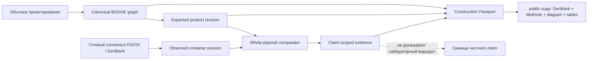

# SPEC — Construction Passport & Publication Pack · «Паспорт конструкции и пакет к статье»

**Статус:** АКТИВНАЯ PRODUCT-SPEC; реализация только bounded-срезами из implementation plan

**Тип:** Type A — архитектура, data model, export pipeline, UX workflow

**Нормативный формат:** `SPEC_BODGE_FORMAT_V2_CORE.md`

**Исполнимые фазы:** `BODGE_V2_IMPLEMENTATION_PLAN.md`

> **Суть:** BodgeGene автоматически сохраняет биографию плазмиды во время обычного проектирования, а затем одним действием превращает её в понятный человеку и машине пакет для коллеги, репозитория или статьи. Опциональное whole-plasmid sequencing подтверждает только то, что предоставленный consensus совпадает с ожидаемой молекулой; оно не «доказывает» весь лабораторный маршрут.

---

## 0. Контекст реализации

Это master-spec/epic, а не один sprint handoff. Её намеренно нельзя отдавать Code командой «сделай всё»: `CURRENT_TASK.md` получает только один bounded gate из `BODGE_V2_IMPLEMENTATION_PLAN.md`, после реализации — отдельная приёмка и следующий срез. Границы и приёмка следуют единому [`WORKFLOW.md`](../process/WORKFLOW.md), а полный продуктовый замысел не распадается на противоречащие документы.

### 0.1 Граница размеров

Фактические размеры снимаются заново перед каждым handoff. `bodge-zip.js` остаётся dispatcher, а publication writer, orchestration, DTO и filtering выносятся в отдельные pure modules. Publication/evidence state не добавляется в `alignmentSlice.js`; hard/soft-политика берётся из `AGENTS.md`, а не из датированного снимка этой спецификации.

### 0.2 Visual reference / source of truth

Внешнего mockup нет. Источник истины по визуалу — `docs/DESIGN_SYSTEM.md` и существующие поверхности BodgeGene. Приёмочные критерии ниже текстовые. Новый fullscreen workspace не создаётся.

### 0.3 Component reuse audit

Использовать:

- `ExportProjectModal` как существующую export surface, а не второй независимый экспортёр;
- `ProjectAssemblyWorkspace` и product/container context action как точки открытия паспорта;
- существующий four-tier DAG/zone graph как источник геометрии диаграммы;
- `bodge-container-genbank` для всех `.gb`-проекций;
- `bodge-readme-writer` как root README generator;
- `parseFile`/GenBank/FASTA parsers для consensus import;
- pure alignment primitives и WFA/Gotoh oracle для сравнения после выбора origin;
- `Icon`, theme tokens, modal/action conventions текущей дизайн-системы.

Не использовать:

- отдельный `recipe.json`, копирующий `assemblies/*.json`;
- `realiseAssembly()` как replay validator: он создаёт новый DAG и новые IDs, а не проверяет frozen graph;
- `alignCircular()` в текущем semiglobal режиме как доказательство whole-plasmid equality;
- ручной `sangerVerified='verified'` как автоматический статус всей молекулы;
- восстановление удалённых legacy-мастеров вместо текущих библиотечных и assembly-поверхностей;
- vendor extension `skeleton.json` как источник публикационной биологии.

### 0.4 Где задача находится в продукте

Эта функция не является отдельным «режимом для публикаций». Она соединяет уже существующие подсистемы:

`Library/Canvas → assembly graph → product revision → primer pool → BODGE v2 → optional observed consensus → publication projection`.

Дневная ценность возникает до статьи: через месяц пользователь понимает, из чего получена плазмида; коллега получает не один финальный `.gb`, а происхождение каждого участка; неправильная версия продукта видна до заказа новых праймеров. Публикационный пакет — полезная проекция уже накопленных данных, а не отдельная бюрократическая работа.

---

## 1. Продуктовая позиция

### 1.1 Основная формулировка

**BodgeGene — редактор плазмид, который сам сохраняет их происхождение.**

Рабочая формулировка для пользователя:

> Соберите плазмиду — BodgeGene запомнит, откуда взялся каждый участок, какие праймеры и методы были заложены, и подготовит понятный пакет для коллеги или статьи.

### 1.2 Что продаёт функция

1. **Память лаборатории.** Не нужно восстанавливать сборку по именам файлов `final_v7_really_final.gb`.
2. **Передача работы.** Получатель видит исходники, праймеры, операции и конечный продукт в одном контейнере.
3. **Быстрое продолжение.** Чужую конструкцию можно открыть, заменить один источник или участок и создать новую ветку.
4. **Подготовка Methods.** Таблицы и черновик текста строятся из уже существующего графа.
5. **Честная проверка продукта.** Готовый consensus можно сравнить с ожидаемой плазмидой без ложного заявления о доказанности всей процедуры.

### 1.3 Чего продукт не обещает

BodgeGene не решает весь кризис воспроизводимости и не утверждает, что наличие файла доказывает выполнение эксперимента. Он не подтверждает:

- что автор действительно провёл каждую реакцию;
- точные lot numbers, буферы и фактические режимы, если они не были зафиксированы;
- отсутствие минорной примеси клонов по одному consensus;
- функциональность конструкции в клетке;
- фенотип, экспрессию, активность белка или стабильность;
- качество скрытых raw reads или отчёта внешнего провайдера;
- физическую форму ДНК, суперскрученность и чистоту препарата.

### 1.4 Почему не «Dockerfile для плазмиды»

Метафора полезна для инженеров, но опасна как продуктовый контракт. Лабораторная реакция не является чистой программной функцией: одинаковый дизайн не гарантирует одинаковый выход. Поэтому BodgeGene хранит **проектный граф и наблюдения**, а не выдаёт общий бейдж «воспроизводимо».

---

## 2. Цели, IN/OUT и границы prerelease

### 2.1 Цели prerelease

- автоматически построить readable construction record для выбранного product;
- экспортировать dependency-closed `.bodge` с GenBank всех нужных молекул;
- сгенерировать Methods, диаграмму, materials и primers tables;
- импортировать готовый whole-plasmid consensus из FASTA/GenBank;
- выполнить строгий circular-aware expected-vs-observed comparison;
- сохранить claim-scoped evidence без перезаписи ожидаемого дизайна;
- показать четыре понятных статуса конечной последовательности;
- исключить private/local данные по строгому allowlist;
- сохранить работоспособность при появлении новой chemistry/method plugin.

### 2.2 IN

- один или несколько выбранных конечных products;
- producer graph и upstream dependency closure;
- source/material containers и их exact revisions;
- использованные primer/primer-pair records;
- canonical assembly operations/connections;
- human-readable projections;
- готовый consensus sequence и компактные метрики сравнения;
- optional external links/DOI/Addgene/NCBI refs;
- deterministic manifest/digests/checksums;
- import в BodgeGene и исследование ZIP без BodgeGene.

### 2.3 OUT prerelease

- basecalling POD5/FAST5;
- сборка consensus из raw FASTQ/BAM;
- локальный запуск EPI2ME/Nextflow/Docker;
- хранение всех неудачных PCR/трансформаций;
- LIMS: аликвоты, морозильники, остатки, партии, операторы и оборудование;
- универсальная онтология гелей/Western/functional assay;
- электронные подписи и PKI;
- ORCID/ROR/RO-Crate/SBOL3 как обязательный слой;
- автолаб, исполнение протоколов и управление роботами;
- автоматический replay всех исторических операций;
- обещание, что файл является достаточным доказательством воспроизводимости.

### 2.4 После prerelease

Raw-read pipeline, RO-Crate, signatures, batch/autolab и полная assay provenance остаются расширениями. Формат резервирует ссылки и opaque attachments, но основной UI не заставляет биолога заполнять эти данные.

---

## 3. Модель доверия: четыре независимых вопроса

Нельзя сворачивать разные утверждения в один `verified`.

| Вопрос | Источник | Статус |
|---|---|---|
| Полон ли проектный граф? | canonical BODGE refs/invariants | `complete / incomplete / conflicted` |
| Что утверждает автор о выполнении? | явная author assertion | `design-only / reported-performed` |
| Совпадает ли конечная последовательность? | scoped comparison evidence | `not-checked / matches-expected / differs / inconclusive` |
| Валиден ли файл? | conformance validator | `structural / integrity / biological / full` |

Эти оси не повышают друг друга автоматически. `full` conformance означает соответствие формату, а не лабораторную проверку. `reported-performed` — утверждение автора, а не независимое доказательство. Sanger одного стыка не даёт `matches-expected` для всей молекулы.

### 3.1 Допустимые пользовательские формулировки

- «В пакете сохранён полный проектный путь для выбранного продукта».
- «Автор отметил сборку как выполненную».
- «Предоставленный whole-plasmid consensus точно совпадает с ожидаемой молекулой».
- «Обнаружены отличия между ожидаемой и наблюдаемой последовательностями».
- «Проверка неокончательна: consensus неполный или содержит неоднозначные позиции».

### 3.2 Запрещённые формулировки

- «Эксперимент воспроизведён».
- «Плазмида полностью экспериментально верифицирована» без уточнения claim/scope.
- «Nanopore доказал маршрут сборки».
- «100% чистый клон» только по consensus.
- «Функция конструкции подтверждена» по совпадению DNA sequence.

---

## 4. Основные пользовательские сценарии

### 4.1 Обычная работа: паспорт возникает сам

1. Пользователь добавляет source containers и выбирает фрагменты.
2. В guided-сценарии он просто набрасывает fragments в assembly picker: BodgeGene предлагает метод, ориентации/стыки и праймеры; пользователь подтверждает безопасный вариант.
3. В details/pro-сценарии любой fragment, junction, enzyme, primer, tail/modification и параметр можно заменить вручную без потери автоматического пути.
4. После подтверждения BodgeGene создаёт pieces, reactions, connections, product refs и exact primer refs по обычному workflow.
5. Derived primer/method сохраняет algorithm/version/parameters; manual override сохраняется как manual value с author/time. Временные отклонённые кандидаты не становятся canonical history.
6. Каждая значимая принятая операция создаёт canonical provenance side-effect.
7. У продукта появляется действие **«Паспорт конструкции»**.
8. Паспорт показывает происхождение, схему, источники, праймеры и известные пробелы одинаково корректно для guided и полностью ручной сборки.

Пользователь не заполняет вторую форму и не ведёт параллельный журнал ради будущей статьи.

### 4.2 Передача коллеге

1. Выбрать product → «Паспорт конструкции».
2. Проверить список включаемых источников и предупреждения.
3. Нажать «Экспортировать пакет».
4. Получатель открывает `.bodge` в BodgeGene или извлекает `.gb`, `.md`, `.tsv`, `.png` обычным архиватором.

### 4.3 Подготовка к статье

Guided flow состоит максимум из трёх экранов:

1. **Что публикуем:** один или несколько exact product revisions.
2. **Что утверждаем:** design-only или author-reported-performed; optional whole-plasmid comparison.
3. **Что попадёт в файл:** preview allowlist, privacy report и export.

Defaults безопасны: notebook, raw reads, local paths, device IDs и extensions исключены.

### 4.4 Проверка whole-plasmid consensus

1. На product выбрать «Сравнить конечную последовательность».
2. Перетащить consensus `.fasta/.fa/.fna/.gb/.gbk`.
3. Проверить topology и выбрать нужную запись, если файл multi-record.
4. BodgeGene выполняет circular-aware whole-molecule comparison в worker.
5. Результат сохраняется как evidence; observed consensus становится отдельным container.
6. При отличии дизайн не меняется. Пользователь может отдельно создать child-version из observed sequence.

### 4.5 Импорт чужого пакета

1. Reader валидирует ZIP, manifest, hashes, schemas и refs до изменения store.
2. Пакет открывается read-only preview: product, граф, Methods, status и privacy provenance.
3. Пользователь может открыть как проект либо импортировать выбранные containers в Library.
4. Unknown required chemistry блокирует writable open, но стандартные `.gb` и derived publication files остаются извлекаемыми.

---

## 5. Каноническая модель: никакой второй биологии

### 5.1 Источники истины

- `containers/*.json` — canonical molecule revisions;
- `containers/*.gb` — GenBank projections;
- `assemblies/*.json` — pieces, reactions, connections, products;
- `provenance/*.json` — revision graphs и activities;
- `primers/pool.json` — primer records;
- `evidence/*.json` — scoped observations/comparisons;
- `project.json` — selection и minimal publication binding;
- `manifest.json` — structural inventory, capabilities и hashes.

### 5.2 Отмена `recipe.json`

Старый план вводил `recipe.json`, повторяющий materials, primers и steps. Это создаёт две версии одного графа и неизбежный stale-state. В v2 отдельного recipe-lockfile **нет**.

Machine reader использует `assemblies/*.json` и refs. Human files генерируются из того же snapshot. `project.json.publication` содержит только выбор target product/evidence, а не копию биологии.

### 5.3 Publication binding

Для `public-supp` `project.json` хранит массив publication products:

- `assemblyId`;
- exact `expectedProduct {kind,id,revisionDigest}`;
- `verificationEvidenceId | null`;
- `constructionAssertion: design-only | reported-performed`;
- optional public title/short label.

Этот блок отвечает «что именно выпускается», но не повторяет sequence, operations или evidence payload.

### 5.4 Expected и observed — разные контейнеры

**Expected product** — exact revision, вычисленная проектом.

**Observed consensus** — новый canonical container с origin `sequencing-consensus` и ссылкой на источник/evidence.

Инварианты:

- импорт observed никогда не мутирует expected;
- comparison связывает две exact revisions;
- `differs` не создаёт correction commit автоматически;
- создание child-version из observed — отдельное явное действие;
- удаление observed не удаляет expected; evidence становится dangling-invalid до явного удаления/переназначения;
- изменение expected создаёт новую revision и делает старое evidence историческим, а не текущим.

### 5.5 Claim-scoped evidence

Каждая evidence record обязана иметь:

- exact subject revision;
- scope: `whole-molecule`, `regions`, `junctions` или `property`;
- method и assessment source;
- `pass`, `fail` или `inconclusive`;
- human summary;
- attachment refs как optional supporting data.

Core kind для этой фичи: `whole-plasmid-sequence-comparison`.

Минимальные comparison fields:

- expected и observed molecule digests;
- topology обеих молекул;
- algorithm name/version;
- orientation и rotation offset;
- full-length flag;
- unresolved positions count;
- expected/observed lengths;
- normalized variants;
- status `exact-match`, `different`, `inconclusive`;
- `attachmentsOmitted` для sanitized export.

### 5.6 Legacy `sangerVerified`

Текущий `pending/verified/failed` — ручной лабораторный статус клона. Миграция трактует его как author-reported regional/property observation, если нет exact evidence. Он не становится whole-molecule `pass`.

В UI legacy label постепенно меняется:

- `pending` → «не проверено»;
- `verified` без файла → «отмечено автором»;
- `failed` → «автор отметил расхождение»;
- linked comparison → конкретный status и scope.

---

## 6. Публикационный пакет `public-supp`

### 6.1 Один существующий profile token

Новый token не вводится. Канонический ID остаётся `public-supp`; в UI он называется **«Пакет к статье»**. Это избегает миграции уже написанного writer/tests и устраняет конкурирующие профили `recipe`, `publication-supplement`, `public-supp`.

### 6.2 Состав пакета

Обязательные canonical assets:

- `manifest.json`, `_recovery.json`, `project.json`;
- выбранные `assemblies/*.json`;
- dependency closure canonical containers;
- GenBank projections этих containers;
- referenced primers;
- minimal provenance closure;
- selected whole-plasmid comparison evidence, если выбрано.

Обязательные derived assets:

- `README.md`;
- `publication/methods.md`;
- `publication/assembly.png`;
- `publication/materials.tsv`;
- `publication/primers.tsv`, если есть праймеры;
- `publication/verification.md` всегда: при отсутствии evidence — честное `not checked`;
- `CITATION.cff` при заполненном public author/title metadata.

Optional derived assets:

- `publication/assembly.svg` как download-only;
- `publication/assembly.pdf`;
- `publication/variants.tsv` при `differs`;
- `publication/checksums.txt` для удобства человека, при этом manifest остаётся нормативным.

### 6.3 Dependency closure

От каждого selected product walker идёт назад по exact refs:

1. product revision → producer reaction;
2. reaction → input pieces/containers/primers/connections;
3. pieces → source revisions и locations;
4. промежуточные products → их producers;
5. selected evidence → observed consensus revision;
6. public external refs → только достижимые записи.

Closure обязан быть детерминированным, без orphan refs и duplicate producers. Порядок assets — lexical canonical path; порядок reaction rendering — stable topological order с ID как tie-breaker.

### 6.4 Privacy allowlist

Публикуется только явно разрешённое:

- public project title/description;
- выбранная canonical biology и minimal provenance;
- display author, если пользователь оставил;
- referenced primers/material names;
- выбранное compact comparison evidence;
- public external refs.

По умолчанию исключаются:

- notebook text и все черновые заметки;
- device/fingerprint IDs;
- absolute/local paths, file handles и runtime URLs;
- sample IDs, barcodes и внутренние clone labels, если не разрешены;
- raw AB1/FASTQ/BAM/POD5 и vendor reports;
- photos/PDF attachments;
- embedded original sources;
- UI layout и extensions;
- private refs и чувствительные free-form поля.

Export обязан показать privacy report **до** записи файла и повторно проверить итоговый ZIP после генерации. Нельзя сначала создать полный архив, а затем пытаться вырезать секреты строковым фильтром.

### 6.5 Почему GenBank достаточно извлекаем

Любой canonical container имеет одну GenBank projection в `containers/<id>.gb`. Expected, sources и optional observed consensus извлекаются без BodgeGene. Никакой chemistry plugin не нужен, чтобы прочитать sequence/topology/features.

Нельзя создавать вторые копии `.gb` внутри `publication/`: это порождает расхождение. Methods и README дают точные relative paths на canonical projections.

---

## 7. Construction Record: генерация биографии конструкции

### 7.1 Вход renderer

Renderer получает immutable filtered snapshot после dependency closure:

- selected products;
- assemblies;
- containers/revisions;
- pieces and locations;
- reactions and connections;
- primers/pairs;
- public metadata;
- selected evidence summary.

Renderer ничего не читает из live Zustand и не мутирует state.

### 7.2 Три уровня полноты

1. **Complete:** все refs разрешены, каждый materialized product имеет producer, required params присутствуют.
2. **Incomplete:** граф читаем, но часть method params/source refs отсутствует; пакет можно экспортировать с явным warning.
3. **Conflicted:** duplicate producer, stale revision digest, cycle или несовместимый output; publication export блокируется.

### 7.3 Методы как утверждение дизайна

По умолчанию текст использует язык проектного намерения:

- «Дизайн предусматривает ПЦР…»;
- «Фрагменты спроектированы для сборки Gibson…»;
- «Ожидаемый продукт…».

Если пользователь явно выбрал `reported-performed`, шапка добавляет: «Автор отметил указанные шаги как выполненные». Отдельные предложения не превращаются в независимое доказательство.

### 7.4 Core method templates

| Reaction | Минимальный human render |
|---|---|
| PCR | template revision, primer pair, selected range, expected amplicon length |
| Restriction | input revision, enzymes, expected cuts/ends, selected fragment |
| Ligation | ordered inputs, end compatibility, expected topology |
| Gibson/overlap | ordered inputs, overlap definitions, expected topology |
| Golden Gate/MoClo | Type IIS enzyme, ordered inputs, fusion sites, topology |
| KLD/mutagenesis | template, primers, expected edits; phosphorylation warning if relevant |
| Synthesis | sequence specification и provider/reference при наличии |
| Manual edit | parent revision и typed edit summary |

Биологические инварианты остаются действующими: GG и RE enzyme dictionaries не смешиваются; KLD/RE cloning требуют соответствующего circular/backbone context; merge через ligation/re_ligation не маскирует restriction site; короткие PCR fragments не получают фиктивные праймеры.

### 7.5 Diagram projection

Диаграмма строится из универсального `inputs → reaction → outputs` graph. Она не зависит от live canvas coordinates. Layout детерминированный, пригодный для печати:

- source/material — прямоугольник;
- reaction — компактный ромб/узел с method label;
- expected product — усиленная рамка;
- observed consensus — отдельный пунктирный узел;
- comparison — связь expected ↔ observed с конкретным status;
- missing ref — красный warning marker, но export при conflicted state блокируется.

PNG обязателен для безопасного просмотра; SVG optional download-only. Цвет помогает, но каждый узел и edge имеют текстовую подпись — диаграмма не должна зависеть только от цвета.

### 7.6 Таблицы

`materials.tsv` минимум содержит ID, name, role, topology, length, molecule digest, GenBank path, source reference.

`primers.tsv` содержит ID, name, full sequence, binding segment, tail/modifications, direction, used-in reactions, calculated Tm и статус manual/derived.

`variants.tsv` содержит normalized position, type, expected, observed и confidence/source при наличии.

---

## 8. Whole-plasmid comparison

### 8.1 Input policy prerelease

Принимаются готовые consensus sequences:

- FASTA/FNA/FA;
- GenBank/GBK;
- pasted DNA как expert shortcut.

Raw FASTQ/BAM/POD5 не анализируются. Их можно приложить только в profile `full` либо сохранить external reference/checksum. Для vendor PDF можно создать `assessmentSource: reported`, но BodgeGene не показывает его как самостоятельно рассчитанное совпадение.

### 8.2 Почему отдельный comparator

Текущий `alignCircular()` удваивает reference и выполняет semiglobal placement. Это правильно для короткого Sanger read, но недостаточно для claim «вся молекула сравнена»: terminal segments могут остаться вне alignment.

Новый `compareWholeMolecule(expected, observed, opts)` — pure API. UI/store не входят в algorithm module.

### 8.3 Нормализация

1. Удалить whitespace и разрешённые separators, привести к uppercase, `U→T` только после подтверждения DNA alphabet.
2. Сохранить IUPAC ambiguity count; не превращать `N` в совпадение.
3. Проверить topology и strandedness.
4. Для circular dsDNA вычислить каноническую rotation/reverse-complement форму согласно `moleculeDigest` v1.
5. Для linear molecule сохранить orientation/ends contract.

### 8.4 Exact fast path

Если topology совместима, обе последовательности полные и не содержат ambiguity:

- равные `moleculeDigest` → `exact-match` без alignment;
- для diagnostic output определить orientation и rotation offset linear-time rotation search;
- exact match требует равных длин и нулевого списка variants.

Это главный путь для готового высококачественного whole-plasmid consensus.

### 8.5 Difference path

Если digest различается:

1. Для forward и reverse-complement orientation найти кандидаты origin через seed/minimizer placement.
2. Повернуть circular sequences к выбранному seam.
3. Выполнить **global affine alignment** по всей expected и observed molecule, не semiglobal.
4. Выбрать результат с минимальной edit cost и stable tie-breaker.
5. Нормализовать SNP/insert/delete относительно canonical expected origin.
6. Проверить, что alignment покрывает обе молекулы целиком.

WFA используется как быстрый движок; Gotoh oracle — в тестах на малых/adversarial случаях. Для слишком больших/сложных входов действует worker timeout и `inconclusive`, а не зависание main thread.

### 8.6 Статусные правила

`matches-expected` только если:

- whole-molecule scope;
- известная совместимая topology;
- expected и observed molecule digests равны;
- обе последовательности full-length;
- unresolved IUPAC positions = 0;
- algorithm завершён без truncation/timeout.

`differs` если:

- comparison full-length и надёжен;
- существует хотя бы один normalized variant либо topology/length differs;
- ambiguity не мешает локализовать отличие.

`inconclusive` если:

- consensus partial/multi-contig без однозначной circular molecule;
- присутствуют unresolved positions;
- topology неизвестна;
- сравнение прервано лимитом;
- vendor сообщил результат без доступного consensus и выбран режим independent-compute;
- evidence records конфликтуют и пользователь не выбрал конкретное.

`not-checked` — comparison evidence отсутствует.

Никакого identity threshold для зелёного `matches`: 99.99% с одним SNP — это `differs`, а не «почти совпало».

### 8.7 Биологические ограничения интерпретации

Высококачественный consensus может подтвердить доминирующую последовательность чистого препарата и выявить SNP/indel/structural difference. Но BodgeGene всегда показывает оговорку: consensus-level comparison не заменяет оценку raw-read mixture, а длинные homopolymers и минорные варианты могут требовать дополнительного анализа.

### 8.8 Lifecycle

- import consensus → preview → save observed container + evidence atomically;
- cancel preview → state не меняется;
- delete evidence → observed container остаётся, если используется где-либо ещё;
- replace evidence → старая record остаётся исторической либо удаляется явно;
- update expected design → previous comparison отображается как stale/historical;
- undo import → удаляет только созданные refs, если они не получили новых dependents;
- re-import идентичного consensus → dedup по molecule digest с явным выбором reuse/new record.

---

## 9. UX и прогрессивное раскрытие

### 9.1 Не два разных приложения

Глобальный «студент/профи» здесь не вводится: проект закрепляет expert-mode always on. Вместо гейта — два слоя одной поверхности:

- **Guided:** три понятных шага, безопасные defaults, объяснения статусов;
- **Details:** exact refs/digests, dependency tree, variants, export allowlist и raw metadata.

Профи может менять каждое решение и пропускать необязательные подсказки. Новичок получает рабочий результат без знания префиксов, digest semantics и ZIP structure.

### 9.2 Точки входа

Все вызовы должны вести в один workflow state:

1. Product/container context menu → «Паспорт конструкции».
2. `ProjectAssemblyWorkspace`/assembly toolbar после materialize product → «Подготовить пакет».
3. Общий Export → профиль «Пакет к статье».
4. Sanger/clone row → «Добавить проверку» с уже выбранным expected clone.
5. Library inspector final container → «Сравнить конечную последовательность».

Нельзя иметь пять независимых наборов export options. Точки входа передают `productRef` и optional initial step в один controller.

### 9.3 Паспорт в приложении

Панель содержит:

- header: product name, length, topology, exact revision;
- статус полноты истории;
- construction assertion;
- final sequence status;
- вкладки «Схема», «Шаги», «Материалы», «Праймеры», «Проверка», «Экспорт»;
- список blockers/warnings;
- действие «Открыть источник» для каждого material;
- действие «Создать вариант» без мутации исходника.

### 9.4 Publication wizard

Шаг 1 — **Продукты**: checkbox exact revisions; default — product текущей assembly.

Шаг 2 — **Проверка**: design-only/reported-performed; выбрать existing evidence или импортировать consensus.

Шаг 3 — **Публичные данные**: author/public refs, preview files, privacy report, export.

Кнопка export disabled только при structural conflict/privacy failure. Отсутствие sequencing не блокирует design-only package.

### 9.5 Визуальные критерии

- четыре final-sequence statuses различаются текстом, icon и цветом;
- зелёный применяется только к exact whole-molecule match;
- `reported` всегда видим рядом со статусом и не выглядит как computed;
- expected и observed показаны как два объекта;
- при `differs` первый экран показывает count/type, а не пугающий raw alignment;
- variants раскрываются по запросу;
- privacy preview перечисляет concrete paths/classes;
- unknown chemistry остаётся видимой generic reaction card;
- keyboard/Escape/focus trap соответствуют modal conventions;
- никакой status не передаётся одним цветом без текста.

---

## 10. Расширяемая химия и долговечность формата

### 10.1 Универсальный reaction envelope

Publication renderer должен понимать минимум:

- stable reaction ID;
- reaction class;
- namespaced method ID и version;
- inputs/outputs exact refs;
- product refs;
- typed params или schema reference/digest;
- engine/registry version;
- human display name как metadata, не как discriminator.

### 10.2 Новая chemistry без нового BODGE major

Core methods используют встроенные trusted schemas. Новая chemistry регистрируется локальным `ChemistryRegistry` через namespaced method ID. Архив не содержит исполняемый код.

- известная chemistry → schema validation + rich Methods template;
- неизвестная optional chemistry → core graph сохраняется, generic render показывает method ID/inputs/outputs;
- неизвестная required chemistry → writable open/recompute блокируется, read-only inspection и GenBank extraction доступны;
- plugin-specific fields живут в namespaced params/extension, но sequence/topology/ends/products остаются core;
- `public-supp` исключает executable/opaque extensions, а нужные human params материализует в sanitized derived text.

### 10.3 Generic fallback обязателен

Отсутствие plugin не должно превращать реакцию в пустой ромб. Минимальный текст:

> «Метод `vendor:method@version` использует входы A/B и задаёт ожидаемый продукт C. Специфичная chemistry не проверена этой установкой BodgeGene.»

### 10.4 Принцип актуальности

Долгоживущим фундаментом являются не списки текущих ферментов, а:

- exact sequence revisions;
- universal graph refs;
- stable method identifiers;
- trusted schema/version negotiation;
- capability gating;
- claim-scoped evidence;
- canonical/derived separation;
- deterministic digests и dependency closure.

---

## 11. Архитектура реализации

### 11.1 Pure domain modules

Рекомендуемые новые модули:

- `lib/bodge-publication-closure.js` — select products и dependency closure;
- `lib/bodge-publication-model.js` — DTO/assertions/status derivation;
- `lib/bodge-publication-render.js` — Methods/materials/primers/verification text;
- `lib/bodge-publication-diagram.js` — print graph model, не React DOM screenshot;
- `lib/bodge-publication-assets.js` — derived files + generatedFrom descriptors;
- `lib/whole-plasmid-compare.js` — pure comparison;
- `lib/whole-plasmid-variants.js` — circular normalization и variants;
- `lib/bodge-evidence.js` — schema helpers/status aggregation;
- worker wrapper только для тяжёлого comparison.

`bodge-zip.js` вызывает writer orchestration и не содержит templates/closure/comparison.

### 11.2 Store mutations

Нужны атомарные domain actions, без `useState` в `App.jsx`:

- add observed consensus container;
- add/remove evidence record;
- bind/unbind selected evidence к publication product;
- set construction assertion;
- create child-version from observed sequence;
- undo/redo import transaction.

Полная wiring-матрица:

| Domain action | UI call sites |
|---|---|
| add observed consensus | Library inspector «Сравнить конечную последовательность»; Passport/Export step «Проверка»; Sanger clone row с выбранным expected |
| add/remove evidence | comparison confirm/result details; Passport details; Sanger notebook migration/action |
| bind/unbind publication evidence | единый `ExportProjectModal` verification step и Passport export details |
| set construction assertion | Passport details и тот же Export step; других checkbox-источников нет |
| create child-version from observed | `differs` result action «Создать вариант»; Library inspector comparison history |
| undo/redo import transaction | global undo/redo и post-import toast action; modal не реализует собственный shadow undo |

Modal-local step index/file preview может быть local state; biology/evidence — только domain store. При изменении store shape inventory обязан grep-ом проверить все существующие readers/writers `evidence`, `sangerVerified`, `attachments`, `projectMeta.publication`, container versions и export profile; список фактических call sites фиксируется в K-спринте до первой mutation.

### 11.3 Runtime boundary

1. UI создаёт immutable export request.
2. Controller снимает canonical snapshot.
3. Validator проверяет refs/claims.
4. Profile фильтрует snapshot allowlist-first.
5. Closure строит полный подграф.
6. Derived renderers работают только над filtered snapshot.
7. Writer считает assets/hashes и создаёт ZIP.
8. Post-write inspector повторно проверяет privacy и full conformance.
9. Только после успеха UI предлагает сохранить файл.

### 11.4 Async/worker stability

- Controller создаёт monotonically increasing request ID и `AbortController` на каждый parse/compare/export request.
- Reactive dependencies ограничены `productRef`, exact expected revision digest, input file fingerprint и normalized options; derived result/store object не возвращается в dependency list.
- Новый request отменяет старый; unmount/Escape вызывает cancel, worker termination и reject pending Promise.
- Late progress/result с неактуальным request ID игнорируется до любой store mutation.
- Parse/compare preview не мутирует store; одна атомарная transaction выполняется только после явного confirm.
- Export работает над frozen canonical snapshot. Изменение проекта во время render либо не влияет на этот ZIP, либо требует явного restart; смешанный snapshot запрещён.
- Timeout/resources реализуются в worker/service layer, а не цепочкой component `setTimeout`; cleanup покрывается StrictMode mount→unmount→remount test.

### 11.5 Error model

Ошибки разделяются:

- `PUBLICATION_SELECTION_INVALID`;
- `PUBLICATION_GRAPH_INCOMPLETE`;
- `PUBLICATION_GRAPH_CONFLICTED`;
- `PUBLICATION_PRIVACY_BLOCKED`;
- `CONSENSUS_PARSE_FAILED`;
- `CONSENSUS_TOPOLOGY_UNKNOWN`;
- `WHOLE_COMPARE_TIMEOUT`;
- `WHOLE_COMPARE_INCONCLUSIVE`;
- `EVIDENCE_STALE_REVISION`;
- `UNKNOWN_REQUIRED_CHEMISTRY`;
- `PUBLICATION_POSTWRITE_INVALID`.

UI показывает действие исправления, а diagnostics сохраняет exact refs/paths без утечки private payload в публичный README.

---

## 12. Фазы поставки и зависимости

Подробные K-gates живут в `BODGE_V2_IMPLEMENTATION_PLAN.md`; здесь продуктовая последовательность.

### P0 — Format foundation and contract correction

- убрать generic `experimentally_verified` из assembly/reaction states до format freeze;
- ввести expected/observed и scoped evidence semantics;
- зафиксировать `public-supp` composition;
- зафиксировать universal reaction envelope/capabilities;
- characterization tests текущего writer/profile/legacy Sanger state.
- пройти обязательные format prerequisites A–F из `BODGE_V2_IMPLEMENTATION_PLAN.md` отдельными bounded sprint-ами: secure reader, canonical project/container, GenBank codec, canonical assembly graph, digests/provenance и allowlist writer.

**Gate:** structured core имеет один source of truth; schemas/fixtures различают format conformance, author assertion и product sequence comparison; public writer не опирается на blacklist.

### P1 — Construction Passport, без sequencing

- dependency closure для одного product;
- completeness/conflict diagnostics;
- Methods/materials/primers renderers;
- deterministic diagram model/PNG;
- in-app read-only passport;
- preview будущего design-only package из filtered snapshot; публичная запись ZIP включается только после P2 gate.

**Gate:** пользователь обычной сборки без дополнительных форм получает readable in-app passport и детерминированные derived artifacts; no duplicate recipe graph.

### P2 — Publication profile hardening

- strict privacy allowlist;
- publication binding в `project.json`;
- derived asset descriptors/generatedFrom;
- GenBank closure;
- post-write validation/privacy report;
- import/read-only preview.
- включение production design-only `public-supp` export.

**Gate:** adversarial private fields не попадают ни в ZIP, ни в README/TSV/PNG metadata.

### P3 — Whole-plasmid consensus comparison

- canonical circular molecule digest implementation;
- FASTA/GenBank consensus import;
- expected/observed lifecycle;
- exact fast path + global difference path в worker;
- normalized variants;
- evidence persistence/status UI;
- publication verification summary.

**Gate:** rotation/RC exact, SNP/indel differs, N/partial inconclusive; expected immutable.

### P4 — UX integration

- все call sites ведут в один controller;
- guided/details layers;
- Sanger manual statuses получают scoped semantics;
- Library/Assembly/Product actions;
- accessibility, IME, keyboard, cancel/undo lifecycle;
- browser smoke на реальном проекте.

### P5 — Conformance and prerelease gate

- valid/invalid corpus;
- independent inspect/validate tooling;
- OpenCloning/GenBank interop cases;
- unknown chemistry fixtures;
- performance and resource limits;
- full suite/build/browser acceptance;
- docs/user guide after UX acceptance.

**Порядок:** P0 → P1 → P2 → P3 → P4 → P5. P3 не блокирует выпуск P1/P2 design-only package.

---

## 13. Приёмочные сценарии

### 13.1 Happy paths

1. Gibson assembly из двух PCR fragments → паспорт показывает оба templates, две primer pairs, Gibson reaction и exact product.
2. Golden Gate → Type IIS enzyme/fusion sites из GG registry; RE dictionary не участвует.
3. RE cloning → restriction/digest/ligation steps и internal-site warnings отражены корректно.
4. Product без sequencing → пакет экспортируется с `not checked`, без ложного warning о невалидности.
5. Circular consensus с другим origin → exact match.
6. Reverse-complement circular consensus → exact match.
7. Один SNP/indel → `differs`, expected не меняется, variants.tsv создаётся.
8. Observed FASTA без features → отдельный canonical container + обычная GenBank projection.
9. Unknown optional chemistry → generic diagram/text, package остаётся читаемым.

### 13.2 Negative paths

1. Sanger одного junction не даёт whole-molecule green status.
2. Manual `verified` без file/evidence отображается как reported, не computed.
3. Partial consensus или `N` не даёт `matches-expected`.
4. Different molecule digests с `result: pass` → archive invalid.
5. Evidence указывает на старую expected revision → stale, не current.
6. Duplicate producer/cycle/dangling source → publication export blocked.
7. `public-supp` не содержит notebook/raw reads/local paths/device IDs/extensions.
8. Cancel consensus preview не оставляет container/evidence.
9. Unknown required chemistry не разрешает writable recompute.
10. Derived artifact со stale `generatedFrom` блокирует full conformance.

### 13.3 Lifecycle test

`import consensus → exact comparison → save evidence → export public-supp → re-import → inspect status → undo import in source project`.

Проверяется, что expected revision неизменна, observed/evidence refs восстановились из архива, export содержит dependency closure, а undo не удаляет reused container.

### 13.4 Regression coverage

- обычный full `.bodge` round-trip;
- single-assembly export;
- GenBank export/import;
- Sanger pairwise/AB1 alignment;
- manual corrected-reference branching;
- primer pool/tails/modifications;
- Golden Gate/RE separation;
- skeleton save/open bridge;
- export modal cancel/Escape;
- legacy v1 migration fixtures.

---

## 14. Проверки реализации

Фаза должна иметь отдельные red→green tests. Минимальные команды для полного handoff:

- `npm test -- src/lib/__tests__/bodge-publication-closure.test.js`
- `npm test -- src/lib/__tests__/bodge-publication-render.test.js`
- `npm test -- src/lib/alignment/__tests__/whole-plasmid-compare.test.js`
- `npm test -- src/lib/__tests__/bodge-export-profiles.test.js`
- `npm test -- src/lib/__tests__/bodge-zip-v2-writer.test.js`
- `npm test -- src/canvas/__tests__/ExportProjectModal.test.jsx`
- `npm test -- src/components/CanvasSkeleton/__tests__/publication-package.test.jsx`
- `npm test`
- `npm run build`

Manual/browser acceptance:

1. Открыть реальную assembly с product.
2. Просмотреть паспорт и перейти к каждому source.
3. Экспортировать design-only package, распаковать и открыть `.gb` внешним viewer.
4. Импортировать rotated и mutated consensus.
5. Проверить statuses/variants и неизменность expected.
6. Экспортировать package с selected evidence.
7. Просмотреть ZIP paths/privacy report и повторно импортировать `.bodge`.
8. Проверить keyboard, focus, Escape и отсутствие console errors.

Performance gate:

- comparison не блокирует UI;
- worker cancel срабатывает при смене/закрытии запроса;
- typical 3–20 kb plasmid comparison укладывается в интерактивное ожидание;
- resource limit/timeout возвращает inconclusive;
- повторный exact digest comparison не запускает тяжёлый alignment.

---

## 15. Предположения, внешние ориентиры и риски

### 15.1 Проверенные предположения

- OpenCloning уже экспортирует cloning history JSON/ZIP и SVG, а также связывает sequencing data с design. Следовательно, сам факт «история в JSON» не уникален; дифференциация BodgeGene — local-first canonical revisions, primer/library integration, zero-friction passport и публикационная проекция. Источники: [OpenCloning export](https://docs.opencloning.org/exporting/), [sequencing data](https://docs.opencloning.org/sequencing_data/).
- ONT `wf-clone-validation` принимает FASTQ/BAM, строит plasmid assembly и сравнивает full assembly с reference. BodgeGene prerelease не должен дублировать этот pipeline; он принимает его готовый consensus/report. Источник: [EPI2ME wf-clone-validation](https://epi2me.nanoporetech.com/epi2me-docs/workflows/wf-clone-validation/).
- Whole-plasmid Nanopore consensus может давать точную последовательность чистого plasmid sample при строгом pipeline, но raw-read quality, mixtures и homopolymers требуют честных ограничений. Источники: [Brown et al., 2023](https://pmc.ncbi.nlm.nih.gov/articles/PMC10039527/), [Nanopore troubles and biases](https://journals.plos.org/plosone/article?id=10.1371%2Fjournal.pone.0257521).
- Современные рекомендации по reusable methods поддерживают структурированное и полное описание, но не превращают наличие файла в доказательство выполнения. Источник: [Nature Methods, 2025](https://www.nature.com/articles/s41592-025-02615-4).

### 15.2 Основные риски

| Риск | Митигация |
|---|---|
| Пользователь читает `verified` слишком широко | Claim/scope в data model и UI; убрать generic assembly verified. |
| Дублирование graph в derived files | Только one-way render, generatedFrom, никаких recipe steps copy. |
| Current `public-supp` лишь strip deviceId | Characterization test, allowlist rewrite до UI mount. |
| Current writer опирается на `.gb`, а normative core требует canonical `.json` | P0/P1 BODGE contract implementation precedes publication claim. |
| Skeleton extension становится скрытым source of truth | Publication closure использует structured core; extension excluded. |
| Whole-plasmid alignment зависает | Digest fast path, worker, WFA, timeout/cancel/resource cap. |
| Consensus с другим origin выглядит мутантным | Rotation/RC canonical molecule digest. |
| Новая chemistry ломает Methods | Universal envelope + generic fallback + capability gate. |
| Пакет раскрывает notebook/sample IDs | Allowlist-before-render + post-write privacy validator. |
| Авто-Methods звучит как выполненный эксперимент | Design language default; separate reported assertion. |
| Пользователь ждёт raw-read validation | Явный label `consensus-level`; raw pipeline OUT. |

### 15.3 STOP-условия

Остановить фазу и вернуть вопрос Chat, если:

- формат всё ещё допускает generic `experimentally_verified` для assembly;
- publication требует копировать reaction graph в новый canonical файл;
- writer не умеет построить exact dependency closure;
- expected revision может быть мутирована импортом consensus;
- green match возможен при ambiguity/partial coverage;
- public package строится через blacklist после полного export;
- unknown chemistry скрывает inputs/outputs/product;
- реализация требует наращивать `bodge-zip.js` или `alignmentSlice.js` без выноса;
- текущий active sprint/dirty worktree не финализирован и изменения пересекаются с его файлами.

---

## 16. Definition of Done prerelease

- Паспорт строится автоматически из canonical graph.
- Отдельного `recipe.json` нет.
- Design-only package полезен без sequencing.
- `public-supp` имеет strict allowlist и deterministic closure.
- Methods/diagram/tables генерируются из filtered snapshot.
- Все selected canonical containers имеют matching `.gb`.
- Expected/observed revisions разделены.
- Whole-plasmid exact match инвариантен к circular origin и reverse complement.
- SNP/indel даёт differs; ambiguity/partial — inconclusive.
- Evidence claim-scoped и не повышает assembly целиком.
- New chemistry имеет generic representation и capability gating.
- ZIP проходит structural/integrity/biological/full validation.
- External user может извлечь GenBank и human files без BodgeGene.
- Full test suite/build clean, browser acceptance пройден.
- Size report: `bodge-zip.js` уменьшен/не вырос; новых hard violators нет.
- BUGS/PROJECT_STATE/RELEASES/DECISIONS/ANCHORS обновляются только при финализации реализованной фазы.

---

## 17. Handoff discipline

Эта спецификация не является готовой задачей целиком. `CURRENT_TASK.md` получает один bounded-срез из [`BODGE_V2_IMPLEMENTATION_PLAN.md`](./BODGE_V2_IMPLEMENTATION_PLAN.md) после проверки актуального дерева. Нормативная схема принадлежит [`SPEC_BODGE_FORMAT_V2_CORE.md`](./SPEC_BODGE_FORMAT_V2_CORE.md), а формат handoff, TDD и финальной проверки определяет [`WORKFLOW.md`](../process/WORKFLOW.md). Whole-plasmid comparison и production publication export не начинаются до зелёного canonical graph/profile contract.
